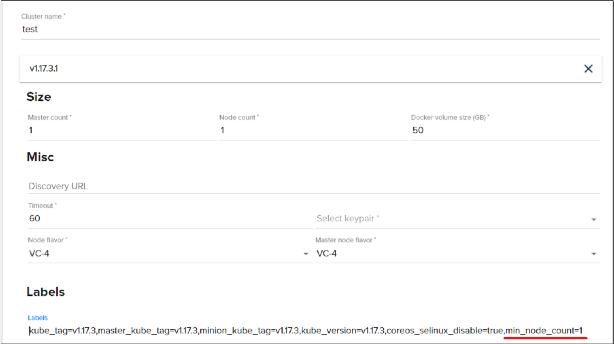
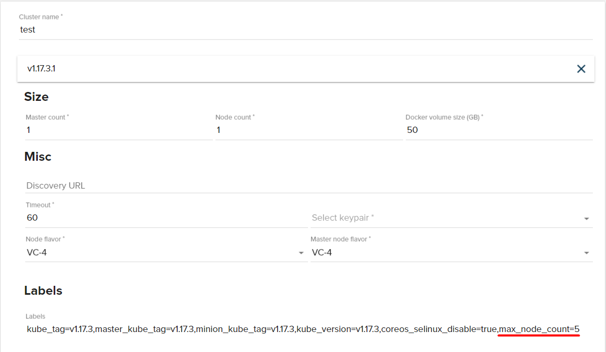

# Autoscaling: min and max count of nodes in Kubernetes cluster
---

In this task we will see how to control count of nodes in Kubernetes cluster. When we indicate min node count, autoscaler will not scale-in count of nodes less then number of min node count. And when we indicate max node count, autoscaler will not scale-out count of nodes more then number of max node count.


## Min node count

- Go to Cloud page, choose Kubernetes and create your [Kubernetes cluster](https://ventuscloud.eu/docs/Kubernetes/Kubernetes%20Cluster) with existing parameters and add tag `min_node_count=3`:

```
Master count: 1
Node count: 3
Docker volume size (Gb): 50
Node flavor: VC-2
Master node flavor: VC-2
```

   

- Now connect to your cluster using [CLI](https://ventuscloud.eu/docs/Kubernetes/access-by-cli)  

- Use command `kubectl get nodes` to make sure that we have minimum 3 nodes on our cluster:

```
NAME                         STATUS   ROLES    AGE     VERSION
test-ptdzc7aqfngp-master-0   Ready    master   16m     v1.17.3
test-ptdzc7aqfngp-node-0     Ready    <none>   14m     v1.17.3
test-ptdzc7aqfngp-node-1     Ready    <none>   7m30s   v1.17.3
test-ptdzc7aqfngp-node-2     Ready    <none>   82s     v1.17.3
```
Now we have 3 nodes on our cluster and autoscaler don't scale-in it lower then 3 nodes, as we indicated in min_node_count. 

## Max node count

- Go to Cloud page, choose Kubernetes and create your [Kubernetes cluster](https://ventuscloud.eu/docs/Kubernetes/Kubernetes%20Cluster) with existing parameters and add tag `max_node_count=1`:

```
Master count: 1
Node count: 1
Docker volume size (Gb): 50
Node flavor: VC-2
Master node flavor: VC-2
```

 

- Connect to your cluster using [CLI](https://ventuscloud.eu/docs/Kubernetes/access-by-cli)

- Now, to check how autoscaler will scale your nodes, create `deployment-test.yaml` file with existing lines:    

```yaml
apiVersion: apps/v1
kind: Deployment
metadata:
  name: deployment-test
  labels:
    app: nginx
spec:
  replicas: 5
  selector:
    matchLabels:
      app: nginx
  template:
    metadata:
      labels:
        app: nginx
    spec:
      containers:
      - name: nginx
        image: nginx:1.7.9
        resources:
          requests:
            memory: "800Mi"
        ports:
        - containerPort: 80
```
- Create deployment using next command:   
```
kubectl apply -f deployment-test.yaml
```
```
deployment.apps/deployment-test created
```

- Use command `kubectl get pods` and look how many pod are in running status: 

```
kubectl get pods
```
```
NAME                               READY   STATUS    RESTARTS   AGE
deployment-test-675c865767-7t6fm   1/1     Running   0          42s
deployment-test-675c865767-bl268   0/1     Pending   0          42s
deployment-test-675c865767-hqb7h   1/1     Running   0          42s
deployment-test-675c865767-rwnf9   0/1     Pending   0          42s
deployment-test-675c865767-v5c4p   0/1     Pending   0          42s
```
As you can see, only 2 of 5 pods are in running status and 3 in pending. 

- Use command  `kubectl describe pod "pod name"` on one of the pods with pending status: 

`kubectl describe pod deployment-test-675c865767-v5c4p`

```concole
Name:           deployment-test-675c865767-v5c4p
Namespace:      default
Node:           <none>
Labels:         app=nginx
                pod-template-hash=675c865767
Annotations:    <none>
Status:         Pending
IP:
IPs:            <none>
Controlled By:  ReplicaSet/deployment-test-675c865767
Containers:
  nginx:
    Image:      nginx:1.7.9
    Port:       80/TCP
    Host Port:  0/TCP
    Requests:
      memory:     800Mi
    Environment:  <none>
    Mounts:
      /var/run/secrets/kubernetes.io/serviceaccount from default-token-vxqs2 (ro)
Conditions:
  Type           Status
  PodScheduled   False
Volumes:
  default-token-vxqs2:
    Type:        Secret (a volume populated by a Secret)
    SecretName:  default-token-vxqs2
    Optional:    false
QoS Class:       Burstable
Node-Selectors:  <none>
Tolerations:     node.kubernetes.io/not-ready:NoExecute for 300s
                 node.kubernetes.io/unreachable:NoExecute for 300s
Events:
  Type     Reason             Age        From                Message
  ----     ------             ----       ----                -------
  Warning  FailedScheduling   <unknown>  default-scheduler   0/2 nodes are available: 1 Insufficient memory, 1 node(s) had taints that the pod didn't tolerate.
  Warning  FailedScheduling   <unknown>  default-scheduler   0/2 nodes are available: 1 Insufficient memory, 1 node(s) had taints that the pod didn't tolerate.
  Normal   NotTriggerScaleUp  4m30s      cluster-autoscaler  pod didn't trigger scale-up (it wouldn't fit if a new node is added): 1 max node group size reached
```
In output we can see massage from autoscaler cluster:

```
pod didn't trigger scale-up (it wouldn't fit if a new node is added): 1 max node group size reached
```
