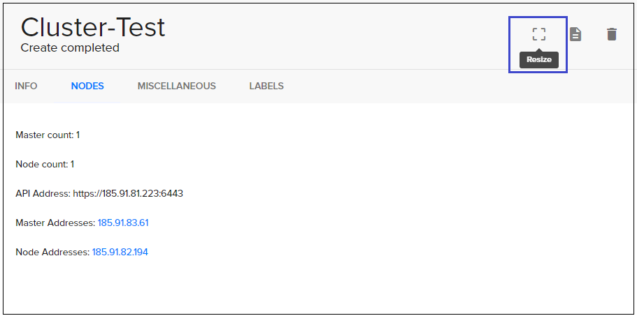

# Scale-out and scale-in of Kubernetes cluster
---

In this task we will see how to scale-out and scale-in of Kubernetes cluster.

 

- go to Cloud page, choose Kubernetes and open your cluster:

   

- In opening cluster choose `Resize`  

 

- Choose how many nodes you need and use action `resize cluster`  

  

- Wait until update progress will end:

    
   

 

 **Let's see how it works on server side:** 

- Create Kubernetes cluster with existing parametrs (How to create Kubernetes cluster you can see in this core task [Kubernetes cluster](https://ventuscloud.eu/docs/kubernetes/kubernetes-cluster):

```
Master count: 1
Node count: 1
Docker volume size (Gb): 30
Node flavor: VC-2
Master node flavor: VC-2
```

- Get access to this cluster (How to getting access to cluster you can see in this core task [Access to Kubernetes Cluster using CLI](https://ventuscloud.eu/docs/kubernetes/access-by-cli) 

- Create `deployment-test.yaml` file with existing lines:    

```yaml
apiVersion: apps/v1
kind: Deployment
metadata:
  name: deployment-test
  labels:
    app: nginx
spec:
  replicas: 5
  selector:
    matchLabels:
      app: nginx
  template:
    metadata:
      labels:
        app: nginx
    spec:
      containers:
      - name: nginx
        image: nginx:1.7.9
        resources:
          requests:
            memory: "400Mi"
        ports:
        - containerPort: 80
```
- Create deployment using next command to create deployment.   
```
kubectl apply -f deployment-test.yaml
```
```console
deployment.apps/deployment-test created
```

- Using command `kubectl get pods` we will see that one of pods can't move in running state:   
```
kubectl get pods
```
```console
NAME                               READY   STATUS      RESTARTS   AGE
deployment-test-8676b58c7f-6hfl6   1/1     Running     0          61s
deployment-test-8676b58c7f-bk72m   1/1     Running     0          61s
deployment-test-8676b58c7f-pnwk4   0/1     Pending     0          61s
deployment-test-8676b58c7f-vnkwc   1/1     Running     0          61s
deployment-test-8676b58c7f-xlkhv   1/1     Running     0          61s
```

- Using command `kubectl describe pod "pod name"` we will see that this pod have problem: `Insufficient memory`    
```
kubectl describe pod deployment-test-8676b58c7f-pnwk4
```
```console
Status:         Pending
IP:
Controlled By:  ReplicaSet/deployment-test-8676b58c7f
Containers:
  nginx:
    Image:      nginx:1.7.9
    Port:       80/TCP
    Host Port:  0/TCP
    Requests:
      memory:     400Mi
    Environment:  <none>
    Mounts:
      /var/run/secrets/kubernetes.io/serviceaccount from default-token-vzppl (ro)
Conditions:
  Type           Status
  PodScheduled   False
Volumes:
  default-token-vzppl:
    Type:        Secret (a volume populated by a Secret)
    SecretName:  default-token-vzppl
    Optional:    false
QoS Class:       Burstable
Node-Selectors:  <none>
Tolerations:     node.kubernetes.io/not-ready:NoExecute for 300s
                 node.kubernetes.io/unreachable:NoExecute for 300s
Events:
  Type     Reason            Age                 From               Message
  ----     ------            ----                ----               -------
  Warning  FailedScheduling  74s (x4 over 4m5s)  default-scheduler  0/2 nodes are available: 1 Insufficient memory, 1 node(s) had taints that the pod didn't tolerate.
```

- Now resize cluster and add one more node like we saw on steps earlier.

- Use the command `kubectl get nods` to make sure that one more node was added: 
```
kubectl get nods
```
```concole
NAME                                 STATUS   ROLES    AGE     VERSION
cluster-test-yin3p44gdbom-master-0   Ready    master   93m     v1.17.3
cluster-test-yin3p44gdbom-node-0     Ready    <none>   91m     v1.17.3
cluster-test-yin3p44gdbom-node-1     Ready    <none>   4m14s   v1.17.3
```

- Use comand `kubectl get pods` and make sure that all pods in running state: 
```
kubectl get pods
```
```console
NAME                               READY   STATUS      RESTARTS   AGE
deployment-test-8676b58c7f-6hfl6   1/1     Running     0          61s
deployment-test-8676b58c7f-bk72m   1/1     Running     0          61s
deployment-test-8676b58c7f-pnwk4   1/1     Running     0          61s
deployment-test-8676b58c7f-vnkwc   1/1     Running     0          61s
deployment-test-8676b58c7f-xlkhv   1/1     Running     0          61s
```


