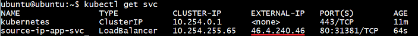

# Source IP 
{: .no_toc }

  

## Table of contents
{: .no_toc .text-delta }

1. TOC
{:toc}

## Preconditions

Before you begin you need to deploy small nginx webserver that echoes back the source IP of requests. For example you can use command `kubectl run source-ip-app --image=k8s.gcr.io/echoserver:1.4` to do it.

The output is:

```
deployment.apps/source-ip-app created
```

## Creation service with Type LoadBalancer

1) Create Service with Type `LoadBalancer` and annotation `loadbalancer.openstack.org/x-forwarded-for: "true"` using this `loadbalancer.yaml` file: 

```yaml
apiVersion: v1
kind: Service
metadata:
  annotations:
    loadbalancer.openstack.org/x-forwarded-for: "true"
  creationTimestamp: "2019-12-18T13:35:06Z"
  labels:
    run: source-ip-app
  name: loadbalancer
  namespace: default
  resourceVersion: "1284161"
  selfLink: /api/v1/namespaces/default/services/loadbalancer
  uid: b5b714ca-7373-41ef-a969-221a9bf2f2ef
spec:
  clusterIP: 10.254.182.88
  externalTrafficPolicy: Cluster
  ports:
  - nodePort: 30951
    port: 80
    protocol: TCP
    targetPort: 8080
  selector:
    run: source-ip-app
  sessionAffinity: None
  type: LoadBalancer
status:
  loadBalancer:
    ingress:
    - ip: 46.4.240.47
```
Use command `kubectl apply -f loadbalancer.yaml` to create it. 

The output is: 

```
service/loadbalancer created
```
Now get external ip of your service using command `kubectl get svc`:

 

## Getting Source IP

To get Source IP you need use command `curl` with external IP that you has been received in previous step.

In our case it's: `curl 46.4.240.46`

The output is:
```
CLIENT VALUES:
client_address=10.100.1.1
command=GET
real path=/
query=nil
request_version=1.1
request_uri=http://46.4.240.46:8080/

SERVER VALUES:
server_version=nginx: 1.10.0 - lua: 10001

HEADERS RECEIVED:
accept=*/*
host=46.4.240.46
user-agent=curl/7.58.0
x-forwarded-for=188.40.161.103
```


In our case it's an IP from line `x-forwarded-for=188.40.161.103`


