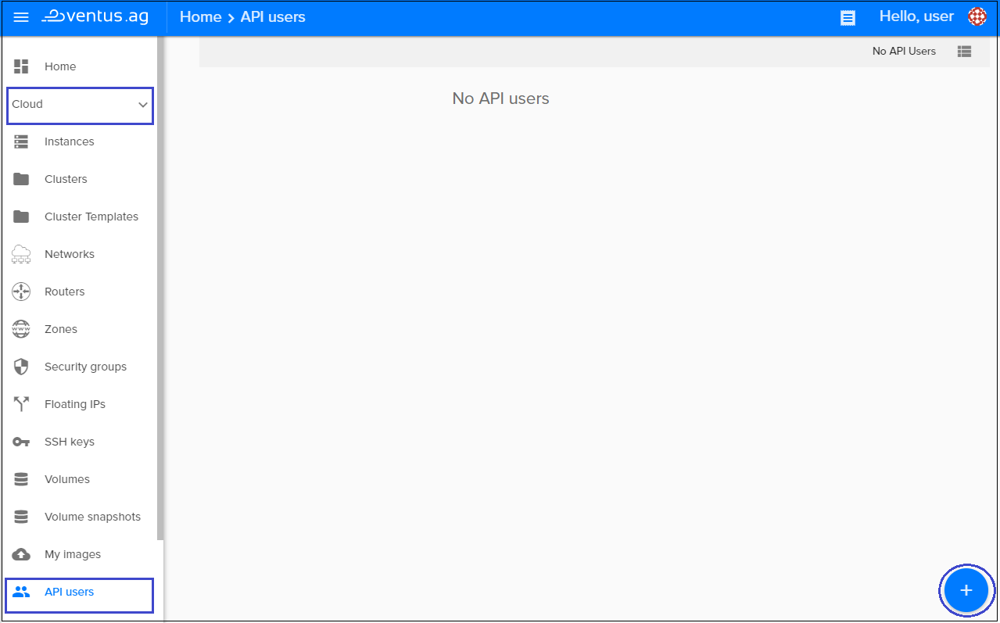
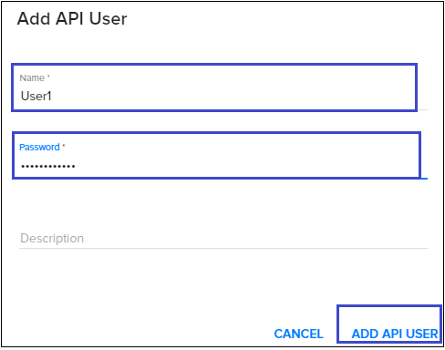
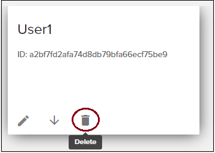
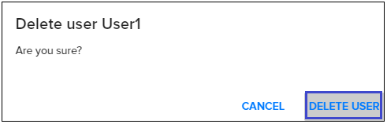
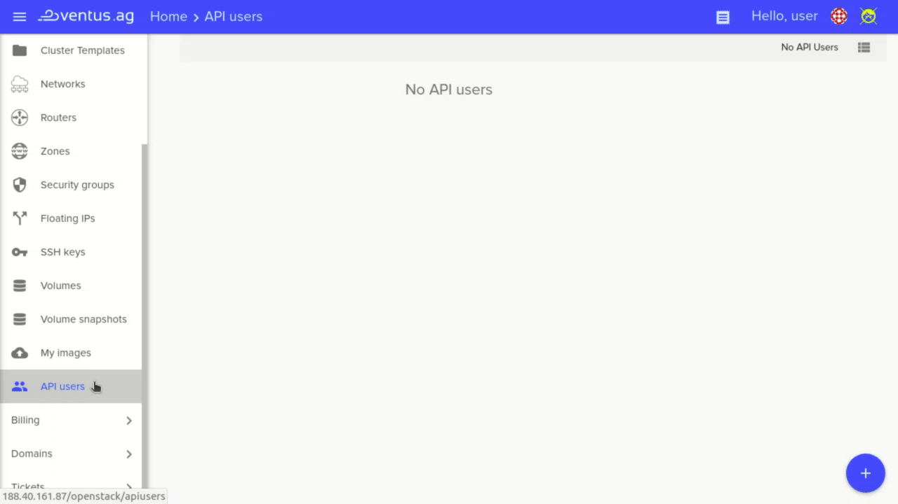

# API Users
{: .no_toc }
---

## Table of contents
{: .no_toc .text-delta }

1. TOC
{:toc}

## Create new API User

For creating new API User do following:

1) On the main Navigation Panal go to  `Cloud`, choose `API Users` and click the floating button `+` present in the lower right corner   
  

2) On the following page enter the user name (Eg. "User1"), password and an optional description as shown below: 
   

Once a user is created, you will be able to access OpenStack endpoints directly with your project ID, username and password.

## Delete an API User
To delete an api user, just click on the delete button in the card or list view and on the following page confirm your action as shown below:
 
 

**For example, see a quick recap**

