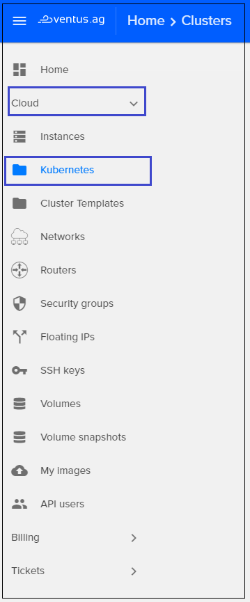

# Clusters
{: .no_toc }

  

## Table of contents
{: .no_toc .text-delta }

1. TOC
{:toc}

## Create new Kubernetes Cluster

For creating new Kubernetes Cluster do following:

1) On the main Navigation Panel go to  `Cloud`, choose `Clusters` and click the floating button `+` present in the lower right corner   

  

2) On the following page enter the `Cluster name`, and select `Cluster template`: k8s_1.15.6_at29_stable

 

3) Then fill the next fields: 
- `Master count`  
- `Node count`  
- `Node flavor`    
- `Docker volume size (GB)`
- `Master node flavor`  
- `Keypair`  

4) Hit `Create Cluster` and the new Kubernetes Cluster will be added. Estimate creation time about 5 minutes.

    

## View Kubernetes Cluster details
To find more details about your Kubernetes Cluster just click on cluster box from Kubernetes page. A new page will open and here you’ll find all details about your Kubernetes Cluster:

- **Cluster name**
- **Cluster status**
- **INFO**: 
    - ID
    - Created at
    - Updated at
    - Cluster template
    - Status reason  
- **NODES**:
    - Master count
    - Node count
    - API Address
    - Master Addresses
    - Node Addresses    
- **MISCELLANEOUS**:
    - Discovery URL
    - Cluster create timeout
    - Keypair
    - Master flavor
    - Node flavor
    - Health status  
- **LABELS**
And few icons of quick actions:
    - *Resize*
    - *Get certificate*
    - *Delete*  

 

## Delete a Kubernetes Cluster
To delete a Kubernetes Cluster, just click on the delete button in the card or list view and on the following page confirm your action as shown below:  

 
 

