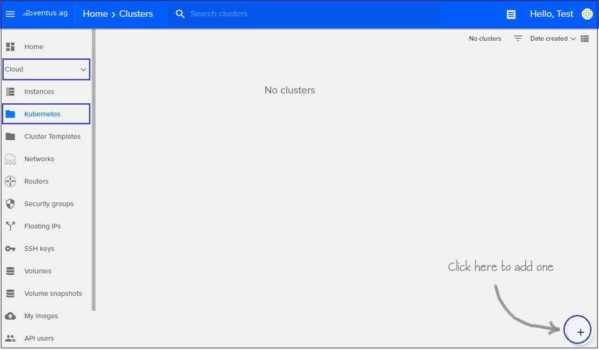
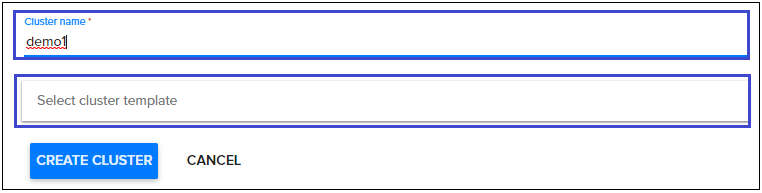
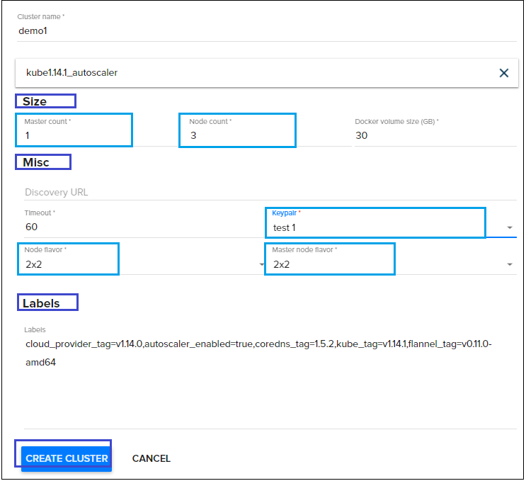
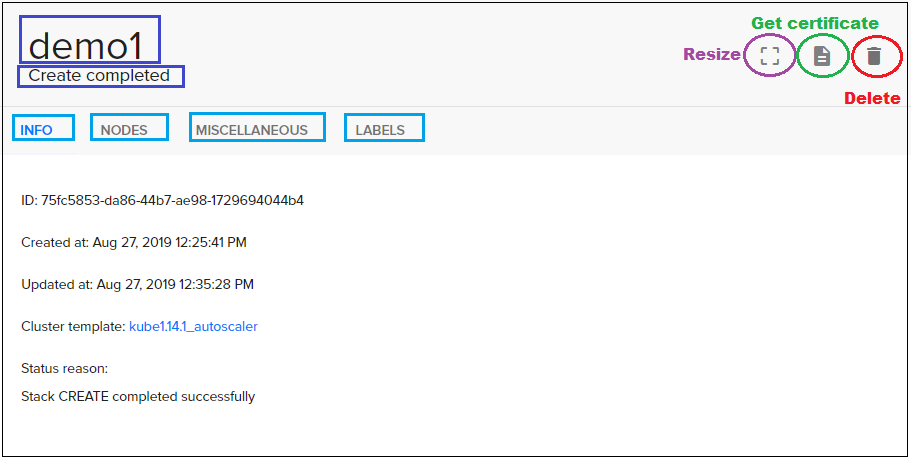
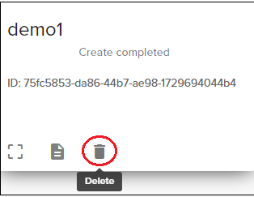
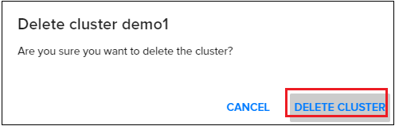

# Clusters
{: .no_toc }

  

## Table of contents
{: .no_toc .text-delta }

1. TOC
{:toc}

## Create new Cluster

For creating new Cluster do following:

1) On the main Navigation Panel go to  `Cloud`, choose `Clusters` and click the floating button `+` present in the lower right corner   

  

2) On the following page enter the `Cluster name` (Eg. "demo1"), and select `Cluster template`

 

3) Then fill the next fields: 
    `Master count`  
    `Node count`  
    `Node flavor`    
    `Master node flavor`  
    `Keypair`  

4) Hit `Create Cluster` and the new Cluster will be added. Estimate creation time about 5 minutes.

    

## View Cluster details
To find more details about your Cluster just click on Cluster box from Clusters page. A new page will open and here you’ll find all details about your Cluster:

- **Cluster name**
- **Cluster status**
- **INFO**: 
    - ID
    - Created at
    - Updated at
    - Cluster template
    - Status reason  
- **NODES**:
    - Master count
    - Node count
    - API Address
    - Master Addresses
    - Node Addresses    
- **MISCELLANEOUS**:
    - Discovery URL
    - Cluster create timeout
    - Keypair
    - Master flavor
    - Node flavor
    - Health status  
- **LABELS**
And few icons of quick actions:
    - *Resize*
    - *Get certificate*
    - *Delete*  

 

## Delete a Cluster
To delete a Cluster, just click on the delete button in the card or list view and on the following page confirm your action as shown below:  

 
 

**For example, see a quick recap**

