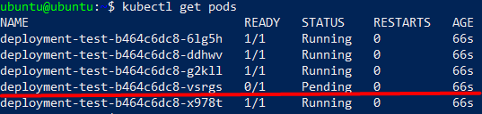
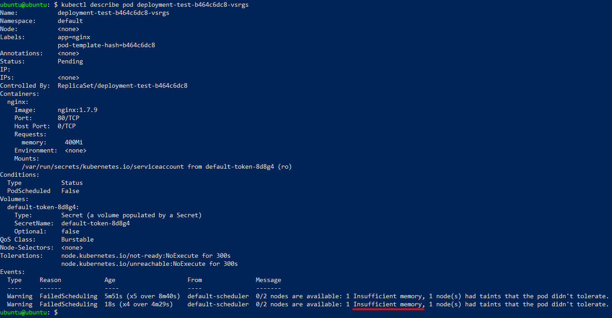
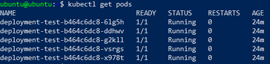

# Scaling cluster memory
---

In this task we will see how to scale cluster memory.


**To scale cluster memory:**  

- go to Cloud page, choose Kubernetes and open your cluster:

   

- In opening cluster choose `Resize`  

 

- Choose how much nodes you need and use action `resize cluster`  

  

- Wait untill update progress will end:  

  

 **Let's see how it works on server side:** 

- Create Kubernetes cluster with existing parametrs (How to create Kubrnetes cluster you can see in this core task <a href="http://docs.ventuscloud.eu/docs/coretasks/Kubernetes">Kubernetes cluster</a>):

```
Master count: 1
Node count: 1
Docker volume size (Gb): 30
Node flavor: Small
Master node flavor: Small
```

- Get access to this cluster (How to getting access to cluster you can see in this core task <a href="http://docs.ventuscloud.eu/docs/coretasks/access-by-cli">Access to Kubernetes Cluster using CLI</a>) 

- Create `deployment-test.yaml` file with existing lines: 

```yaml
apiVersion: apps/v1
kind: Deployment
metadata:
  name: deployment-test
  labels:
    app: nginx
spec:
  replicas: 5
  selector:
    matchLabels:
      app: nginx
  template:
    metadata:
      labels:
        app: nginx
    spec:
      containers:
      - name: nginx
        image: nginx:1.7.9
        resources:
          requests:
            memory: "400Mi"
        ports:
        - containerPort: 80
```
- Create deployment using `kubectl apply -f deployment-test.yaml` to crate deployment.

- Used comand `kubectl get pods` we will see that one of pods can't move in running state:



- Used command `kubectl describe pod "podname"` we will see that this pod have problem: `Insufficient memory` 



- Now resize cluster and add one more node like we saw on steps earlier.

- Used comand `kubectl geet pods` and make sure that all pods in running state: 

