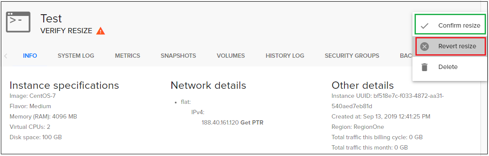
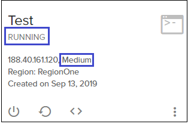
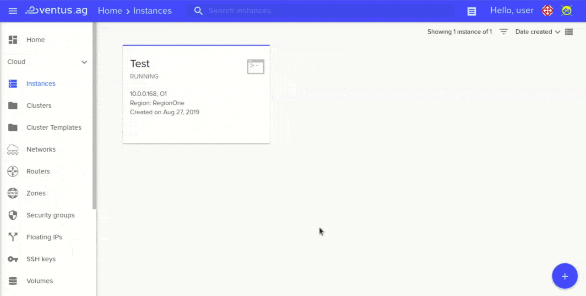

# Scaling cluster memory
---

In this task we will see how to scale cluster memory.


**To scale cluster memory:**  
- go to Cloud page, choose Kubernetes and open your cluster:
   

- In opening cluster choose `resize`  
 

- Choose how much nodes you need and use action `resize cluster`  
  

- Wait untill update progress will end:  
  

 **Let's see how it works on server side:** 

- Create Kubernetes cluster with existing parametrs (How to create Kubrnetes cluster you can see in this core task: <a href="http://docs.ventuscloud.eu/docs/coretasks/Kubernetes">Kubernetes cluster</a>):

```
Master count: 1
Node count: 1
Docker volume size (Gb): 30
Node flavor: Small
Master node flavor: Small
```

- choose `Cofirm resize` from the instanse menu to confirm migration was successful, otherwise choose `Revert resize` to revert back to the initial state.  
    
 
Our instance was resized and its status becomes *running*.  
 

**For example, see a quick recap**

