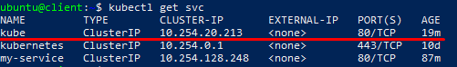
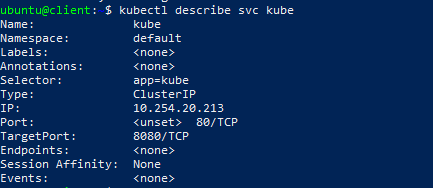

# Services
{: .no_toc }
---

 

 - <a href="https://ventus-ag.github.io/docs/docs/coretasks/Clusters">Kubernetes</a>
 - Get access to your cli 

## Table of contents
{: .no_toc .text-delta }

1. TOC
{:toc}

## Introducing services

A Kubernetes Service is a resource wich we create to make a single way of entry to a group of pods providing the same service. In Kubernetes, a Service is an abstraction which defines a logical set of Pods and a policy by which to access them. Each service has an IP address and port that never change while the service exists. We can connect to that IP and port, and those connections are then routed to one of the pods backing that service. 

## Service creating

To create new Service do next steps:

1) Create a `yaml` file called for example `kube-svc.yaml` with the following listing’s contents: 

```yaml
apiVersion: v1
kind: Service
metadata:
  name: kube
spec:
  ports:
    - port: 80
      targetPort: 8080
    selector:
      app: kube
```   

You’re defining a service called kube, which will accept connections on port 80 and
route each connection to port 8080 of one of the pods matching the app=kube
label selector. 

2) Create the service by using next command:
- `kubectl create -f kube-svc.yaml`.

 

Now you can list all Service resources in your namespace and see
that an internal cluster IP has been assigned to your service. To see it use the command:
- `kubectl get scv` 

  

## ClusterIP

**ClusterIP** - Default Service type, wich exposes the Service on a cluster-internal IP and makes it only reachable from within the cluster. We can use command: `kubectl describe svc kube` to see this type in our Service's details.





