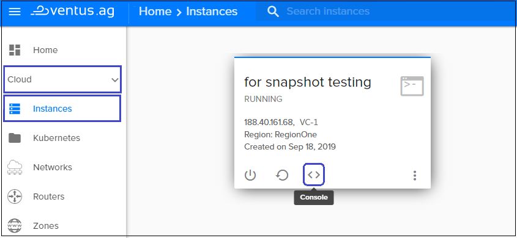
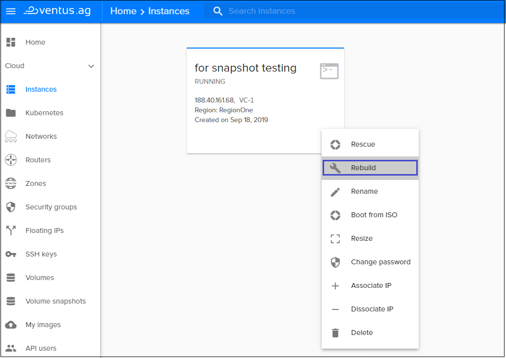
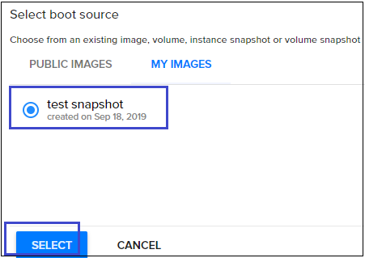

# Snapshots
{: .no_toc }
---
In this page, you can find an explanation of what is snapshot, how it works,how to create snapshot and other information about managing snapshots.

## Table of contents
{: .no_toc .text-delta }

* TOC
{:toc}

## What is snapshot

**Snapshot** is the state of a instance at a particular point in time.
Snapshots are useful any time you need to rollback instance to it's previous state at specific point in time. For example, before performing a risky operation on instance (software installation, OS upgrade, etc) you can create a snapshot to be able to rollback to previously working state if something goes wrong. 

So you can use them to backup your instance and restore it later. Also, you can duplicate an instance by making a snapshot of an instance and boot new instance using previously created snapshot.

Snapshot takes no time to create, and initially uses no disk space, because it stores only the incremental changes needed to roll the volume back to the state at the time the snapshot was created. The storage used by a volume's snapshots does not count against the volume's quota. 



## How snapshot works

This section will show us the snapshot in action.
On the main Navigation Panel go to `Cloud` and choose `Instances`. On this page choose one of available instances or create a new for testing a snapshot and then launch the console window of the selected instance.

Let's create a file (eg. file1.txt) and write some words into it (eg. File before snapshot)

So, we checked, that we can clearly work in our Instance, which name is "for snapshots testing", and now we have only one file in it, which name is "file1.txt"

If we decided that we need to backup our instance in this current state because performing operations can be risky we should create a snapshot of this instance.

### Create snapshot
To create snapshot of your current instance:
- select your instance and click on **Snapshots tab**  
- click on the button `Create Snapshot`
- on the next page type the name of your new snapshot (eg. "test snapshot")
- click on the button `Create Snapshot` again  

Okay, now we can assume that we used our ability to copy (or snapshot)server successfully.

Now we can continue to work in our Instance "for snapshots testing" through the console. Let's create a file (eg. file2.txt) and write some words into it (eg. File after snapshot)

So, we checked that we still can work with our Instance and now we have two our files  "file1.txt” and “file2.txt”.

But, if we decide that we need to rollback, we can return to the previous state of our Instance. 

### Return to the previous state of Instance
For return to the previous state of our Instance:
- click on the button `More` and choose `Rebuild` 
  
  

- on the next page click `change` to change the boot source selected   

- on the next page click `my images`, choose a snapshot which version of instanse you want to return and click `select`  
  

- click `Rebuild Instance` and we returned to the previous state of our Instance  
 

And after that action if we open a console, we can see that we again have only one file with name "File1" on our Instance. It confirmed that we can backup our instance in current state that we want.

**For example, see a quick recap**

