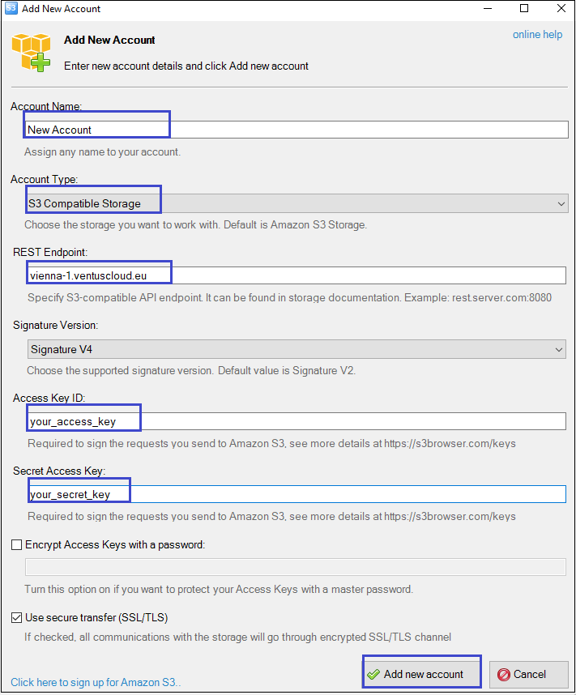

# Object Storage
{: .no_toc }

## Table of contents
{: .no_toc .text-delta }

1. TOC
{:toc}

## Introduction to Object Storage

The Ventus Cloud Object Storage makes it possible to store practically limitless amounts of data, simply and cost effectively. It provides a fully distributed, API-accessible storage platform that can be integrated directly into applications or used for backup, archiving, and data retention.

It's built for scale and optimized for durability, availability, and concurrency across the entire data set. Swift is ideal for storing unstructured data that can grow without bound.

An Object Storage API differs from a conventional filesystem: instead of directories and files, you manipulate containers where you store objects. A container can hold millions of objects.

There is no notion of hierarchy with containers: you cannot nest a container within another, however you can emulate a nested folder structure with a naming convention for your objects. 

## Use the Object Storage by the Python API

Before we start to configure Object Storage with the Python API we need to do next:
- Create new API User (how to do this you can find in coretask API Users)
- Get access to Ventus Cloud CLI  

### Get access to Ventus Cloud CLI

To get access to Ventus Cloud CLI you need do following:

1) Install Python Client by running the next command:

```
sudo apt install python-pip
```

2) Install openstack cli tool by running two next commands one by one: 

```
sudo pip install python-openstackclient
sudo pip install python-magnumclient
```

3) Create "openrc" file to your server Test_Inst 

```
vi openrc
```

Сheck that there were indicated the correct OS_USERNAME and  OS_PROJECT_ID:

```
export OS_ENDPOINT_TYPE=publicURL
export OS_INTERFACE=publicURL

# COMMON OPENSTACK ENVS
export OS_USERNAME=Test_User
export OS_PROJECT_ID=b38e8ed15b4f49cbad07171122334455
echo "Please enter your OpenStack password as user $OS_USERNAME: "
read -sr OS_PASSWORD_INPUT
export OS_PASSWORD=$OS_PASSWORD_INPUT
export OS_AUTH_URL=http://cloud.vstack.ga:5000/v3
export OS_NO_CACHE=1
export OS_USER_DOMAIN_NAME=Default
export OS_PROJECT_DOMAIN_NAME=Default
export OS_REGION_NAME=RegionOne

# For openstackclient
export OS_IDENTITY_API_VERSION=3
export OS_AUTH_VERSION=3
```
Then press `Esc :wq`, and `Enter` to save the changes.

4) Execute "openrc" file starting with dot:

```
. openrc
```

5) Provide password of created API user and hit `enter` - this password will be used to authenticate you in the Ventus Cloud.


### Configure Object Storage with the Python API

1) Python support is provided through a fork of the boto3 library with features to make the most of Ventus Cloud Object Storage. To install it 
run the command bellow
```
pip install boto
```
2) To connect to COS, a client is created and configured using credential information. These values can also be automatically sourced from a credentials file or from environment variables. To get this information type:
```
openstack --os-interface public ec2 credentials list
```
After this command you can see your credential information, remember the access_key, secret_key, because you need this information in the following steps.

3) Next you need to create new file (ex. s3.py ) with the next phyton code:
```
vi s3.py
```
```
import boto
import boto.s3.connection
access_key = 'your_access_key'
secret_key = 'your_secret_key'

conn = boto.connect_s3(
        aws_access_key_id = access_key,
        aws_secret_access_key = secret_key,
        host = 'cloud.vstack.ga',
        port = 8080,
        
        calling_format = boto.s3.connection.OrdinaryCallingFormat(),
        )

bucket = conn.create_bucket('my_new_bucket')

for bucket in conn.get_all_buckets():
        print "{name}\t{created}".format(
                name = bucket.name,
                created = bucket.creation_date,
        )

```
Remember to replace the ‘your_access_key’ and 'your_secret_key' part with your credential information.

Then press `Esc :wq`, and `Enter` to save the changes.

4) To execute your created "s3.py" file type the next:

```
python s3.py
```
If the execution was completed without a problem, you should see the next output, what meens that we have already created the new bucket, which name is my_new_bucket :
```
my_new_bucket  2019-10-09T08:13:19.071Z
```

So, as we can see, by using phyton code, we have just:

- created a connection so that you can interact with the server
- created a new bucket called my_new_bucket
- got a list of Buckets that you own and printed out the bucket name and creation date of each bucket.

## Use the Object Storage by the client S3 Browser

The S3 Browser is the second way, after the the Python API, how you can use  Ventus Cloud Object Storage and manage stored data in it.

S3 Browser is  a simple web services interface that can be used to store and retrieve any amount of data, at any time, from anywhere on the web.  It can be used to deliver your files using a global network of edge locations.

To install it on your computer, go to the next page <https://s3browser.com/>

After instalation you can open on your computer S3 Browser and see the next interface of this programm:  
 

To start work with Ventus Cloud Object Storage you need to get access to your Ventus account, what need to use your credential information too. To get this access on the main Navigation Panel go to  `Accounts`, choose `Add new account` and on the following page fill in fields as shown below:  


So now you have access to your Ventus Cloud Object Storage through the S3 Browser. You can add a new bucket or delete a bucket just by clicking on the one of the butoons:


