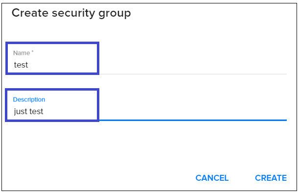

# Security Groups
{: .no_toc }
---
In this page, you can find an explanation of how to create a new security group, edit it, add or delete security rules and how to delete existing security group in Ventus Cloud Portal.

## Table of contents
{: .no_toc .text-delta }

1. TOC
{:toc}

## What is Security Group
**A security group** is a named collection of network access rules that are use to limit the types of traffic that have access to instances. When you launch an instance, you can assign one or more security groups to it. If you do not create security groups, new instances are automatically assigned to the default security group named `fleio`, unless you explicitly specify a different security group.

The associated rules in each security group control the traffic to instances in the group. Any incoming traffic that is not matched by a rule is denied access by default. You can add rules to or remove rules from a security group, and you can modify rules for the default and any other security group.

To find *Security Group page* in Ventus Cloud Portal you need on the main Navigation Panel to go to `Cloud` and choose `Security Group`. When you access this page a list of existing security groups with their details area are displayed in card or list format:  
*card format:*  
  

*list format:*  
    

Clicking on a security group box will take you to a security group details page, where you can see details for a security group, all the rules belonging to that group and associated instances:
  

## Create a new Security Group
For creating new Security Group do the following:  
1) Go to `Security Group page` and click the plus `(+)` button from at the bottom-right of the screen:     

    

2) On the following page fill up the `group name`, `description` and click `Create`:  
   

3) Hit `Create` and the new Security Group will be created:  
 

## Add security rules 
By default newly created Security Group denies all incoming traffic and allows only outgoing traffic to your instance:  
  

In order to allow network traffic you will need to add some additional security rules.

To add a new security rule do the following:  
1) Click the icon for quick action `Add rule` on security group list or details page: 
   

2) On the following page fill up the next fields:  
`Rule protocol` - the type of rule;  
`Description` - this field is optional, you can leave none selected;  
`Direction` - the direction of network traffic for the rule - can be *Ingress* or *Egress*;  
`Remote source of traffic` - you can select here *IP Addresses (CIDR)* or another *security group* to apply the rule for; 

If you choose *IP Addresses (CIDR)*, next you need to specify  `Remote IP prefix`:  
     

If you choose *security group*, next you need select `Remote security group` and `Enter type` of ethernet protocol (can be either *IPv4* or *IPv6*):   
    

3) Hit `Create` and the new rule will be created:  
 

**Note:** For some specific kinds of rules more fields are available.  

**The custom TCP rule** and **The custom UDP rule**   
This kinds of rules have the following extra fields:    
`Port or range` - the TCP or UDP port or range to apply this rule to;  
`All ports` - checkbox allowing you to apply this rule to all TCP or UDP ports.    
  
    

**The custom ICMP rule**  
This kind of rules has the following extra fields:  
`ICMP Type` - type of ICMP packet;  
`ICMP Code` - the ICMP error codes.  
   

**The custom other protocol**  
This kind of rules has the following extra fields:   
`Protocol` - the protocol code;  
`Port or range` - the port or range to apply this rule to;  
`All ports` - checkbox allowing you to apply this rule to all ports.  
  

## Edit a Security Group  
To edit an existing group do the following:  
1) Click the icon for quick action `Edit security group` on groups list or on group details:  
    

2) On the following page you can change group name or description:  
   

3) Hit `Save` to save the changes:  
    

## Delete a Security Group  
To delete an existing group do the following:  
1) Click the icon for quick action `Delete` on groups list or on group details:  
    

2) On the following page confirm your action:  
  

## Delete security rules  
Security rules can be deleted on security group details page:  
  

