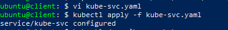
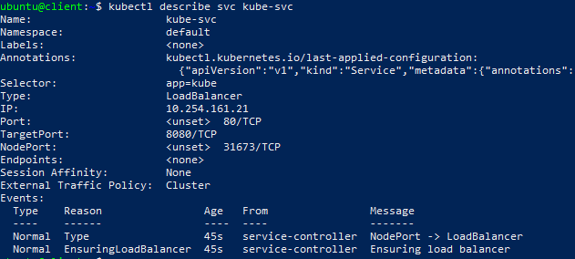

# LoadBalancer
{: .no_toc }
---

 
 - <a href="https://ventuscloud.eu/docs/kubernetes/services">Services</a>


## Table of contents
{: .no_toc .text-delta }

1. TOC
{:toc}

## What is LoadBalancer 

**LoadBalancer** - Service type wich have its own unique, publicly accessible IP address and will redirect all connections to your service. You can thus access your service through the load balancer’s IP address.

## Loadbalancer Service creating

We can create LoadBalancer Service with two ways:

1) Create a `yaml` file called for example `kube-svc.yaml` with the following listing’s contents: 

```yaml
apiVersion: v1
kind: Service
metadata:
  name: kube-svc
spec:
  type: LoadBalancer 
  ports:
    - port: 80
      targetPort: 8080
  selector:
    app: kube
```   
Use `kubectl create -f kube-svc.yaml` command to create LoadBalancer Service.

2) If you already created Service you can edit it with command:
- `kubectl edit svc kube-svc`.

Make nessesary changes and saved. It will be automatically applyed to your cluster.

 


Now you can list all Service resources in your namespace and see
that an internal cluster IP has been assigned to your service. To see it use the command:
- `kubectl get scv` 

Now we can use command: `kubectl describe svc kube-svc` to see LoadBalancer type in our Service's details.

  


