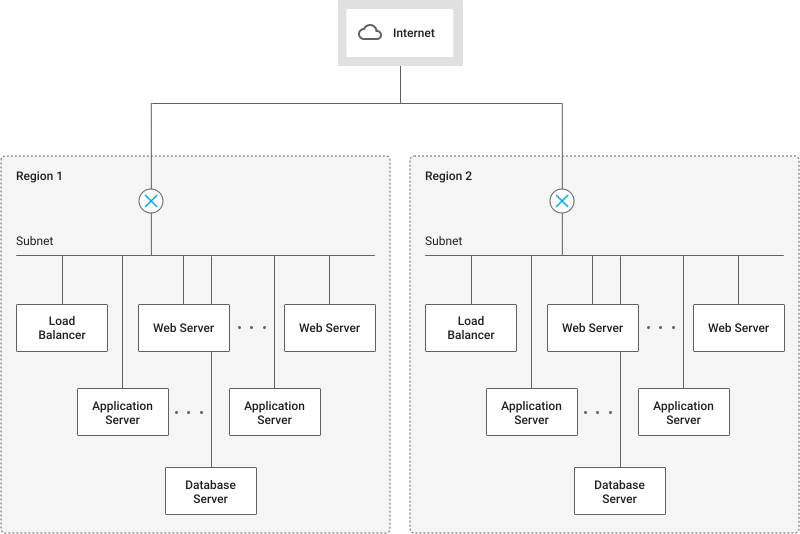
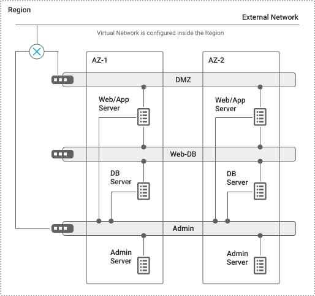

# Platform Overview
{: .no_toc }



## Table of contents
{: .no_toc .text-delta }

1. TOC
{:toc}

## Cloud computing services

Cloud computing services provide a set of baseline services, which include compute, storage, networking, access management, and often database services.

OpenStack’s baseline services include:

- Compute: OpenStack Compute (Nova and Glance)
- Storage: OpenStack Block Storage (Cinder)
- Networking: OpenStack Networking (Neutron)
- Identity and access management: OpenStack Identity Service (Keystone)

## Sample architecture

This section describes how you might build a 3-tier web application system on OpenStack.

A typical 3-tier web application consists of the following components:

- Load balancer
- Web server
- Application server
- Database server

The sample OpenStack configuration shown in figure 1 has the following characteristics:

- You deploy resources across two regions as two separate failure domains for redundancy.
- The network uses a single subnet for all tiers in each region, and all servers are virtual machine (VM) instances.
- You define security groups for the four server roles and assign them to the appropriate instances.
- A Cinder volume is attached to the database server as a data volume. To ensure redundancy across failure domains, the database in the active region is backed up to object storage and restored to the one in the backup region when necessary. (This architecture does not use real-time database replication, because bandwidth is limited between regions.)
- This architecture provides an active-backup configuration. When you failover the service to another region, you restore the most recent backup to the database server in the backup region.

## Regions and Availability zone
In OpenStack, a region can span multiple data centers and consists of availability zones. Availability zone is commonly used to identify a set of servers that have a common attribute

|Entity   |Notes  |
|:---------|:---------|
|Region             |Defined as a single cluster that is managed by dedicated controller nodes.  |
|Availability Zone  |Defines multiple groups of resources, such as compute nodes and storage enclosures.|

Deploying your application across multiple regions can help protect against unexpected failures. Regions are considered independent failure domains, because availability zones in a single region share the same controller nodes. 

## Tenants

Resources within a single tenant can work together easily, for example by communicating through an internal network. Resources in tenant are isolated from other tenants; you can only interconnect them through an external network connection.

This model allows to create tenant for separate divisions or groups within the company. This model can also be useful for testing purposes: after you're done with a project, the tenant can be deleted. In OpenStack, only systems administrators can create new tenants.

## Network configurations

In a typical OpenStack Neutron deployment, each tenant’s virtual network is contained in its own private network space. As shown in figure 1, you don't necessarily have to use multiple subnets, but you can configure multiple subnets if you need to. Figure 3 shows an OpenStack virtual network that consists of a single virtual router and three virtual switches. Two of the virtual switches connect to the external network through the virtual router. AZ-1 and AZ-2 are availability zones.

## IP addresses

In Neutron, VM instances in a private network communicate through virtual switches and routers using private IP addresses assigned at launch. Global IP addresses are not assigned by default.

The virtual router handles access from VM instances to the external network, so that instances share the common global IP address assigned to the virtual router. To expose an instance to the external network and allow connections from external users, you assign a floating IP address to the instance from a pool of global IP addresses.

Because the virtual network is contained in a single region, instances in different regions must use the floating IP addresses to communicate over the external network.

A single network can include multiple virtual routers. VM instances connected to different routers can’t communicate directly with private IP addresses; however, they communicate through the external network using floating IP addresses.

## Firewalls

In OpenStack, a single security group contains multiple access control lists (ACLs), which are independent of VM instances. You assign a security group to a VM instance to apply the ACLs to the instance. Usually you define security groups according to VM instance roles, such as web server or database server.

For example, for the sample architecture, you define the following security groups for each region:

|Security Group  |Source  |Protocol  |
|:---------|:---------|:---------|
|load-balancer	     | any         | HTTP/HTTPS         |
|     | Management Subnet	         |      SSH   |
|web-server	     | load-balancer	         | HTTPS         |
|     |    Management Subnet	     |     SSH    |
|web-application	     |   web-server	      |     TCP 8080    |
|     |Management Subnet	         | SSH         |
|database     |      web-application	   |  MYSQL       |
|     |    Management Subnet	         | SSH         |

You can specify the packet source with a subnet range or the name of a security group. In the preceding table, Management Subnet stands for a subnet range from which system administrators sign in to the guest OS for maintenance purposes.

This architecture assumes that client SSL is terminated at the load balancer, which communicates to web servers by using HTTPS. Web servers communicate to application servers with TCP 8080. MySQL is used for the database server.

After defining these security groups, you assign them to each instance as follows:

|Instance  | Security Group  |
|:---------|:---------|
|Load Balancer     | load-balancer         |
|Web server     | web-server         |
|Application server     |web-application         |
|Database server     |database         |

## Storage

OpenStack provides two options for instance-attached disks: ephemeral disks and Cinder volumes.

Ephemeral disks were designed to be used as system disks that contain operating system files, and Cinder volumes were designed to store persistent application data. Because live migration is not available with ephemeral disks, however, people often use Cinder volumes for system disks, too.

When an ephemeral disk is used as a system disk, an OS template image is copied into the local storage of a compute node, and the local image is attached to the instance. When the instance is destroyed, the attached image is also destroyed.

Cinder volumes provide a persistent disk area that resides in external storage devices. In typical deployments, the block device is attached to the compute node using the iSCSI protocol, and attached to the instance as a virtual disk. When the instance is destroyed, the attached volume remains in the external device and can be reused from another instance.

Application software running on the instance can also access the object storage provided by OpenStack Swift.

## VM instances

When you launch a new VM instance in OpenStack, you choose an instance type to specify the instance size, such as the number of vCPUs and the amount of memory. If you have an appropriate access right assigned by the system administrator, you can define additional instance types. General users are not allowed to add custom instance types.

OpenStack provides a metadata service to retrieve VM instance information from the instance guest operating system (guest OS), such as instance type, security groups, and assigned IP addresses. You can also add custom metadata in key-value form. OpenStack provides a type of metadata called `user-data`. You can specify an executable text file as `user-data` when you launch a new instance to have the `cloud-init` agent running in the guest OS execute startup configuration tasks according to its contents, such as installing application packages. You use the URL under `http://169.254.169.254/latest/meta-data` to access metadata from the guest OS.

## Guest operating system agent

In OpenStack, the agent package called `cloud-init` is preinstalled in the standard guest OS images. It handles the initial configuration tasks at the first boot time, such as extending the root filesystem space, storing an SSH public key, and executing the script provided as `user-data`.

## Access control

OpenStack Keystone provides access control for service APIs based on user account, but does not provide instance-based access control for application APIs, such as read-write permission on object storage or database. You can implement custom access control for application APIs if necessary.
