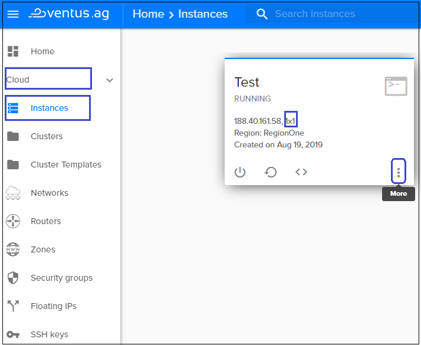
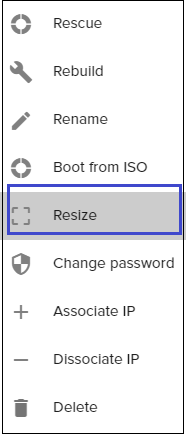
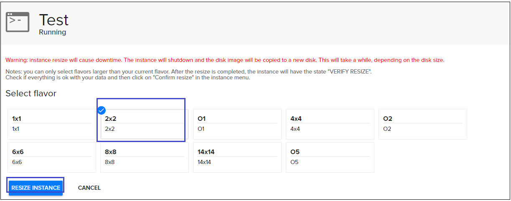
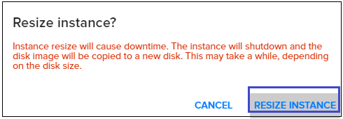

# Resize virtual machines
---

One of the great benefits of Ventus VMs is the ability to change the size of your VM based on the needs for CPU, Network or disk performance. 

**To resize the current instance:**  
- go to Instances page, choose instance, which size you want to change (eg. "Test" which flavor is 1x1)   
   

- click on bottom `more` and choose action `resize`  
  

- choose new flavor of instance you need and click `resize instance`  
  

- confirm the resizing - click `resize instance` again  
  

- check if files have been succesfully migratet to the new instance disk

- choose `Cofirm resize` from the instanse menu to confirm migration was successful, otherwise choose `Revert resize` to revert back to the initial disk  
  
 
Our instance was resized and its status becomes *running*.
 

