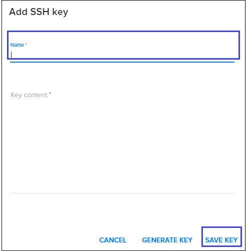
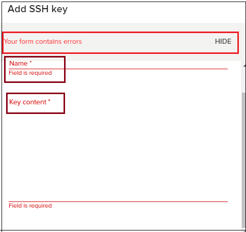
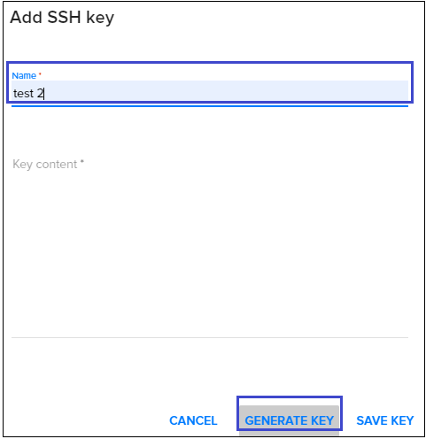
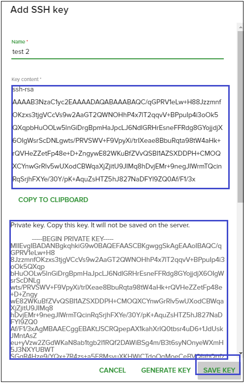
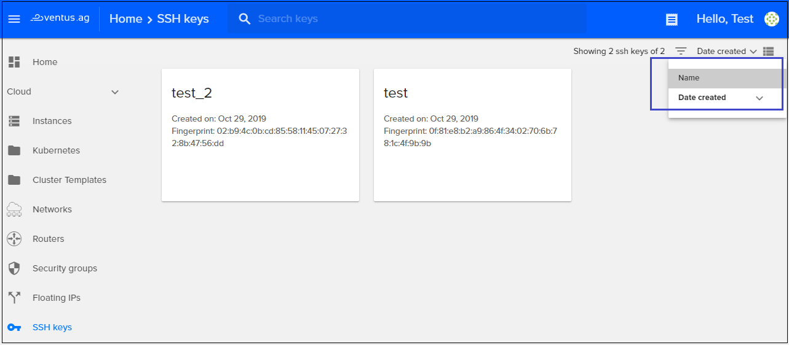
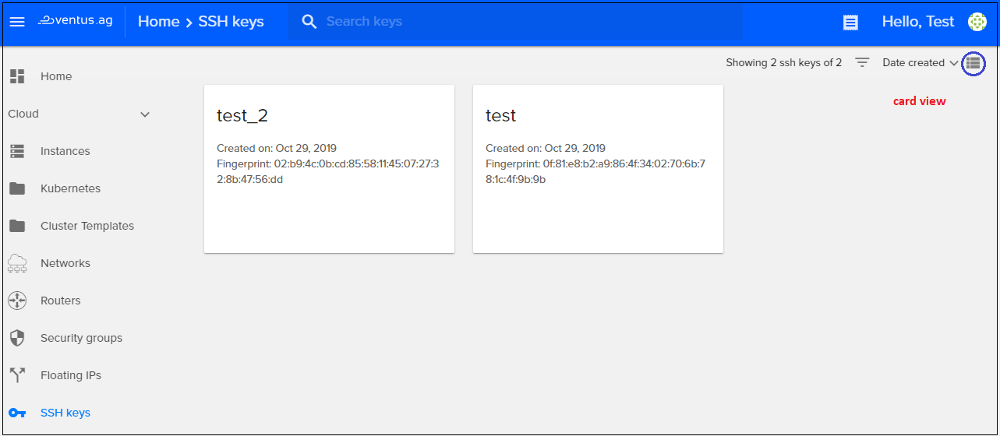
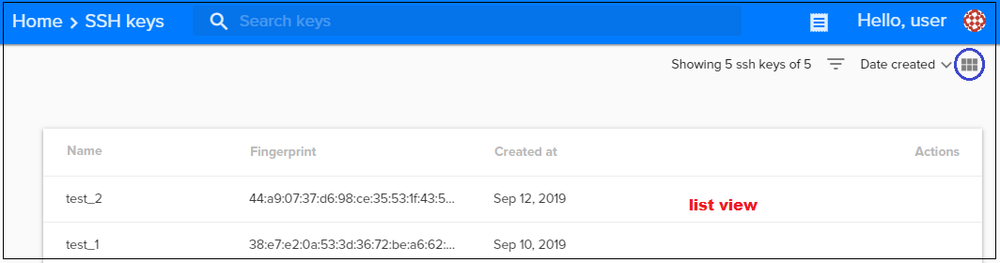
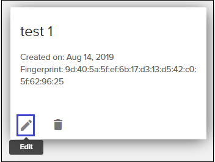
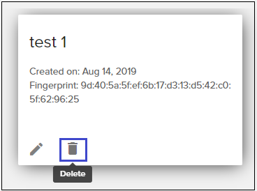

# SSH Keys
{: .no_toc }
---
In this page, you can find an explanation of how to add or generate a new SSH key, how to search for a SSH key and sort it, how to edit and delete a SSH key and other SSH key management actions.

## Table of contents
{: .no_toc .text-delta }

1. TOC
{:toc}

## Add new SSH key
On the main Navigation Panal go to `Cloud` and choose `SSH Keys`. On this page you find all added SSH Keys whith their details area.

**SSH key details area includes:** 

`SSH key name`: Shows the name for the key so that you can more easily identify it.  

`Creation date`: Shows when a SSH key was created in month-day-year format.  

`Fingerprint`: Shows each Public Key fingerprint which is a sequence of bytes used to identify a longer public key. Fingerprints are created by applying a cryptographic hash function to a Public Key.

To add a SSH key which is already created, go to the SSH keys page and  click the plus `(+)` button from the bottom right *Add SSH Key*.  

On the next page fill next fields:  

`Name`: in this field you will set a name for the key, so you can identify it easier. 

`Key Content`: in this field you will add/paste your public key.  

After filling the specified fields hit **Save Key** and a new SSH key will be added.

If you are prompted with the following message **Your form contains errors**, when trying to add a new SSH key, you have to check: 

`Name`, as there might be some unsafe characters() used. 

`Key Content`, as the SSH public key added might be invalid.  



## Generate new SSH key
In order to generate a new SSH key from the Fleio interface
- click on the plus `(+)` button from the bottom right **Add SSH Key**  
- create a name of a new SSH Key (only letters and numbers are accepted)   
- hit **Generate Key**  

On the next page you can view the next fields: 

`Name`: in this field you will see a name for the key, which you created, so you can identify it easier.

`Key Content`: In this field you will see the generated Public Key.

`Private Key`: This field will provide you the Private Key. 
 
Hit **Save Key** and the new generated SSH key will be added.



## Search for a SSH key
To search a SSH key from your dashboard, type the name in the search box from the top of the SSH keys page.

## Sort SSH keys
From the top-right of the page, you can sort SSH keys by:  
- **Name**  
- **Date created**  

Also, you can switch from Card View to List View by clicking on the grid from top-right. Examples are shown below:  

## Edit a SSH key
To edit a SSH key, click the icon for **Edit** and you will be able to change the `Name` and/or `Key Content`. To finish and save the changes press **Save Key**.  

## Delete a SSH key
To remove a SSH key you have to identify it in the dashboard and click the icon for **Delete**.  

