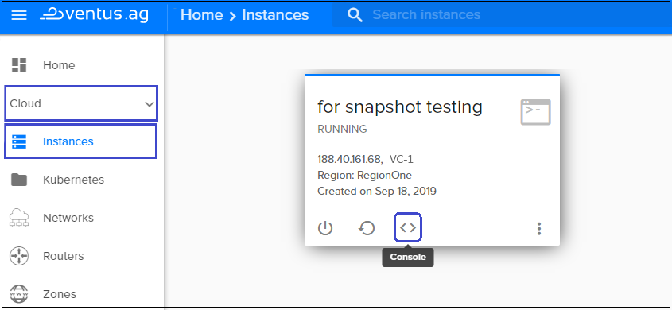

# Snapshots
{: .no_toc }
---
In this page, you can find an explanation of what is snapshot, how it works, how to create snapshot and other information about managing snapshots.

## Table of contents
{: .no_toc .text-delta }

1. TOC
{:toc}

## What is snapshot

**Snapshots are actually images of your current instance.**  Snapshots are useful any time you need to be able to roll back to a known good data set at a specific point in time. For example, before performing a risky operation on a volume, you can create a snapshot to enable rollback capability for the entire volume.

So you can use them to backup your instance and restore it later. Also, you can duplicate an instance by making a snapshot of an instance and install that snapshot as another instance.

A snapshot takes no time to create, and initially uses no disk space, because it stores only the incremental changes needed to roll the volume back to the state at the time the snapshot was created. The storage used by a volume's snapshots does not count against the volume's quota. 



## How a snapshot works

This section will show us the snapshot in action.
On the main Navigation Panal go to `Cloud` and choose `Instances`. On this page choose one of available intances or create a new for testing a snapshot and then launch the console window of the selected intance.

Let's create a file (eg. file1.txt) and write some words into it (eg. File before snapshot)

So, we checked, that we can clearly work in our Instance, which name is "for snapshots testing", and now we have only one file in it, which name is "file1.txt"

If we decided that we need to backup our instance in this current state because performing operations can be risky we should create a snapshot of this instance.

### Create a snapshot
To create a snapshot of your current instance:
- select your instance and click on **Snapshots tab**  
- click on the button `Create Snapshot`
- on the next page create the name of your new snapshot (eg. "test snapshot")
- click on the button `Create Snapshot` again  

Okay, now we can assume that we used our ability to copy (or snapshot)a server image successful.

Now we can continue to work in our Instance "for snapshots testing" through the console. Let's create a file (eg. file2.txt) and write some words into it (eg. File after snapshot)

So, we checked, that we still can clearly work in our Instance, which name is "for snapshots testing", and now we have two files in it, which name are "file1.txt" and "file2.txt"

But if we decide that file2.txt is dangerous for our system, we can return to the previous version of our Instance, by the time the file2.txt has not been created yet. 

### Return to the previous version of Instance
For return to the previous version of our Instance:
- click on the button `More` and choose `Rebuild`
- on the next page click `change` to change the boot source selected
- on the next page click `my images`, choose a snapshot which version of instanse you want to return and click `select`

  
  
  

And after that action if we open a console, we can see that we again have only one file whith name "File1" on our Instance. It confirmed that we can backup our instance in current state that we want.

