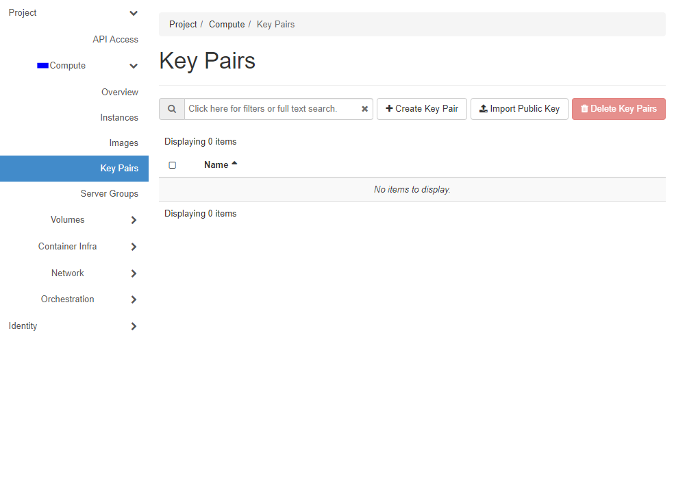

# Create a Linux virtual machine in the VENTUS portal

VENTUS virtual machines (VMs) can be created through the VENTUS portal. The VENTUS portal is a browser-based user interface to create VMs and their associated resources. This quickstart shows you how to use the VENTUS portal to deploy a Linux virtual machine (VM) running ubuntu-1604-xenial. 

## Sign in to VENTUS

Sign in to the [VENTUS portal](https://cloud.vstack.gam).

## Create SSH key pair

You need an SSH key pair to complete this quickstart. If you already have an SSH key pair, you can skip this step.

On the main Navigation Panal go to **Compute**, choose **Key Pairs** and  click the button **Create key pair**.   

## Create virtual machine

1. On the main Navigation Panal go to **Compute**, choose **Instances** and  click the button **Launch Instance**.    

2.  In the **Details** insert the name of the Instance (eg. "VZ1") and click **Next**

3. Select **Instance Boot Source** (eg. Image), declare **Volume Size (GB)** and choose desired image (eg. ubuntu-1604-xenial) by clicking on arrow. After that click **Next**

4.  In the **Flavor** choose which one should manage the sizing for the compute, memory and storage capacity of the instance and click on arrow (eg. 1x1). After that click **Next** 

5. In the **Networks**  you should choose desired networks

6. Open **Security Groups**, after that, choose **default** and click **Next** 

7. In the **Key Pairs**  you should choose one from availables or click the button **Create Key Pair**

8. Launch your Instance by clicking on a **Launch Instance**

It will take a few minutes for your VM to be deployed. When the deployment is finished, move on to the next section.

## View the Instance in action

1. You will see "Instances" menu whith your newly created VM

2. Open the drop-down menu and choose **Console**

3. Click on the black terminal area (to activate access to the console). 
	
4. Enter login and password. 

Now you can type commands. After you finish, type **exit**

## Clean up resources

When no longer needed, you can delete the resource group, virtual machine, and all related resources. To do so, select the resource group for the virtual machine, select **Delete Instances**, then confirm the name of the resource group to delete.

## Next steps

In this quickstart, you deployed a simple virtual machine through the VENTUS portal. To learn more about VENTUS virtual machines, continue to the tutorial for Linux VMs.

