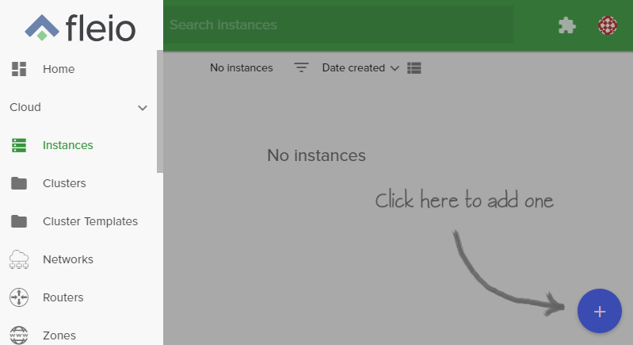
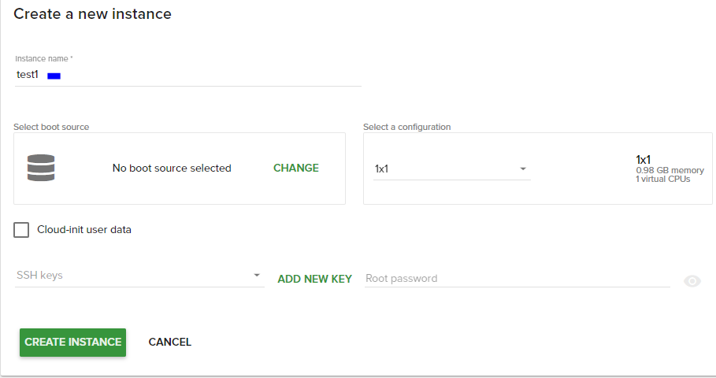
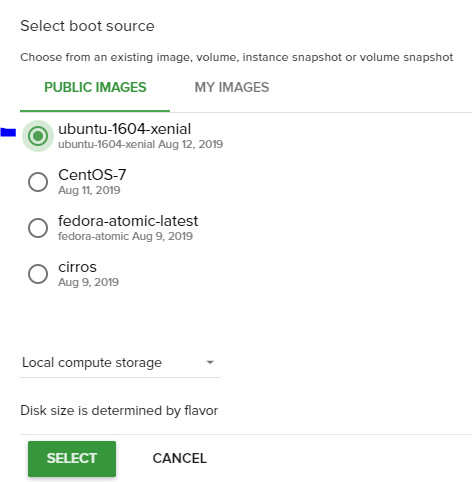
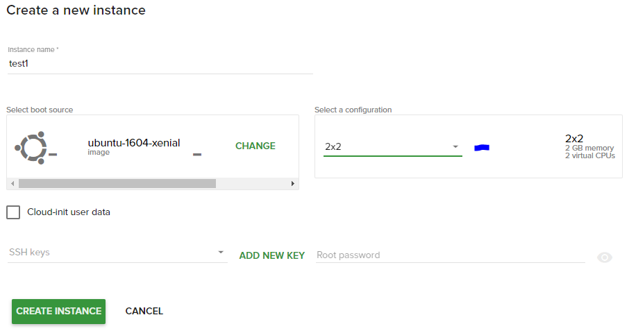
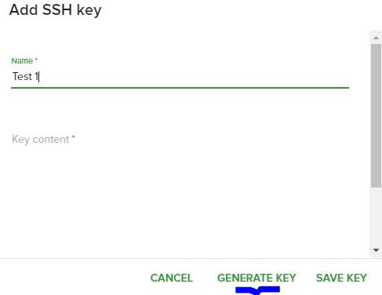
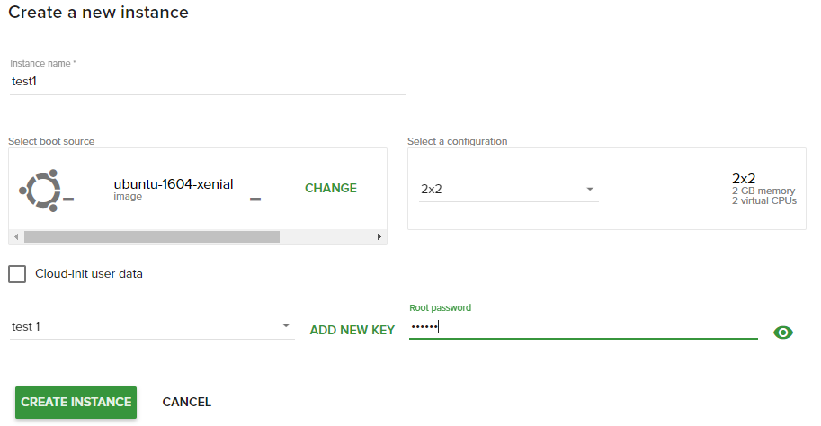

# Create a Linux virtual machine
---


Instances are virtual machines that run inside the cloud.

## Create new instance



For creating new instance do following:

1. On the main Navigation Panal go to **Cloud**, choose **Instances** and  click the plus (+) button from the bottom-right.    

2. On the following page fill in these fields:

- *Instance Name*: 
This will set the name in the Fleio and OpenStack database. The hostname inside the instance will not be set.(eg. "Test1")

- *Select a Region*: 
Select the region (location) of your instance.

- *Select a Boot source*: 
Select the image to boot from, from the list of available images. You can also boot from an instance snapshot if any is available. (eg. "ubuntu-1604-xenial")

- *Select a configuration*: 
Configurations (flavors) hold information about the Instance memory, disk space and the number of virtual CPUs that will be available. (eg. "2x2")

- *Select a SSH Key*: 
A SSH key which you previously added in SSH keys page. Also, you can add your own key or generate a new one to use - cklick the button -Add a new key-, assign a name and click the button **Generate key**. 
This field is optional,you can leave none selected. 

- Root Password: You can view your typed password by clicking on the eye icon from right. The password should be at least 8 characters long and should contain at least one digit, letter or symbol.

3. Hit **Create Instance** and the new instance will be created.

