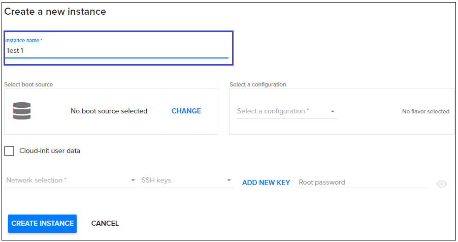
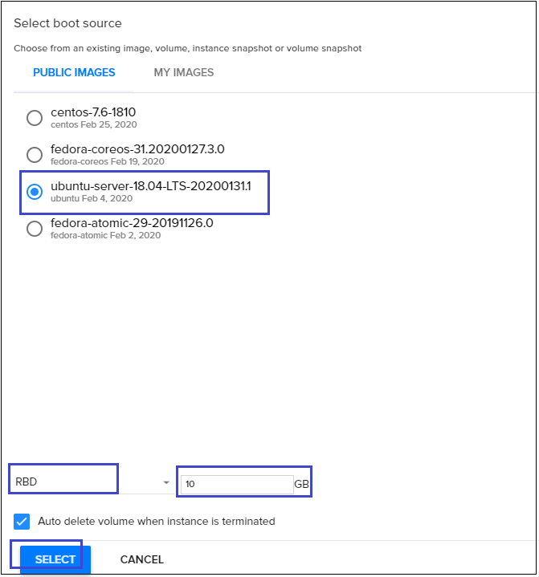
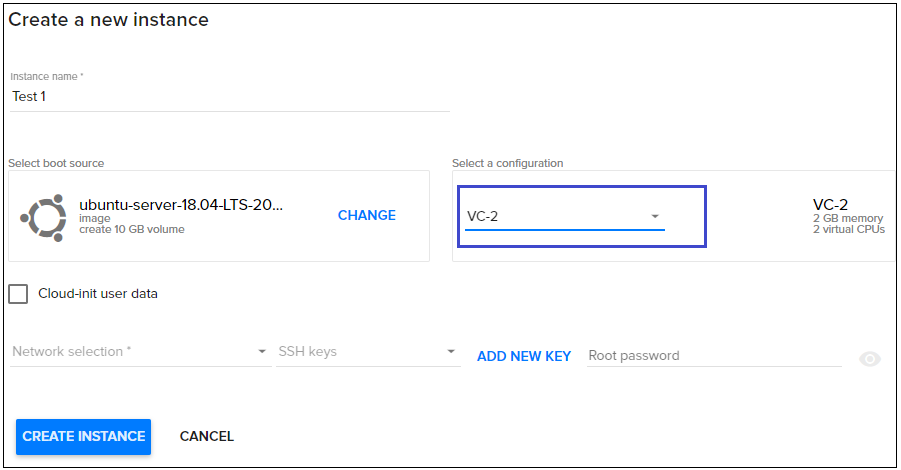
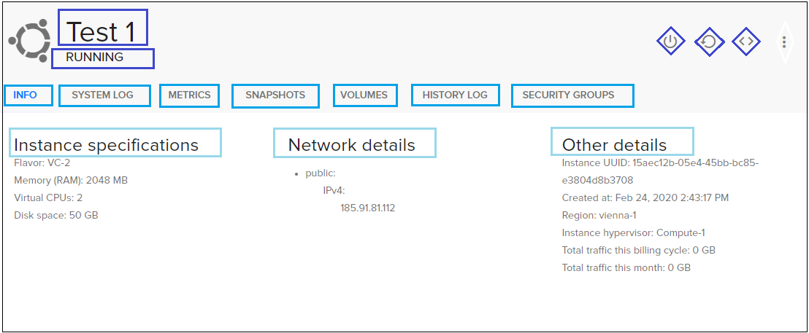
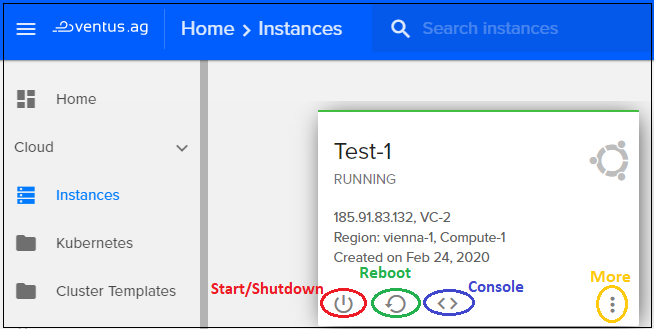
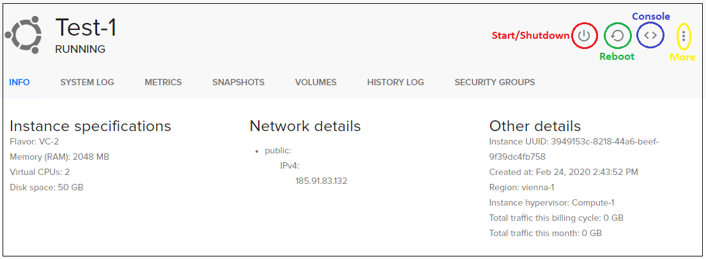

# How to create Linux VM in Ventus Cloud 
{: .no_toc }
---



## Table of contents
{: .no_toc .text-delta }

1. TOC
{:toc}

## Create new instance
---



For creating new instance do the following:

1) On the main Navigation Panel go to **Cloud**, choose **Instances** and  click the plus (+) button from at the bottom-right of the screen.
 


2) On the following page fill in these fields:

- *Instance Name*: 
This will set the name in the Ventus database. The hostname inside the instance will not be set.(eg. "Test1")




- *Select a Boot source*: 
Select the image to boot from, from the list of available images. You can also boot from an instance snapshot if any is available. (eg. "ubuntu-server-18.04-LTS-20200131.1")

- *Select storage type*: 
Select storage type "RBD" and provide preferred disc size




- *Select a configuration*: 
Configurations (flavors) hold information about the Instance memory, disk space and the number of virtual CPUs that will be available. (eg. "VC-2")



- *Network selection*: 
Select network (public or private)

- *Select a SSH Key*: 
A SSH key which you previously added in SSH keys page. Also, you can add your own key or generate a new one to use - cklick the button **Add a new key**, assign a name and click the button **Generate key**. 
This field is optional,you can leave none selected. 


- *Root Password*: 
You can view your typed password by clicking on the eye icon from right. The password should be at least 8 characters long and should contain at least one digit, letter or symbol.


3) Hit **Create Instance** and the new instance will be created.


**For example, see a quick recap**  


## View instance details
---



Instance details area:

- *OS Icon*: Shows instance operating system icon (Centos, Ubuntu, etc.)
- *Instance name*: Could be different from the hostname inside the instance.
- *Instance status*: Depending on the instance state, it could be: Running, Stopped, Mounting, Rescued, etc.
- *Quick actions*: Used for: Shutdown/Start, Restart, Launch Console, More (Rescue, Rebuild, Rename, Resize, Change password, Delete).
- *Instance tab menu*: Access to following subpages: Info, System Log, Metrics, Snapshots, Volumes, History Log, Security Groups
- *Specification*: Details about instance (installed image, flavor, RAM, CPUs, disk space)
- *Network*: Details about network (private and public IPs)
- *Other*: Other details like instance unique number and instance data creation.




## Search for an instance
---

To search for an instance, type your instance name in the search box from the top of the instance page.


## Start / Shutdown / Reboot instance
---

There are two ways in interface for **Start / Shutdown / Restart** your instance:

First one is directly from instance page. In each instance box, there is one icon for **Start/Shutdown** and one icon for **Restart**. See next image for reference:




Second way is from instance details (click on the instance you want)and there you will find, in the top-right of the instance window, one icon for Start/Shutdown and one icon for Restart, as you can see below:




## Login into console
---

You can launch the web-console window directly from instance page or from instance details. Click on the icon *<>*  for launching the web-console.    
After the new window with the web-console will appear, you can login into your VPS with your user details and start working.    
You can also connect to your instance through another Terminal using the SSH protocol and instance-IP:  
```
ssh <IP of instance>
```

## Manage an instance
---

The icon **More** is responsible for managing an instance
So whith this icon **More**, you can:
 - **Rescue instance** (recover your data)
 - **Rebuild instance** (reinstall instance)
 - **Rename instance**
 - **Resize instance** (upgrade CPU, RAM, HDD)
 - **Change root password**


## Delete instance  
---

If you want to delete an instance click the icon **More** and select **Delete**

  


