# How to create Windows Server VM using Ventus Cloud 
{: .no_toc }
---



## Table of contents
{: .no_toc .text-delta }

1. TOC
{:toc}

## Create new instance
---



For creating new instance do the following:

On the main Navigation Panel go to **Cloud**, choose **Instances** and  click the plus (+) button from at the bottom-right of the screen.
 
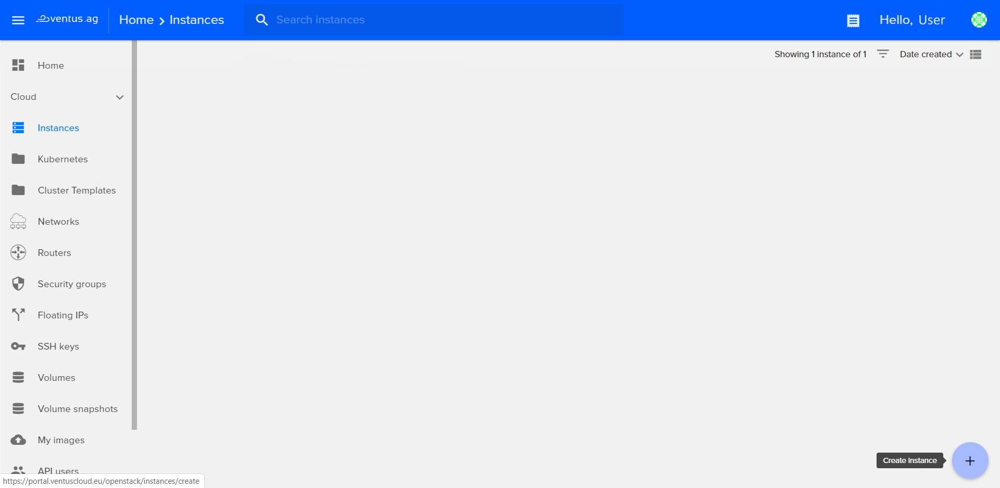

On the following page fill in these fields:

- *Instance Name*: 
This will set the name in the Ventus database. The hostname inside the instance will not be set.(eg. "win-test")

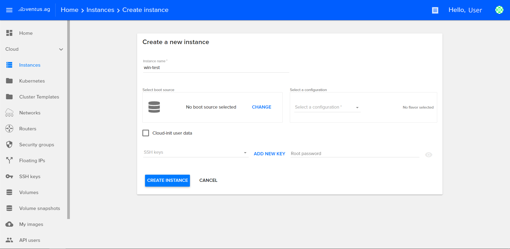

- *Select a Boot source*: 
Select the image to boot from, from the list of available images. You can also boot from an instance snapshot if any is available. (eg. "Windows-server-2019")

- *Select storage type*: 
Select storage type "RBD" and provide preferred disc size

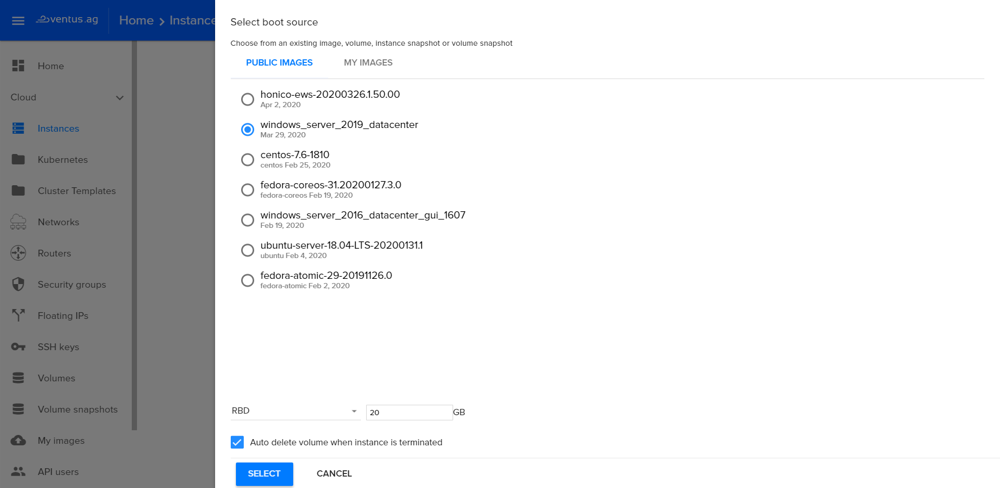

- *Select a configuration*: 
Configurations (flavors) hold information about the Instance memory, disk space and the number of virtual CPUs that will be available. (eg. "VC-2")

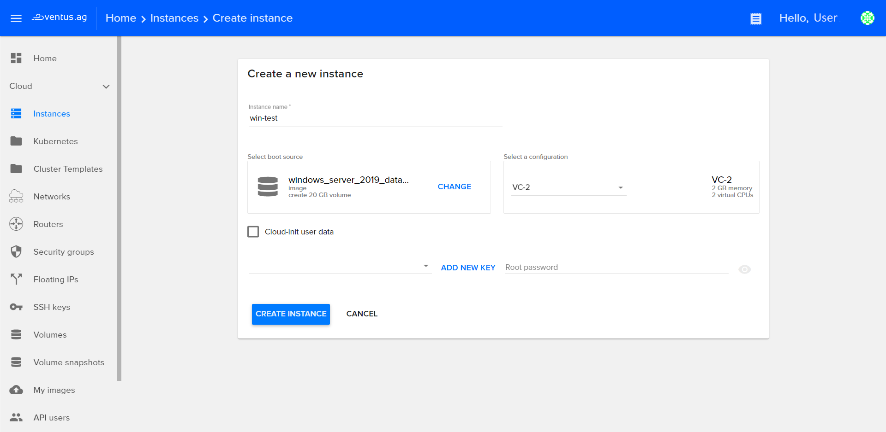

Hit **Create Instance** and the new instance will be created.

## Start / Shutdown / Reboot instance
---

There are two ways in interface for **Start / Shutdown / Restart** your instance:

First one is directly from instance page. In each instance box, there is one icon for **Start/Shutdown** and one icon for **Restart**. See next image for reference:

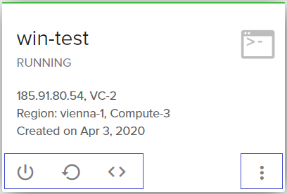

## Search for an instance
---

To search for an instance, type your instance name in the search box from the top of the instance page.

## Login into console
---

You can launch the web-console window directly from instance page or from instance details. Click on the icon *<>*  for launching the web-console.    
After the new window with the web-console will appear massage about first login, you should create password.

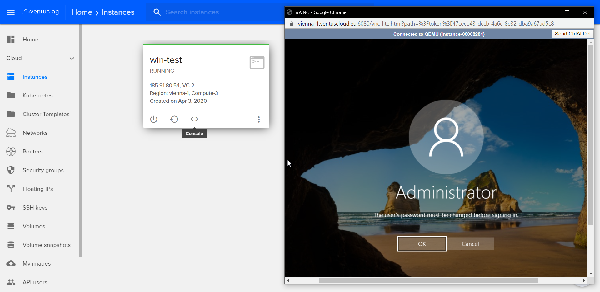

## How to open windows server using RDP
---

You should press **WIN + R** input **mstsc** and run

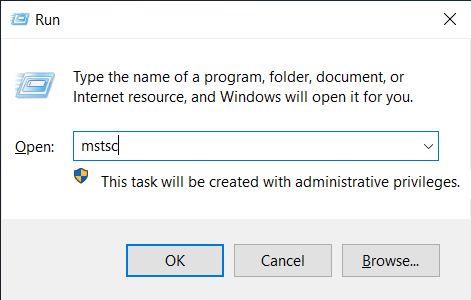

You will see **RDP window**, than paste **your ip addres**

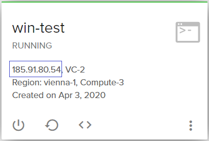

**Example:**
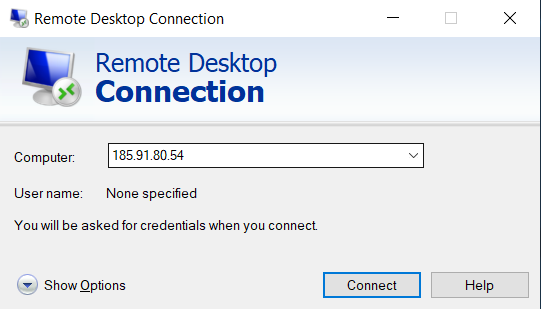

At last, input **Administrator** and your **password**

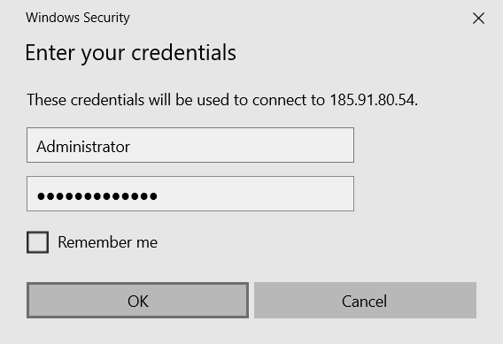

After **credentials** you will see result!

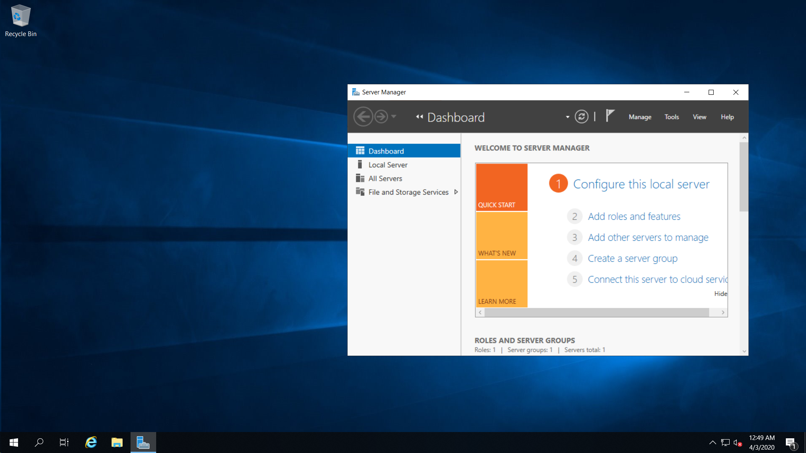

