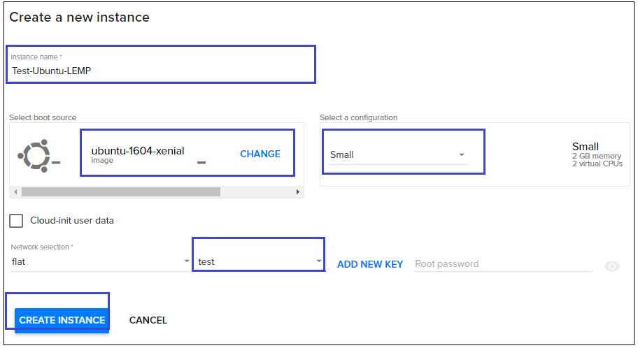
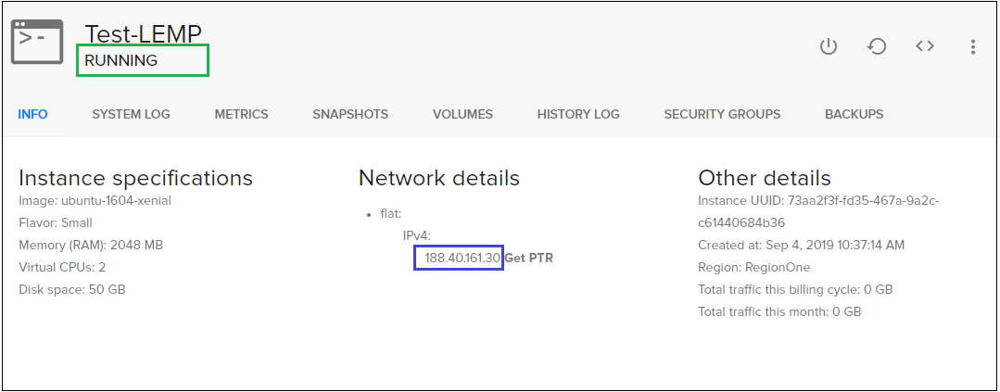
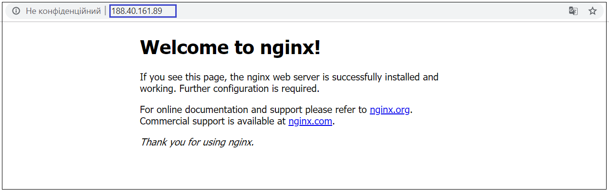
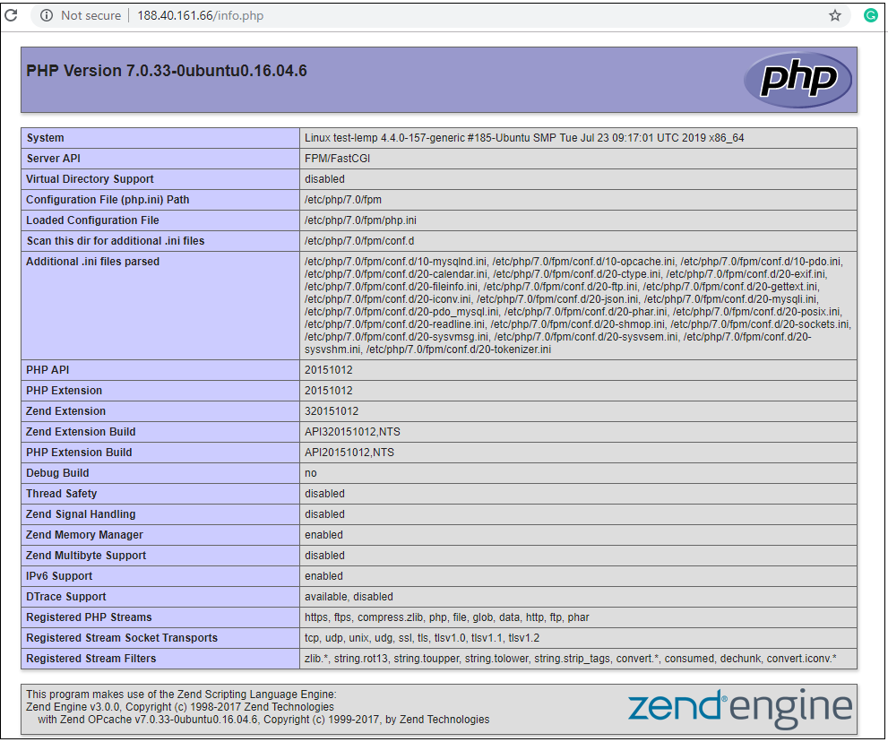
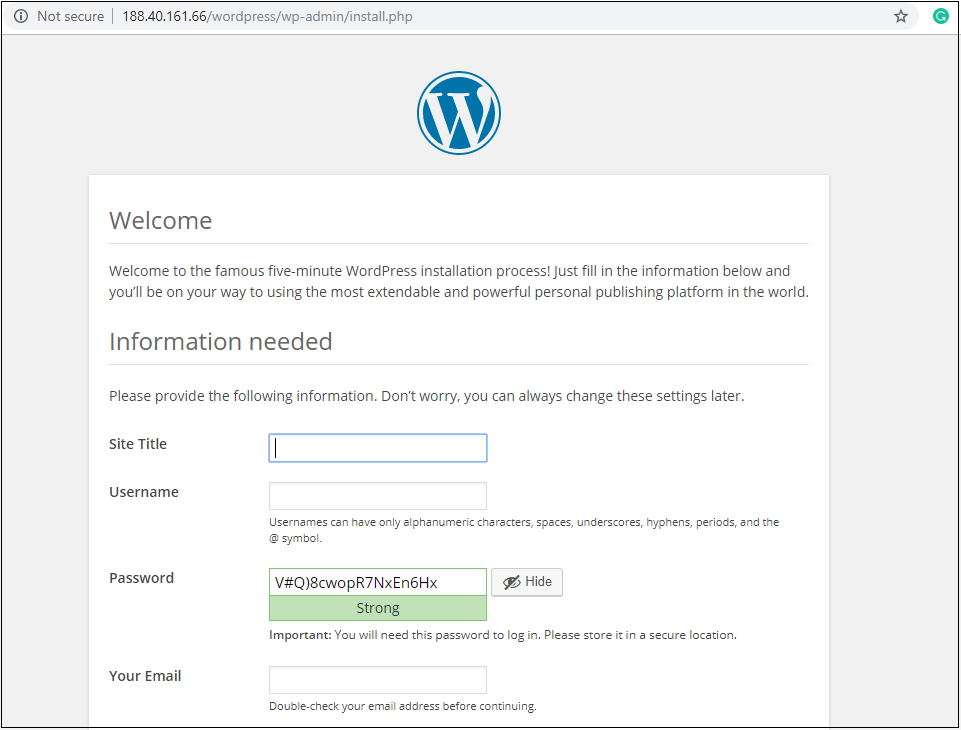

# Install a LEMP web server on a Linux virtual machine
{: .no_toc }
---

The LEMP software stack is a group of software that can be used to serve dynamic web pages and web applications. This is an acronym that describes a **L**inux operating system, with an Nginx (pronounced like “**E**ngine-X”) web server. The backend data is stored in the **M**ySQL database and the dynamic processing is handled by **P**HP.

A LEMP stack is a powerful platform that will allow you to set up and serve nearly any website or application from your server.

This article walks you through how to deploy an NGINX web server, MySQL, and PHP (the LEMP stack) on an Ubuntu VM in Azure. The LEMP stack is an alternative to the popular LAMP stack, which you can also install in Ventus. To see the LEMP server in action, you can optionally install and configure a WordPress site.  

## Table of contents
{: .no_toc .text-delta }

1. TOC
{:toc}

## Create a virtual machine
---

For creating new virtual machine do the following:

1) On the main Navigation Panel go to `Cloud`, choose `Instances` and  click the plus `+` button from at the bottom-right of the screen.  

2) On the following page fill next information:
  - Instance Name (eg. "Test_LEMP")
  - Select a Boot source (eg. "ubuntu-1604-xenial")
  - Select a configuration (eg. "Small")
  - Select a SSH Key

 

 

3) Hit `CREATE INSTANCE` button

4) Wait untill status of your Instance will be **RUNNING**
When the VM has been created, you can view instance details. Take note of the publicIpAddress. This address is used to access the VM in next steps.

  

## Install NGINX, MySQL, and PHP
---

Run the following command to update Ubuntu package sources and install NGINX, MySQL, and PHP.

`sudo apt update && sudo apt install nginx && sudo apt install mysql-server php-mysql php-fpm`  

You are prompted to install the packages and other dependencies. This process installs the minimum required PHP extensions needed to use PHP with MySQL.

## Verify installation and configuration
---
### Verify NGINX

Check the version of NGINX with the following command:  

`nginx -v`

With NGINX installed, and port 80 open to your VM, the web server can now be accessed from the internet. To view the NGINX welcome page, open a web browser, and enter the public IP address of the VM. Use the public IP address you used to SSH to the VM:

 

### Verify and secure MySQL

Check the version of MySQL with the following command (note the capital V parameter):  

`mysql -V`    

To help secure the installation of MySQL, including setting a root password, run the *mysql_secure_installation* script.
  
`sudo mysql_secure_installation`  

You can optionally set up the Validate Password Plugin (recommended). Then, set a password for the MySQL root user, and configure the remaining security settings for your environment. We recommend that you answer "Y" (yes) to all questions.

If you want to try MySQL features (create a MySQL database, add users, or change configuration settings), login to MySQL. This step is not required to complete this tutorial.
  
`sudo mysql -u root -p`  

When done, exit the mysql prompt by typing \q.

### Verify PHP

Check the version of PHP with the following command:
  
`php -v`  

You now have all of the required LEMP stack components installed, but you still need to make a few configuration changes in order to tell Nginx to use the PHP processor for dynamic content. This is done on the server block level (server blocks are similar to Apache’s virtual hosts).

### Configuring Nginx to Use the PHP Processor

1) Open a new server block configuration file within the /etc/nginx/sites-available/ directory. In this example, the new server block configuration file is named example.com, although you can name yours whatever you’d like:   

`sudo nano /etc/nginx/sites-available/example.com`  
 
By editing a new server block configuration file, rather than editing the default one, you’ll be able to easily restore the default configuration if you ever need to.

2) Add the following content, which was taken and slightly modified from the default server block configuration file, to your new server block configuration file:  

server {
        listen 80;
        root /var/www/html;
        index index.php index.html index.htm index.nginx-debian.html;
        server_name example.com;
    
        location / { 
                try_files $uri $uri/ =404;
        }  

        location ~ \.php$ {  
                include snippets/fastcgi-php.conf;  
                fastcgi_pass unix:/var/run/php/php7.0-fpm.sock;  
        }  

        location ~ /\.ht {  
                deny all;  
        }  
        }

Here’s what each of these directives and location blocks do:

- `listen` — Defines what port Nginx will listen on. In this case, it will listen on port 80, the default port for HTTP.  
- `root` — Defines the document root where the files served by the website are stored.  
- `index` — Configures Nginx to prioritize serving files named index.php when an index file is requested, if they’re available.  
- `server_name` — Defines which server block should be used for a given request to your server. **Point this directive to your server’s domain name or public IP address.**  
- `location /` — The first location block includes a try_files directive, which checks for the existence of files matching a URI request. If Nginx cannot find the appropriate file, it will return a 404 error.  
- `location ~ \.php$` — This location block handles the actual PHP processing by pointing Nginx to the fastcgi-php.conf configuration file and the php7.2-fpm.sock file, which declares what socket is associated with php-fpm.  
- `location ~ /\.ht` — The last location block deals with .htaccess files, which Nginx does not process. By adding the deny all directive, if any .htaccess files happen to find their way into the document root they will not be served to visitors.  

3) After adding this content press CTRL + X to save and close the file, and press y and ENTER to confirm. 

4) Enable your new server block by creating a symbolic link from your new server block configuration file (in the /etc/nginx/sites-available/ directory) to the /etc/nginx/sites-enabled/ directory:

`sudo ln -s /etc/nginx/sites-available/example.com /etc/nginx/sites-enabled/`

5) Then, unlink the default configuration file from the /sites-enabled/ directory:

`sudo unlink /etc/nginx/sites-enabled/default`

**Note**: *If you ever need to restore the default configuration, you can do so by recreating the symbolic link, like this*:

`sudo ln -s /etc/nginx/sites-available/default /etc/nginx/sites-enabled/`

6) Test your new configuration file for syntax errors by typing:

`sudo nginx -t`  

If any errors are reported, go back and recheck your file before continuing.

7) When you are ready, reload Nginx to make the necessary changes:

`sudo systemctl reload nginx`   

This concludes the installation and configuration of your LEMP stack. However, it’s prudent to confirm that all of the components can communicate with one another.

### Creating a PHP File to Test Configuration

Your LEMP stack should now be completely set up. You can test it to validate that Nginx can correctly hand .php files off to the PHP processor.

1) Use your text editor to create a test PHP file called info.php in your document root:

`sudo nano /var/www/html/info.php`  

2) Enter the following lines into the new file. This is valid PHP code that will return information about your server:  
  
`<?php`  
`phpinfo ();`  
`?>`    

3) Press CTRL + X to save and close the file, and press y and ENTER to confirm.

4) Open a browser and type in your IP address/info.php
The output should display the details of the LAMP stack as seen in the image below:

 

## Install WordPress
---

If you want to try your stack, install a sample app. As an example, the following steps install the open source [WordPress](https://wordpress.org/) platform to create websites and blogs. Other workloads to try include [Drupal](https://www.drupal.org/) and [Moodle](https://moodle.org/).

This WordPress setup is only for proof of concept. To install the latest WordPress in production with recommended security settings, see the [WordPress documentation](https://codex.wordpress.org/Main_Page).

### Install the WordPress package

Run the following command:
  
`sudo apt install wordpress`    

### Configure WordPress

Configure WordPress to use MySQL and PHP.

1) In a working directory, create a text file *wordpress.sql* to configure the MySQL database for WordPress:  

`sudo sensible-editor wordpress.sql`  

2) Add the following commands, substituting a database password of your choice for *yourPassword* (leave other values unchanged). If you previously set up a MySQL security policy to validate password strength, make sure the password meets the strength requirements. Save the file.
  
`CREATE DATABASE wordpress;`  
`GRANT SELECT,INSERT,UPDATE,DELETE,CREATE,DROP,ALTER`  
`ON wordpress.*`  
`TO wordpress@localhost`  
`IDENTIFIED BY 'yourPassword';`  

3) Run the following command to create the database:  

`cat wordpress.sql | sudo mysql --defaults-extra-file=/etc/mysql/debian.cnf`  

4) Because the file *wordpress.sql* contains database credentials, delete it after use:  

`sudo rm wordpress.sql`  

5) To configure PHP, run the following command to open a text editor of your choice and create the *file /etc/wordpress/config-localhost.php*:  

`sudo sensible-editor /etc/wordpress/config-localhost.php`  

6) Copy the following lines to the file, substituting your WordPress database password for *yourPassword* (leave other values unchanged). Then save the file.
  
`<?php`  
`define('DB_NAME', 'wordpress');`  
`define('DB_USER', 'wordpress');`  
`define('DB_PASSWORD', 'yourPassword');`  
`define('DB_HOST', 'localhost');`  
`define('WP_CONTENT_DIR', '/usr/share/wordpress/wp-content');`  
`?>`  

7) Move the WordPress installation to the web server document root:  
`sudo ln -s /usr/share/wordpress /var/www/html/wordpress`  
`sudo mv /etc/wordpress/config-localhost.php /etc/wordpress/config-default.php`  

8) Now you can complete the WordPress setup and publish on the platform. Open a browser and go to http://yourPublicIPAddress/wordpress. Substitute the public IP address of your VM. It should look similar to this image.

 

Let's re-cap what we've done:
- Create an Ubuntu VM
- Install NGINX, MySQL, and PHP
- Verify installation and configuration
- Install WordPress on the LEMP server