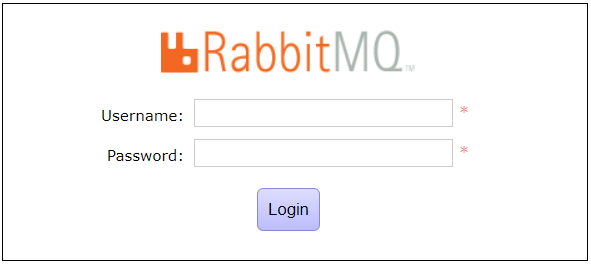
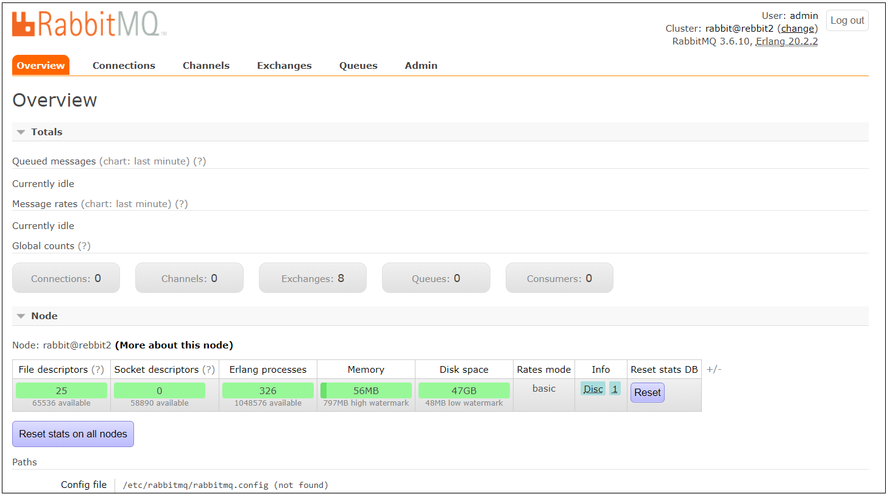
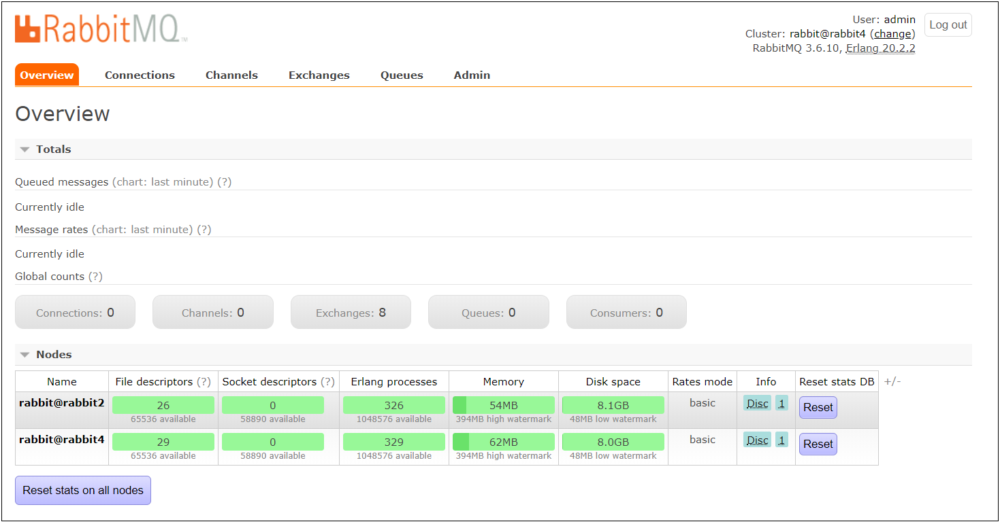
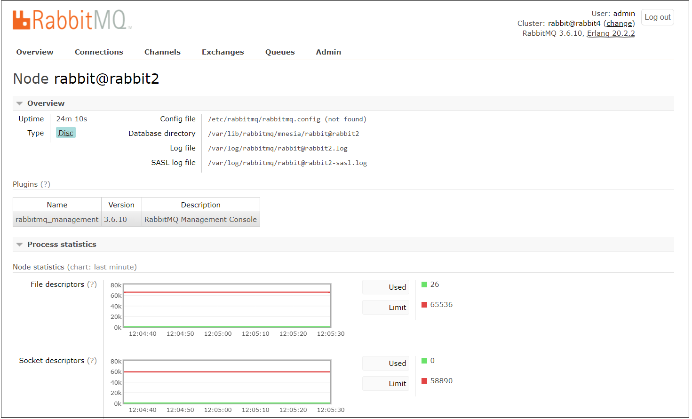
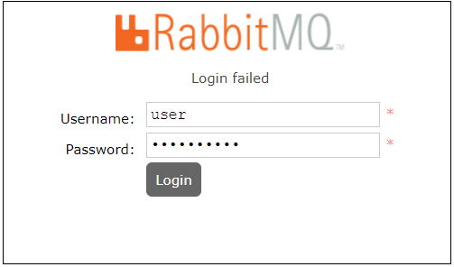
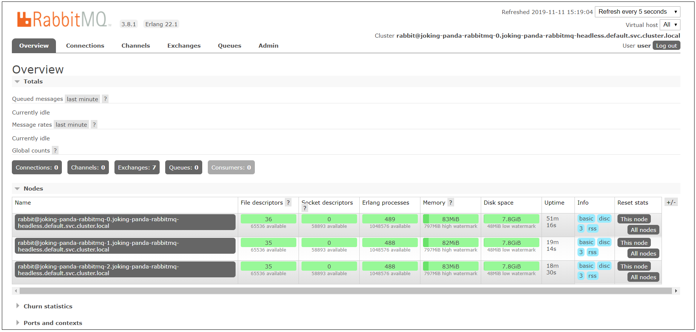

# Install RabbitMQ sevice using Ventus Cloud
{: .no_toc }
---
## Table of contents
{: .no_toc .text-delta }

* TOC
{:toc}

## Intoduction

**Message Brokers** are usually application stacks with dedicated pieces covering the each stage of the exchange setup. From accepting a message to queuing it and delivering it to the requesting party, brokers handle the duty which would normally be much more cumbersome with non-dedicated solutions or simple hacks such as using a database, cron jobs, etc. They simply work by dealing with queues which technically constitute infinite buffers, to put messages and pop-and-deliver them later on to be processed either automatically or by polling.

Using this technology allows you to cover many areas, including, but not limited to:
* Allowing web servers to respond to requests quickly instead of being forced to perform resource-heavy procedures on the spot
* Distributing a message to multiple recipients for consumption (e.g. processing)
* Letting offline parties (i.e. a disconnected user) fetch data at a later time instead of having it lost permanently
* Introducing fully asynchronous functionality to the backend systems
* Ordering and prioritising tasks
* Balancing loads between workers
* Greatly increase reliability and uptime of your application
* and much more

**Advanced Message Queuing Protocol (AMQP)**  is a widely accepted open-source standard for distributing and transferring messages from a source to a destination. As a protocol and standard, it sets a common ground for various applications and message broker middlewares to interoperate without encountering issues caused by individually set design decisions.

**RabbitMQ** is an open-source message-broker application stack which implements the Advanced Message Queuing Protocol (AMQP). It is a lightweight application available for most of the popular operating systems. RabbitMQ supports multiple messaging protocols. It can be easily deployed in a distributed and federated configurations to meet high-scale, high-availability requirements.

RabbitMQ works by offering an interface, connecting message senders (Publishers) with receivers (Consumers) through an exchange (Broker) which distributes the data to relevant lists (Message Queues).

This tutorial will help you to install RabbitMQ on Ubuntu / Debian Based Systems

## Prerequisites

Before you can start this guide you will need to create a new Ubuntu or Centos server. To do this follow the instructions from the next quickstarts [Creating a new Linux VM using Ventus](<https://docs.ventuscloud.eu/docs/quickstarts/create-linux-vm-using-Ventus>).
After creating you need to connect to your remote Ubuntu or Centos server using the ssh protocol and IP of this server and continue below.

## Installing RabbitMQ

RabbitMQ packages are distributed both for CentOS / RHEL & Ubuntu / Debian based systems. However, they are - like with most applications - outdated. The recommended way to get RabbitMQ on your system is therefore to download the package online and install manually.

### Installing on CentOS / RHEL Based Systems

Before installing RabbitMQ, we need to get its main dependencies such as Erlang. However, first and foremost we should update our system and its default applications.

Run the following to update our droplet:
```
yum -y update
```

And let’s use the below commands to get Erlang on our system. Add and enable relevant application repositories (we are also enabling third party remi package repositories):
```
wget http://dl.fedoraproject.org/pub/epel/6/x86_64/epel-release-6-8.noarch.rpm
wget http://rpms.famillecollet.com/enterprise/remi-release-6.rpm
sudo rpm -Uvh remi-release-6*.rpm epel-release-6*.rpm
```

Finally, download and install Erlang:
```
yum install -y erlang
```

Once we have Erlang, we can continue with installing RabbitMQ:
* Download the latest RabbitMQ package using wget:
```
wget http://www.rabbitmq.com/releases/rabbitmq-server/v3.2.2/rabbitmq-server-3.2.2-1.noarch.rpm
```
* Add the necessary keys for verification:
```
rpm --import http://www.rabbitmq.com/rabbitmq-signing-key-public.asc
```
* Install the .RPM package using YUM:
```
yum install rabbitmq-server-3.2.2-1.noarch.rpm
```
* Restart the service:
```
/sbin/service rabbitmq-server restart
```

### Installing on Ubuntu / Debian Based Systems

The process for downloading and installing RabbitMQ on Ubuntu and Debian will be similar to CentOS due to our desire of having a more recent version.

Let’s begin with updating our system’s default application toolset:
```
apt-get    update
apt-get -y upgrade
```

Enable RabbitMQ application repository:
```
echo "deb http://www.rabbitmq.com/debian/ testing main" >> /etc/apt/sources.list
```

Add the verification key for the package:
```
curl http://www.rabbitmq.com/rabbitmq-signing-key-public.asc | sudo apt-key add -
```

Update the sources with our new addition from above:
```
apt-get
```

And finally, download and install RabbitMQ:
```
sudo apt-get install rabbitmq-server
```

In order to manage the maximum amount of connections upon launch, open up and edit the following configuration file using nano:
```
sudo nano /etc/default/rabbitmq-server
```
Uncomment the `limit` line (i.e. remove `#`) before saving and exit by pressing `CTRL+X` followed with `Y`.

## Managing RabbitMQ

As we have mentioned before, RabbitMQ is very simple to get started with. Using the instructions below for your system, you can quickly manage its process and have it running at the system start-up (i.e. boot).

RabbitMQ Management Console is one of the available plugins that lets you monitor the [RabbitMQ] server process through a web-based graphical user interface (GUI).

Using this console you can:

* Manage exchanges, queues, bindings, users
* Monitor queues, message rates, connections
* Send and receive messages
* Monitor Erlang processes, memory usage
* And much more

To enable RabbitMQ Management Console, run the following:
```
sudo rabbitmq-plugins enable rabbitmq_management
```
Once you’ve enabled the console, it can be accessed using your favourite web browser by visiting `http://[server IP|Hostname]:15672`



By default, the guest user exists and can connect only from localhost. You can login with this user locally with the password “guest”

To be able to login on the network, create an admin user like below:
```
sudo rabbitmqctl add_user admin StrongPassword
sudo rabbitmqctl set_user_tags admin administrator
```

Use the created user to login to the RabbitMQ management interface.



### Managing on CentOS / RHEL Based Systems
Upon installing the application, RabbitMQ is not set to start at system boot by default.

To have RabbitMQ start as a daemon by default, run the following:
```
chkconfig rabbitmq-server on
```

To start, stop, restart and check the application status, use the following:
* To start the service:
```
/sbin/service rabbitmq-server start
```
* To stop the service:
```
/sbin/service rabbitmq-server stop
```
* To restart the service:
```
/sbin/service rabbitmq-server restart
```
* To check the status:
```
/sbin/service rabbitmq-server status
```

### Managing on Ubuntu / Debian Based Systems

For managing RabbitMQ on Ubuntu / Debian based systems use the following commands:
* To start the service:
```
service rabbitmq-server start
```
* To stop the service:
```
service rabbitmq-server stop
```
* To restart the service:
```
service rabbitmq-server restart
```
* To check the status:
```
service rabbitmq-server status
```

And that’s it! You now have your own message queue working on your virtual server.

## Configuring RabbitMQ

RabbitMQ by default runs with its standard configuration. In general, it does not require much tempering with for most needs as long as everything runs smoothly.

To learn about configuring it for custom needs, check out its documentation for [Configuration](https://www.rabbitmq.com/configure.html)


## Setup RabbitMQ Cluster on Ubuntu / Debian Based Systems

By setting a RabbitMQ cluster on Ubuntu / Debian Based Systems, you avoid a single point of failure and achieve higher throughput when compared to single instance RabbitMQ setup.

**Setup Requirements**

This setup has the following requirements:
* Installed Ubuntu 18.04 LTS servers
* At least two RabbitMQ servers
* A user with sudo privileges
* The servers should have internet access

This setup of RabbitMQ Cluster on Ubuntu 18.04 is based on two servers with the following IP addresses and hostnames:

|  Server  | Hostname  | IP Address    |
| -------- | ----------| ------------- |
|  Server1 |  rabbit2  | 188.40.161.24 |
|  Server2 |  rabbit4  | 188.40.161.59 |

**Step 1: Setup Hostnames and DNS**  

The first step in the installation of the RabbitMQ cluster on Ubuntu 18.04 is to configure correct hostnames and DNS.

Server1:
```
sudo hostnamectl set-hostname rabbit2 --static
```

Server2:
```
sudo hostnamectl set-hostname rabbit4 --static
```

If you don’t have a DNS server, you can add the records to the /etc/hosts file
```
echo "188.40.161.24 rabbit2" >> /etc/hosts
echo "188.40.161.59 rabbit4" >> /etc/hosts
```

Then update your systems:
```
sudo apt update
sudo apt -y upgrade
```

**Step 2: Install RabbitMQ Server on both nodes**  

Login to your servers and install RabbitMQ server on all nodes using the instructions described in the second chapter of this tutorial.

The status of your RabbitMQ servers should be running:

```
sudo systemctl status rabbitmq-server.service
```
```console
● rabbitmq-server.service - RabbitMQ Messaging Server
   Loaded: loaded (/lib/systemd/system/rabbitmq-server.service; enabled; vendor preset: enabled)
   Active: active (running) since Mon 2019-11-04 15:20:13 UTC; 17h ago
  Process: 19086 ExecStop=/usr/sbin/rabbitmqctl stop (code=exited, status=0/SUCCESS)
  Process: 19395 ExecStartPost=/usr/lib/rabbitmq/bin/rabbitmq-server-wait (code=exited, status=0/SUCCESS)
 Main PID: 19394 (rabbitmq-server)
    Tasks: 88 (limit: 2361)
   CGroup: /system.slice/rabbitmq-server.service
           ├─19394 /bin/sh /usr/sbin/rabbitmq-server
           ├─19412 /bin/sh /usr/lib/rabbitmq/bin/rabbitmq-server
           ├─19584 /usr/lib/erlang/erts-9.2/bin/epmd -daemon
           ├─19719 /usr/lib/erlang/erts-9.2/bin/beam.smp -W w -A 64 -P 1048576 -t 5000000 -stbt db -zdbbl 32000 -K true
           ├─19831 erl_child_setup 65536
           ├─19895 inet_gethost 4
           └─19896 inet_gethost 4

Nov 04 15:20:10 rabbit4 systemd[1]: Starting RabbitMQ Messaging Server...
Nov 04 15:20:11 rabbit4 rabbitmq[19395]: Waiting for rabbit@rabbit4
Nov 04 15:20:11 rabbit4 rabbitmq[19395]: pid is 19412
Nov 04 15:20:13 rabbit4 systemd[1]: Started RabbitMQ Messaging Server.
lines 1-20/20 (END)
```
**Step 3: Copy RabbitMQ Server 1 Cookie RabbitMQ Server2**  

For RabbitMQ cluster to work, all the nodes participating in the cluster should have the same Cookie. Copy Cookie on your first node to all other nodes in the cluster.

1) Сopy the information from the following file:

Server1:
```
vi /var/lib/rabbitmq/.erlang.cookie
```
2) Replace the current information with the copied

Server2:
```
vi /var/lib/rabbitmq/.erlang.cookie
```

**Step 4: Reset RabbitMQ on Node2**  

Reconfigure RabbitMQ on Node 2 and join it to the cluster.

* Restart RabbitMQ service on Server2
```
sudo systemctl restart rabbitmq-server
```
* Stop application
```
sudo rabbitmqctl stop_app
```
```console
Stopping rabbit application on node rabbit@rabbit4
```

* Reset rabbitmq
```
sudo rabbitmqctl reset
```
```console
Resetting node rabbit@rabbit4
```

* Join the node to cluster
```
sudo rabbitmqctl join_cluster rabbit@rabbit2
```
```console
Clustering node rabbit@rabbit4 with rabbit@rabbit2
```

* Start the application process
```
sudo rabbitmqctl start_app
```
```console
Starting node rabbit@rabbit4
```

* Check Cluster Status:
```
rabbitmqctl cluster_status
```
```console
Cluster status of node rabbit@rabbit4
[{nodes,[{disc,[rabbit@rabbit2,rabbit@rabbit4]}]},
 {running_nodes,[rabbit@rabbit2,rabbit@rabbit4]},
 {cluster_name,<<"rabbit@rabbit4">>},
 {partitions,[]},
 {alarms,[{rabbit@rabbit2,[]},{rabbit@rabbit4,[]}]}]
```

**Step 5: Configure RabbitMQ HA Policy**  

Create a policy that allows for queues mirroring to all nodes in the cluster.
```
sudo rabbitmqctl set_policy ha-all "." '{"ha-mode":"all"}'
```
```console
Setting policy "ha-all" for pattern "." to "{\"ha-mode\":\"all\"}" with priority "0"
```

You can list configured policies using:
```
sudo rabbitmqctl list_policies
```
```console
Listing policies
/       ha-all  all     .       {"ha-mode":"all"}       0
```
To drop a policy, use:
```
sudo rabbitmqctl clear_policy <policyname>
```

**Step 6: Testing**  

Finally, test your RabbitMQ cluster setup on Ubuntu 18.04.  Enable the RabbitMQ Management Web dashboard for easy management.
```
sudo rabbitmq-plugins enable rabbitmq_management
```

If you have an active UFW firewall, allow TCP ports 5672 and 15672
```
sudo ufw allow proto tcp from any to any port 5672,15672
```

Access it by opening the URL  `http://[server IP|Hostname]:15672`


By default, the `guest` user exists and can connect only from localhost. You can login with this user locally with the password `guest`

To be able to login on the network, create an admin user like below:

```
sudo rabbitmqctl add_user admin StrongPassword
sudo rabbitmqctl set_user_tags admin administrator
```

Use the created user to login to the RabbitMQ management interface. You should get status of all Cluster nodes.



More details about a node can also be viewed from the web console.



If you login to RabbitMQ node2 and check for created RabbitMQ users, you should see output similar to below.
```
rabbitmqctl list_users
```
```console
Listing users
admin   [administrator]
guest   [administrator]
```

You have successfully installed RabbitMQ cluster on Ubuntu 18.04. Enjoy and stay connected for more informative content.


## Deploy RabbitMq on Kubernetes cluster in Ventus Cloud

There are a lot of possible approaches to setting up clustered RabbitMQ on Kubernetes. There are many possible approaches to setting up a clustered RabbitMQ in Kubernetes. In this article we will propose the option to setup RabbitMQ on in Ventus Cloud using Helm.

Helm is the first application package manager running atop Kubernetes. It allows describing the application structure through convenient helm-charts and managing it with simple commands.

**Setup Requirements**

This setup has the following requirements:
* Created Kubernetes Cluster in Ventus Cloud (you can see how to do it [here](https://docs.ventuscloud.eu/docs/coretasks/Kubernetes))
* Access this Kubernetes cluster using CLI or ssh protocol (you can see how to do it [here](https://docs.ventuscloud.eu/docs/coretasks/access-by-cli))
* A user with sudo privileges

This setup of RabbitMQ is based on created Kubernetes Cluster with following parametres:   
`Name`: Rabbit  
`Cluster template`: kube.1.14.1_autoscaler  
`Master count`: 1  
`Node count`: 1  
`Master node flavor`: VC-1  
`Node flavor`: VC-2  
`Docker volume size (GB)`: 60  
`IP of master node`: 188.40.161.89  
`User name`: fedora  

Method of connection to the Cluster Rabbit - using the ssh protocol and connecting directly to the master node:
```
ssh fedora@188.40.161.89
```


**Step 1. Install Helm in the Kubernetes Cluster**  

Helm is a tool for managing Kubernetes charts. Charts are packages of pre-configured Kubernetes resources. Once deployed in the cluster, it deploys a Tiller management server within the cluster.

To install it in your cluster, you need to execute the following commands:
```
curl https://raw.githubusercontent.com/kubernetes/helm/master/scripts/get > get_helm.sh
chmod 700 get_helm.sh
./get_helm.sh
```

That will install helm client. Now we need to run the command:
```
helm init
```
This command will install tiller inside kubernetes. Tiller is a mechanism to interact with k8s. 


After that, the Helm Tiller management server has been deployed in your Kubernetes Cluster, but it needs some settings, so execute the following commands:
```
kubectl create serviceaccount --namespace kube-system tiller
kubectl create clusterrolebinding tiller-cluster-rule --clusterrole=cluster-admin --serviceaccount=kube-system:tiller
kubectl patch deploy --namespace kube-system tiller-deploy -p '{"spec":{"template":{"spec":{"serviceAccount":"tiller"}}}}'
helm init --service-account default
```

**Step 2. Deploy StorageClass**    

Before we use helm, we need to deploy StorageClass:
```
vi sc.yml
```
```yaml
apiVersion: storage.k8s.io/v1
kind: StorageClass
metadata:
  name: cinder
  annotations:
    storageclass.kubernetes.io/is-default-class: "true"
provisioner: kubernetes.io/cinder
parameters:
  availability: nova
```
```
kubectl apply -f sc.yml
```

**Step 3. Install RabbitMQ**  

To install RabbitMQ using Helm, execute the following command:
```
helm install stable/rabbitmq
```
```console
NAME:   joking-panda
LAST DEPLOYED: Mon Nov 11 12:26:47 2019
NAMESPACE: default
STATUS: DEPLOYED

RESOURCES:
==> v1/ConfigMap
NAME                                AGE
joking-panda-rabbitmq-config        1s
joking-panda-rabbitmq-healthchecks  1s

==> v1/Pod(related)
NAME                     AGE
joking-panda-rabbitmq-0  0s

==> v1/Role
NAME                                   AGE
joking-panda-rabbitmq-endpoint-reader  1s

==> v1/RoleBinding
NAME                                   AGE
joking-panda-rabbitmq-endpoint-reader  1s

==> v1/Secret
NAME                   AGE
joking-panda-rabbitmq  1s

==> v1/Service
NAME                            AGE
joking-panda-rabbitmq           1s
joking-panda-rabbitmq-headless  1s

==> v1/ServiceAccount
NAME                   AGE
joking-panda-rabbitmq  1s

==> v1/StatefulSet
NAME                   AGE
joking-panda-rabbitmq  0s


NOTES:

** Please be patient while the chart is being deployed **

Credentials:

    Username      : user
    echo "Password      : $(kubectl get secret --namespace default joking-panda-rabbitmq -o jsonpath="{.data.rabbitmq-password}" | base64 --decode)"
    echo "ErLang Cookie : $(kubectl get secret --namespace default joking-panda-rabbitmq -o jsonpath="{.data.rabbitmq-erlang-cookie}" | base64 --decode)"

RabbitMQ can be accessed within the cluster on port  at joking-panda-rabbitmq.default.svc.cluster.local

To access for outside the cluster, perform the following steps:

To Access the RabbitMQ AMQP port:

    kubectl port-forward --namespace default svc/joking-panda-rabbitmq 5672:5672
    echo "URL : amqp://127.0.0.1:5672/"

To Access the RabbitMQ Management interface:

    kubectl port-forward --namespace default svc/joking-panda-rabbitmq 15672:15672
    echo "URL : http://127.0.0.1:15672/"

```

Once it is installed, you get info on how to get the user credentials to access RabbitMQ’s management service. Username is user, while for password you need the following command:
```
echo "Password      : $(kubectl get secret --namespace default joking-panda-rabbitmq -o jsonpath="{.data.rabbitmq-password}" | base64 --decode)"
```

and for the Erlang cookie:
```
echo "ErLang Cookie : $(kubectl get secret --namespace default joking-panda-rabbitmq -o jsonpath="{.data.rabbitmq-erlang-cookie}" | base64 --decode)"
```

**Step 4. Access RabbitMQ’s management service**  

You have several ways to connect to the RabbitMQ’s management service.

**Method 1**  
The first way to connect to the RabbitMQ’s management service is to configure the command `kubectl` on your local host and execute the following commands:
```
kubectl port-forward --namespace default svc/joking-panda-rabbitmq 15672:15672
echo "URL : http://127.0.0.1:15672/"
```

You can access RabbitMQ’s management service on `http://127.0.0.1:15672/`  

**Method 2**  
The second way to connect to the RabbitMQ’s management service is to use ``ssh`` protocol - execute the following command on your local host:
```
ssh -L 8080:10.254.5.177:15672 fedora@188.40.161.89
```
here:    
- `10.254.5.177` - CLUSTER-IP of service   
- `fedora` - cluster user name  
- `188.40.161.89` - IP of master node  

After this you can access RabbitMQ’s management service on `http://127.0.0.1:8080/`  

**Method 3**   
And the third way to connect to the RabbitMQ’s management service is to change the type of service to a LoadBalancer.

As we can see, now, type of service is ClusterIP:
```
kubectl get svc
```
```console
NAME                             TYPE        CLUSTER-IP     EXTERNAL-IP   PORT(S)                                 AGE
kubernetes                       ClusterIP   10.254.0.1     <none>        443/TCP                                 158m
joking-panda-rabbitmq            ClusterIP   10.254.5.177   <none>        4369/TCP,5672/TCP,25672/TCP,15672/TCP   20m
joking-panda-rabbitmq-headless   ClusterIP   None           <none>        4369/TCP,5672/TCP,25672/TCP,15672/TCP   20m
```

Let's change it - open configuration of this service and change it `type` from ClusterIP to LoadBalancer:
```
kubectl edit svc joking-panda-rabbitmq
```

Check our changes:
```
kubectl get svc
```
```console
NAME                             TYPE           CLUSTER-IP       EXTERNAL-IP      PORT(S)                                                         AGE
joking-panda-rabbitmq            LoadBalancer   10.254.165.113   188.40.161.107   4369:31436/TCP,5672:30399/TCP,25672:31736/TCP,15672:30660/TCP   34m
joking-panda-rabbitmq-headless   ClusterIP      None             <none>           4369/TCP,5672/TCP,25672/TCP,15672/TCP                           34m
kubernetes                       ClusterIP      10.254.0.1       <none>           443/TCP                                                         63m
```

After this you can access RabbitMQ’s management service using EXTERNAL-IP of service - on `http://188.40.161.107:15672/`

You can choose one from the listed methods that is the easiest for you.   

**Step 5. Login to the RabbitMQ management interface**   

To login to the RabbitMQ management interface use the user credentials info that you have already received on Step 3 of this section of tutorial: 

Username is user, while for password you need the following command:
```
echo "Password      : $(kubectl get secret --namespace default wayfaring-jaguar-rabbitmq -o jsonpath="{.data.rabbitmq-password}" | base64 --decode)"
```


Now you can get status of all Cluster nodes and see more details about a node from the web console. 

**Step 6. Cnahge the number of RabbitMQ pods**

As you can see, now, we have only one running pod:
```
kubectl get pods
```
```console
NAME                      READY   STATUS    RESTARTS   AGE
joking-panda-rabbitmq-0   1/1     Running   0          26m
```
On web interface you can find only one this pod too:


If you want to increase the number of pods, you need to edit this changes to statefulset. Open the configuration of this statefulset and change number of `replicas` from 1 to 3:
```
kubectl get statefulset
```
```console
NAME                      READY   STATUS    RESTARTS   AGE
joking-panda-rabbitmq-0   1/1     Running   0          26m
```
```
kubectl edit statefulset joking-panda-rabbitmq-0
```

Check our changes:
```
kubectl get pods
```
```console
NAME                      READY   STATUS    RESTARTS   AGE
joking-panda-rabbitmq-0   1/1     Running   0          40m
joking-panda-rabbitmq-1   1/1     Running   0          8m19s
joking-panda-rabbitmq-2   1/1     Running   0          7m13s
```
Ok, now we have three running RabbitMQ pods, which we can find on our web interface too:



You have successfully installed RabbitMq on Kubernetes cluster in Ventus Cloud. 


