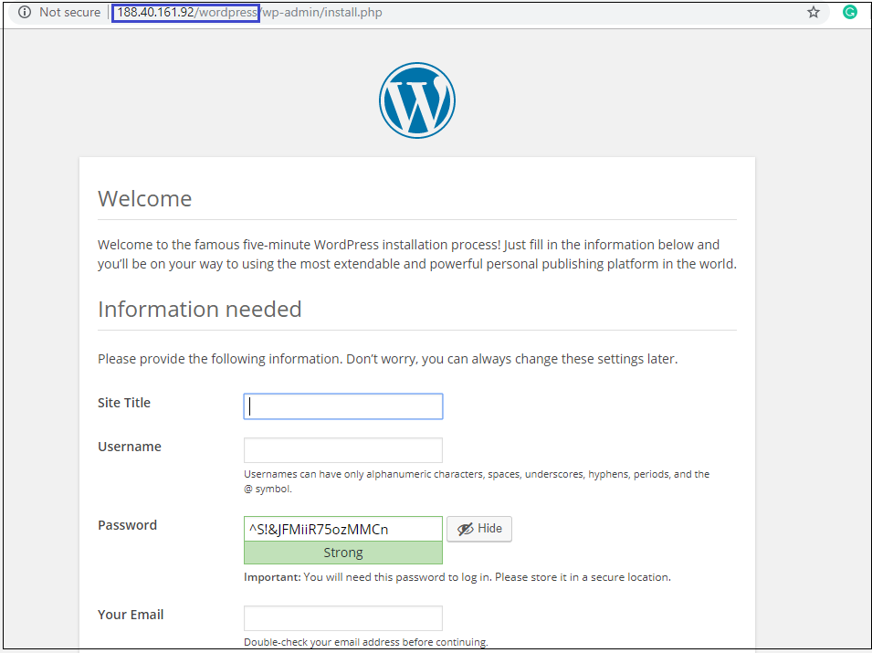
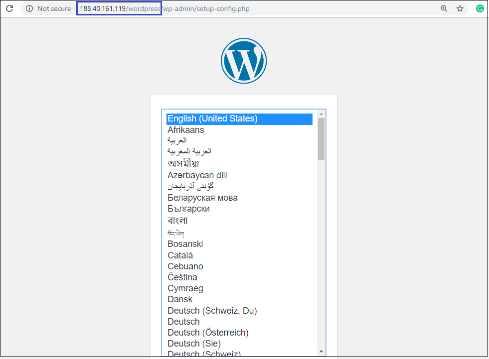

# Install Wordpress on a Linux virtual machine
{: .no_toc }
---
**WordPress** is the most popular CMS (content management system) on the internet. It allows you to easily set up flexible blogs and websites on top of a MySQL backend with PHP processing. WordPress has seen incredible adoption and is a great choice for getting a website up and running quickly. After setup, almost all administration can be done through the web frontend.


## Table of contents
{: .no_toc .text-delta }

* TOC
{:toc}

## Prerequisites

You will need to perform the following tasks before you can start this guide: 
- Create a new Ubuntu or Centos server 
- Install a LEMP or LAMP stack: WordPress will need a web server, a database, and PHP in order to correctly function.
- Setting up a LEMP or LAMP stack (Linux, Apache, MySQL, and PHP) fulfills all of requirements.

To install and configure software for **LEMP stack** follow [this guide](https://vika1990z.github.io/docs/docs/tutorials/Install-LEMP) and or if you want to use **LAMP stack** follow [this guide](https://vika1990z.github.io/docs/docs/tutorials/Install-LAMP+centos)

When you are finished the setup steps, log into your server as your sudo user and continue below.

## Install WordPress on an Ubuntu VM

1) To install the WordPress package run the following command:

```
sudo apt install wordpress    
```

2)After that you need to configure WordPress by using MySQL and PHP.

2.1) In a working directory, create a text file `wordpress.sql` to configure the MySQL database for WordPress: 

```
sudo sensible-editor wordpress.sql
```  

2.2) Add the following commands, substituting a database password of your choice for *yourPassword* (leave other values unchanged). If you previously set up a MySQL security policy to validate password strength, make sure the password meets the strength requirements. Save the file.

```  
CREATE DATABASE wordpress;  
GRANT SELECT,INSERT,UPDATE,DELETE,CREATE,DROP,ALTER  
ON wordpress.*  
TO wordpress@localhost 
IDENTIFIED BY 'yourPassword';  
```

2.3) Run the following command to create the database:  

```
cat wordpress.sql | sudo mysql --defaults-extra-file=/etc/mysql/debian.cnf  
```

2.4) Because the file `wordpress.sql` contains database credentials, delete it after use:  

```
sudo rm wordpress.sql
```

2.5) To configure PHP, run the following command to open a text editor of your choice and create the file `/etc/wordpress/config-localhost.php`:  

```
sudo sensible-editor /etc/wordpress/config-localhost.php
```  

Copy the following lines to the file, substituting your WordPress database password for *yourPassword* (leave other values unchanged). Then save the file.

```  
<?php
define('DB_NAME', 'wordpress');  
define('DB_USER', 'wordpress');  
define('DB_PASSWORD', 'yourPassword');  
define('DB_HOST', 'localhost'); 
define('WP_CONTENT_DIR', '/usr/share/wordpress/wp-content');  
?>  
```

2.6) Move the WordPress installation to the web server document root: 

```
sudo ln -s /usr/share/wordpress /var/www/html/wordpress  
sudo mv /etc/wordpress/config-localhost.php /etc/wordpress/config-default.php
``` 

2.7) Now you can complete the WordPress setup and publish on the platform. Open a browser and type in your **IP address/wordpress**. Substitute the public IP address of your VM. It should look similar to this image.

 


## Install WordPress on a Centos VM

1) Login to your mysql server using the command:

```
mysql -u root -p
```

2) Then create a database by following the commands. For this tutorial we will create a database named "orders_newdatabasename" with a user "orders_dbuser" and password of "mynewpassword".

You will have to write down this information since we will use it later on.

```
CREATE DATABASE wordpress_sample;

CREATE USER wp_user@localhost IDENTIFIED BY 'wp_password';

GRANT ALL PRIVILEGES ON wordpress_sample.* TO wp_user@localhost;

FLUSH PRIVILEGES;

exit
```

3) Let us install php-gd first, this module is used to resize images so we can create a thumbnail. Let us try to fetch the package from CentOS repository:

```
sudo yum install php-gd
```
4) After that we will need to restart our httpd server so it can recognize the newly installed module:

```
sudo service httpd restart
```

6) Let us install Wget programm:

```
sudo yum install wget
```

5) Go to your /html folder before we download the latest wordpress files. The /html folder is the public facing folder of your webserver.

```
cd /var/www/html/
```

6) Download the last version of wordpress files:

```
wget https://wordpress.org/wordpress-5.1.2.zip
```

7) Let us install unzip programm:

```
sudo yum install unzip
```

8) Unzip the wordpress files in the /var/www/html directory:

```
unzip wordpress-5.1.2.zip
```

9) We need to restart httpd web server one more time for it to work by typing:

```
systemctl restart httpd
```

10) And then we set the appropriate permissions for the html directory and files to increase wordpress security and to avoid problems with permissions later on as we configure our wordpress.

```
sudo chown -R apache:apache /var/www/html/*
```

11) Now you can complete the WordPress setup and publish on the platform. Open a browser and type in your **IP address/wordpress**. Substitute the public IP address of your VM. It should look similar to this image.




