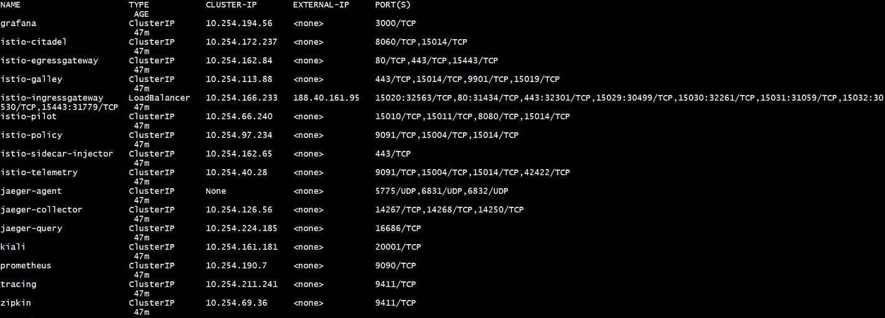
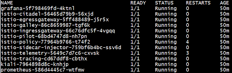
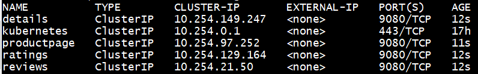
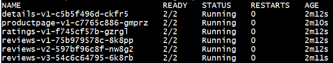
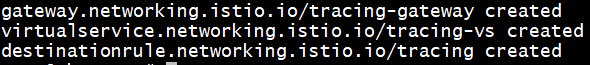

# Install and use Istio in Kubernetes
{: .no_toc }
---





## Table of contents
{: .no_toc .text-delta }

1. TOC
{:toc}

## Create new Kubernetes cluster
---

Create new cluster using this tutorial: <a href ="https://masterhorn.github.io/docs/docs/coretasks/Kubernetes">Kubernetes</a> Use next parameters for your cluster:
  - `Master count`: 1
  - `Node count`: 3
  - `Docker volume size (GB)`: 30
  - `Node flavor`: VC-4
  - `Master node flavor`: VC-2


## Get access to your cluster using cli
---

Getting access to your cluster using this tutorial <a href ="https://masterhorn.github.io/docs/docs/coretasks/access-by-cli">Access to Kubernetes Cluster using CLI</a>

## Install Istio
---

Follow these steps to install Istio:

1) Download the release from the <a href ="https://github.com/istio/istio/releases/">Istio releases page</a>: 
- `wget https://github.com/istio/istio/releases/download/1.4.0/istio-1.4.0-linux.tar.gz`
- `tar -xvf istio-1.4.0-linux.tar.gz`

2) Move tto the Istio package direction:  
- `cd istio-1.4.0`

3) Add the istioctl client to your path:
- `export PATH=$PWD/bin:$PATH`

4) Install Istio:
- ` istioctl manifest apply --set profile=demo`

5) Verify that all Istio services are deployed and pods are in running state:
- `kubectl get svc -n istio-system`



- `kubectl get pods -n istio-system` 



## Deploying Bookinfo application 
---



1) Label the namespace that will host the application:
- `kubectl label namespace default istio-injection=enabled`

2) Deploy your application using the `kubectl` command:
- `kubectl apply -f samples/bookinfo/platform/kube/bookinfo.yaml`

3) Verify that all services are deployed and pods are in running state:
- `kubectl get svc` 



- `kubectl get pods` 



4) Verify that the Bookinfo application is running:

```
kubectl exec -it $(kubectl get pod -l app=ratings -o jsonpath='{.items[0].metadata.name}') -c ratings -- curl productpage:9080/productpage | grep -o "<title>.*</title>"
```


## Geting access to Bookinfo application 
---

1) Define the ingress gateway for the application:
- `kubectl apply -f samples/bookinfo/networking/bookinfo-gateway.yaml`

2) Confirm the gateway has been created:
- `kubectl get gateway` 

   

3) Set the `INGRESS_HOST` and `INGRESS_PORT` variables for accessing the gateway:
```
export INGRESS_HOST=$(kubectl -n istio-system get service istio-ingressgateway -o jsonpath='{.status.loadBalancer.ingress[0].ip}')
export INGRESS_PORT=$(kubectl -n istio-system get service istio-ingressgateway -o jsonpath='{.spec.ports[?(@.name=="http2")].port}')
export SECURE_INGRESS_PORT=$(kubectl -n istio-system get service istio-ingressgateway -o jsonpath='{.spec.ports[?(@.name=="https")].port}')
```
4) Set `GATEWAY_URL`:
- `export GATEWAY_URL=$INGRESS_HOST:$INGRESS_PORT`

5) Confirm that the Bookinfo application is accessible from outside the cluster, run the following `curl` command:
- `curl -s http://${GATEWAY_URL}/productpage | grep -o "<title>.*</title>"`

   

**Now we can view the Bookinfo web page following this staps:**

1) Get the LoadBalancer’s IP:
- `kubectl get svc -n istio-system istio-ingressgateway -o jsonpath='{.status.loadBalancer.ingress[0]}'`

   

2) Navigate to `https://<LoadBalancer's IP>/productpage`

## Getting access to Kiali
--- 



For gettin acces to Kiali we need apply next yaml configuration to expose the tracing service: 
```yaml
 cat <<EOF | kubectl apply -f -
apiVersion: networking.istio.io/v1alpha3
kind: Gateway
metadata:
  name: tracing-gateway
  namespace: istio-system
spec:
  selector:
    istio: ingressgateway
  servers:
  - port:
      number: 15032
      name: http-tracing
      protocol: HTTP
    hosts:
    - "*"
---
apiVersion: networking.istio.io/v1alpha3
kind: VirtualService
metadata:
  name: tracing-vs
  namespace: istio-system
spec:
  hosts:
  - "*"
  gateways:
  - tracing-gateway
  http:
  - match:
    - port: 15032
    route:
    - destination:
        host: tracing
        port:
          number: 80
---
apiVersion: networking.istio.io/v1alpha3
kind: DestinationRule
metadata:
  name: tracing
  namespace: istio-system
spec:
  host: tracing
  trafficPolicy:
    tls:
      mode: DISABLE
---
EOF
```



Now you can open Kiali in your browser opening this link: `https://<LoadBalancer's IP>:15029`


Let's re-cap what we've done:
- Install Istio.
- Deploy Bookinfo application.
- Getting access to observabiliti console for Istio - Kiali.

