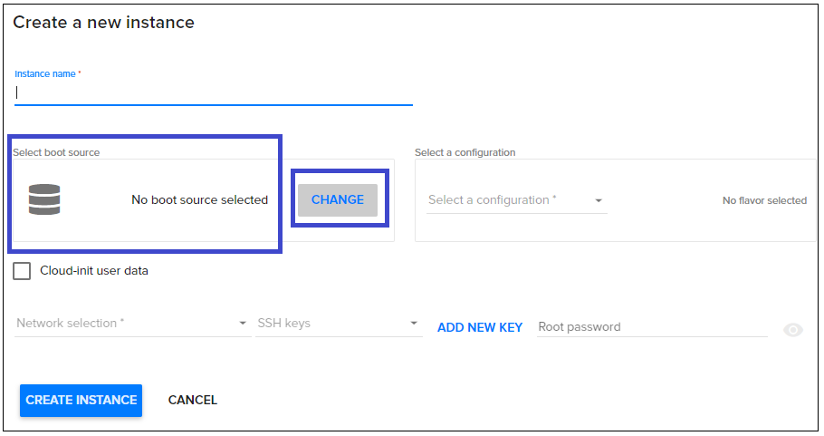
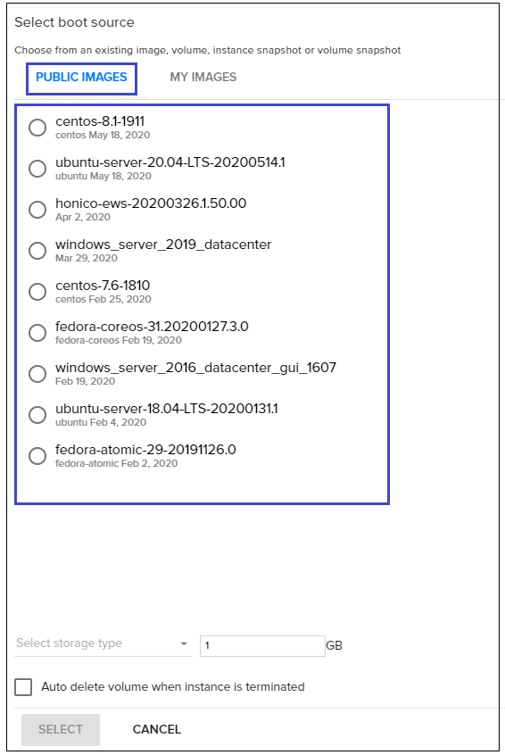
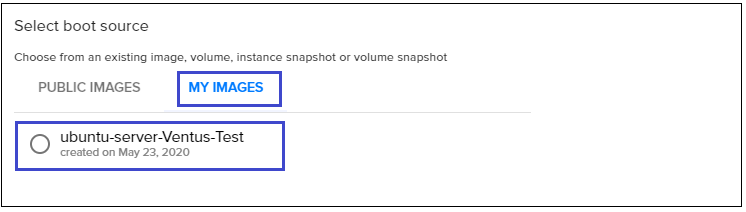
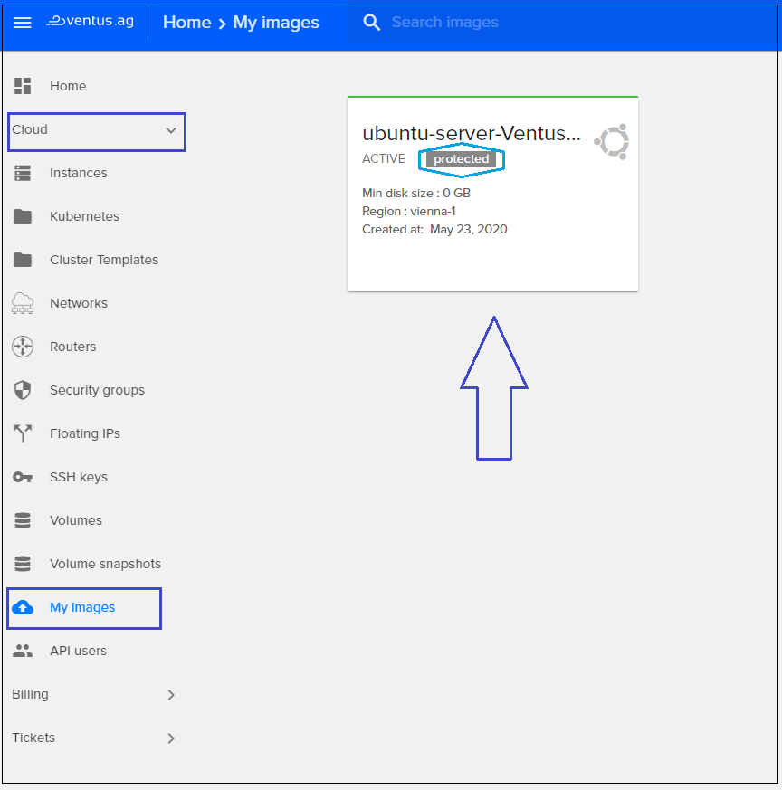
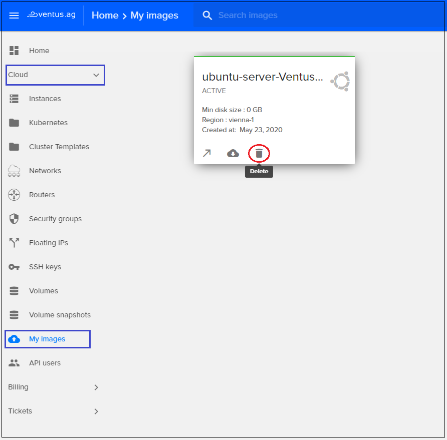

# Creating custom images on a Linux instance. 
{: .no_toc }
---

In this page, you can find an explanation of how to create and delete custom images on a Linux instance. 
You can create custom images from source disks, images, snapshots, or images stored in Cloud Storage. You can use these images to create virtual machine (VM) instances. This is ideal for situations where you have created and modified a persistent boot disk or specific image to a certain state and need to save that state for creating instances.
 

## Table of contents
{: .no_toc .text-delta }

1. TOC
{:toc}

## Prerequisites:

For this tutorial you need:
* login to your Linux virtual machine in the Ventus Cloud Portal, if you do not already have one, follow the instructions on the next page - [Creating a new Linux VM using Ventus Cloud](https://ventuscloud.eu/docs/quickstarts/create-linux-vm-using-ventus) 
* create new API User if you do not already have one by following up the instructions on the next page - [API Users](https://ventuscloud.eu/docs/coretasks/api-users) and execute OpenRC file of the created Api User:
```
. openrc
```
* prepare your own image that you want to upload to the Ventus portal. In our case, we use just one of the Ubuntu images, but you can upload your own unique image that should be located locally on your virtual machine:
```
wget https://cloud-images.ubuntu.com/focal/current/focal-server-cloudimg-amd64.img
```
## Create/upload an image

1) To get a list of all available images for your project use `openstack image list` command:
```
openstack image list
```
```console
+--------------------------------------+-----------------------------------------+--------+
| ID                                   | Name                                    | Status |
+--------------------------------------+-----------------------------------------+--------+
| cebe9b1f-b1fc-4f2d-9736-c0be1a653ab5 | centos-7.6-1810                         | active |
| 63e6f110-dd8e-4340-bbb6-0003c05d7841 | centos-8.1-1911                         | active |
| 0e63ff58-0f9b-44d7-a536-acb2b65c76fa | fedora-atomic-29-20191126.0             | active |
| 58aeea7f-d2af-495d-81db-b01d81154160 | fedora-coreos-31.20200127.3.0           | active |
| 57206584-2c42-46ab-82ae-7ab7e68b5618 | honico-ews-20200326.1.50.00             | active |
| 26ce283f-d77f-4c50-80f7-0426d9fe30e4 | ubuntu-server-18.04-LTS-20200131.1      | active |
| 7155c4e2-c12f-41f6-bca3-060bf21da4e0 | ubuntu-server-20.04-LTS-20200514.1      | active |
| fc962a2d-4359-4f98-b22d-398ce901eb8c | windows_server_2016_datacenter_gui_1607 | active |
| 13aa1128-e7a1-4145-9e7c-9a6970e9bebd | windows_server_2019_datacenter          | active |
+--------------------------------------+-----------------------------------------+--------+
```

Also all this images you can find in Ventus portal on the step of creating instances when you need to **Select boot source**:  
  
  

2) To upload your own unique image, which is already located locally on your virtual machine, use the following command:
```
openstack image create \
                      --disk-format=qcow2 \
                      --container-format=bare \
                      --file=focal-server-cloudimg-amd64.img \
                      --property os_distro='ubuntu' \
                      --protected \
                      ubuntu-server-Ventus-Test
```
Let's take a closer look to this command:
- _--disk-format_ - The supported options are: ami, ari, aki, vhd, vmdk, raw, qcow2, vhdx, vdi, iso, and ploop. The default format is: _raw_.    
- _--container-format_ - The supported options are: ami, ari, aki, bare, docker, ova, ovf. The default format is: _bare_.  
- _--file_ - Upload image from local file.  
- _--property_ - Set a property on this image (repeat for multiple values).  
- _--protected_ - Prevent image from being deleted. The default format is: _unprotected_.  
- _ubuntu-server-Ventus-Test_ - New image name.  

Also here you can use some other required arguments, for example:
- _--location <image-url>_ - Download image from an existing URL.  
- _--copy-from <image-url>_ - Copy image from the data store (similar to _--location_).  
- _--volume <volume>_ - Create image from a volume.  
To find more required arguments use `openstack image create --help`.  

If the creation was successful, the output will be as follows
```console
+------------------+--------------------------------------------------------------------------------------------------------------------+
| Field            | Value                                                                                                              |
+------------------+--------------------------------------------------------------------------------------------------------------------+
| checksum         | 0af114559a9d356d63ce6d971f8c0e94                                                                                   |
| container_format | bare                                                                                                               |
| created_at       | 2020-05-22T21:56:11Z                                                                                               |
| disk_format      | qcow2                                                                                                              |
| file             | /v2/images/35bc479c-1e2b-4c5d-ae28-2858bfc2483e/file                                                               |
| id               | 35bc479c-1e2b-4c5d-ae28-2858bfc2483e                                                                               |
| min_disk         | 0                                                                                                                  |
| min_ram          | 0                                                                                                                  |
| name             | ubuntu-server-Ventus-Test                                                                                          |
| owner            | 921b646f60ee4163aa9f181800e27c57                                                                                   |
| properties       | direct_url='rbd://d0313df0-2f3d-48d5-a09e-336e6ffc96d0/images/35bc479c-1e2b-4c5d-ae28-2858bfc2483e/snap',         
                     locations='[{'url': 'rbd://d0313df0-2f3d-48d5-a09e-336e6ffc96d0/images/35bc479c-1e2b-4c5d-ae28-2858bfc2483e/snap', 
                     'metadata': {}}]', os_distro='ubuntu', os_hash_algo='sha512', 
                     os_hash_value='98a377eb761be242fd3b8c5a6397d5b2bddef7edc5d5aba2b377dd1d17412cac752d9db4253f42b0f0f5778cf8b39ed33', 
                     os_hidden='False' 
| protected        | True                                                                                                               |
| schema           | /v2/schemas/image                                                                                                  |
| size             | 533200896                                                                                                          |
| status           | active                                                                                                             |
| tags             |                                                                                                                    |
| updated_at       | 2020-05-22T21:56:21Z                                                                                               |
| virtual_size     | None                                                                                                               |
| visibility       | shared                                                                                                             |
+------------------+--------------------------------------------------------------------------------------------------------------------+
```
3) To make sure that our new image appeared among the available, use the following command       
```
openstack image list
```
```console
+--------------------------------------+-----------------------------------------+--------+
| ID                                   | Name                                    | Status |
+--------------------------------------+-----------------------------------------+--------+
| cebe9b1f-b1fc-4f2d-9736-c0be1a653ab5 | centos-7.6-1810                         | active |
| 63e6f110-dd8e-4340-bbb6-0003c05d7841 | centos-8.1-1911                         | active |
| 0e63ff58-0f9b-44d7-a536-acb2b65c76fa | fedora-atomic-29-20191126.0             | active |
| 58aeea7f-d2af-495d-81db-b01d81154160 | fedora-coreos-31.20200127.3.0           | active |
| 57206584-2c42-46ab-82ae-7ab7e68b5618 | honico-ews-20200326.1.50.00             | active |
| 26ce283f-d77f-4c50-80f7-0426d9fe30e4 | ubuntu-server-18.04-LTS-20200131.1      | active |
| 7155c4e2-c12f-41f6-bca3-060bf21da4e0 | ubuntu-server-20.04-LTS-20200514.1      | active |
| 35bc479c-1e2b-4c5d-ae28-2858bfc2483e | ubuntu-server-Ventus-Test               | active | here it is! 
| fc962a2d-4359-4f98-b22d-398ce901eb8c | windows_server_2016_datacenter_gui_1607 | active |
| 13aa1128-e7a1-4145-9e7c-9a6970e9bebd | windows_server_2019_datacenter          | active |
+--------------------------------------+-----------------------------------------+--------+
```
Also you can find this new image in Ventus portal on the step of creating instances when you need to **Select boot source**:  
  
  

And on the page with your own images, this one will appear too. To find this page on the main Navigation Panel go to  `Cloud` and choose `Images`. Here you can see that our new ubuntu-server-Ventus-Test image is labeled `protected` what means that any destructive operation on this image will get rejected by Ventus Portal web and CLI interfaces:
  


## Delete an image
The first step to deleting a protected image is to unprotect it. You can simply set a flag to make image non-protected. This is the command to activate the unprotected property for a given image:
```
openstack image set --unprotected <IMAGE-ID>
```
After successful completion of the above command, you can attempt deleting the image by using next command:
```
openstack image delete <IMAGE-ID>
```
Or through the Ventus portal on the **Image** page by clicking the icon for **Delete**:
 
