# Running ML pipeline using Kubeflow on Kubernetes
{: .no_toc }
---





## Table of contents
{: .no_toc .text-delta }

1. TOC
{:toc}

## Create new Kubernetes cluster
---

1) Create new cluster using this tutorial: **Core Tasks/Clusters.** Use next parameters for your cluster:
  - `Master count`: 1
  - `Node count`: 1
  - `Docker volume size (GB)`: 100
  - `Node flavor`: VC-16
  - `Master node flavor`: VC-4

2) Wait until status of your cluster will be **Create completed**

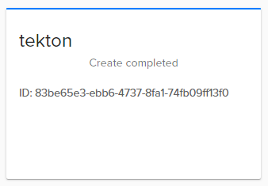

## Get access to your cluster using cli
---

To get access to your cluster you need **openstack** cli tool installed and connected to your project.

1) Install openstack cli tool by running two next commands one by one. First will install openstack and second one will install magnum client which is used to operate with kubenetes clusters:

`sudo pip install python-openstackclient`<br />
`sudo pip install python-magnumclient`

2) Get OpenRC file to connect to Ventus Cloud using cli:
  - On the main Navigation Panel go to **Cloud**, choose **API users** and click the plus (+) button at the bottom-right of the screen.
  - Fill out all fields and hit **ADD API USER**
  - For new user hit **Get OpenRC file** action

  <br />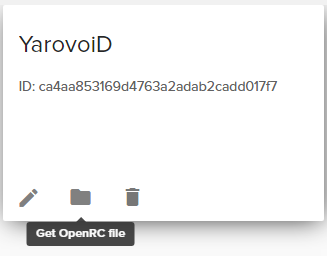

  - Select region and hit **GET FILE**

  <br />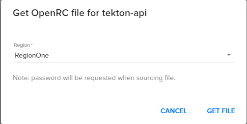
  

  - File named "openrc" will be downloaded to your machine

3) Execute "openrc" file starting with dot:
<br />`. openrc`

4) Provide your password and hit enter - this will authenticate you in the Ventus Cloud using created API user.

5) Run next command to get a list of all clusters:
<br />`openstack coe cluster list`

6) Run next command to get kubeconfig for your cluster:
<br />`openstack coe cluster config kubeflow`

7) Export path to created config for as KUBECONFIG env variable:
<br />`export KUBECONFIG=/home/ubuntu/config`

8) Run next command to test that you have access to the cluster and all pods are running:
<br />`kubectl get pods --all-namespaces`

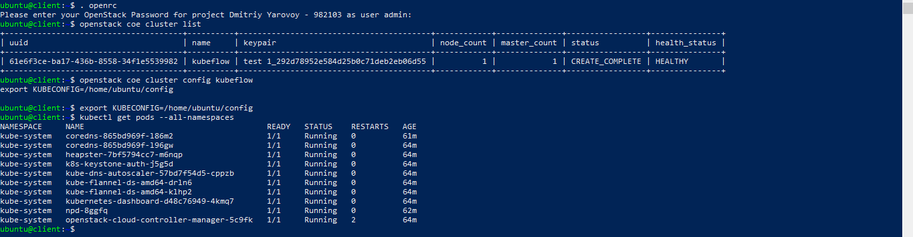

## Deploy Kubeflow
---

Follow these steps to deploy Kubeflow:

1) Download and install `kfctl` release from the <a href ="https://github.com/kubeflow/kubeflow/releases/">Kubeflow releases page</a>: 
- `wget https://github.com/kubeflow/kubeflow/releases/download/v0.7.0/kfctl_v0.7.0_linux.tar.gz`
- `tar -xvf kfctl_v0.7.0_linux.tar.gz`
- `sudo cp kfctl /usr/bin/`

2) Run the following commands to set up and deploy Kubeflow:
- Set the name of a directory where you want Kubeflow configurations to be stored. This directory is created when you run kfctl init:
<br /> `export PATH=$PATH:"<path-to-kfctl>"`

- Specify path to kfctl config file which will be used for kubeflow installation: 
<br /> `export CONFIG_URI="https://raw.githubusercontent.com/kubeflow/manifests<br/>/dc04ff600cee722d93cf80d413aa73ddd8387f1f/kfdef/kfctl_existing_arrikto.0.7.0.yaml"`

- Set KF_NAME to the name of your Kubeflow deployment (For example, your deployment name can be `'my-kubeflow'`):
<br /> `export KF_NAME=<your choice of name for the Kubeflow deployment>`

- Set the path to the base directory where you want to store one or more Kubeflow deployments (The path should be absolute):
<br /> `export BASE_DIR=<path to a base directory>`

- Set the Kubeflow application directory for this deployment:
<br /> `export KF_DIR=${BASE_DIR}/${KF_NAME}`

- Create directory and download the config file with default login credentials:
  - Create directory:
<br />    `mkdir -p ${KF_DIR}`
<br />    `cd ${KF_DIR}`

  - Download the config file:
<br />    `wget -O kfctl_existing_arrikto.yaml $CONFIG_URI`
<br />    `export CONFIG_FILE=${KF_DIR}/kfctl_existing_arrikto.yaml`

Now, you have `kfctl_existing_arrikto.yaml` file with default user credentials: `admin@kubeflow.org:12341234`.
You can chage credentials using `vi kfctl_existing_arrikto.yaml` command and overwrite it.

- Use command `kfctl apply -V -f ${CONFIG_FILE}` to deploy Kubeflow.

3) Run next command to check that all pods are running:
<br />`kubectl get pods --all-namespaces`

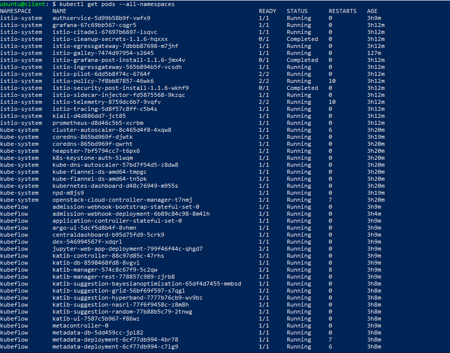

## Accsessing Kubeflow
---
**Log in as a static user**

After deploying Kubeflow, the Kubeflow dashboard is available at the Istio Gateway IP. To get the Istio Gateway IP, run:
  - `kubectl get svc -n istio-system istio-ingressgateway -o jsonpath='{.status.loadBalancer.ingress[0].ip}'`

Get the IP and open it in a browser: `https://<LoadBalancerIP address>/.`

Enter the credentials you specified in `KUBEFLOW_USER_EMAIL`, `KUBEFLOW_PASSWORD` and access the Kubeflow dashboard!  

**Expose with a LoadBalancer**

To expose Kubeflow with a LoadBalancer Service, just change the type of the `istio-ingressgateway` Service to `LoadBalancer`.

- `kubectl patch service -n istio-system istio-ingressgateway -p '{"spec": {"type": "LoadBalancer"}}'`

After that, get the LoadBalancer’s IP or Hostname from its status and create the necessary certificate.

- `kubectl get svc -n istio-system istio-ingressgateway -o jsonpath='{.status.loadBalancer.ingress[0]}'`

Create the Certificate with cert-manager:
```yaml
apiVersion: cert-manager.io/v1alpha2
kind: Certificate
metadata:
  name: istio-ingressgateway-certs
  namespace: istio-system
spec:
  commonName: istio-ingressgateway.istio-system.svc
  # Use ipAddresses if your LoadBalancer issues an IP
  ipAddresses:
  - <LoadBalancer IP>
  # Use dnsNames if your LoadBalancer issues a hostname (eg on AWS)
  dnsNames:
  - <LoadBalancer HostName>
  isCA: true
  issuerRef:
    kind: ClusterIssuer
    name: kubeflow-self-signing-issuer
  secretName: istio-ingressgateway-certs
```
After applying the above Certificate, cert-manager will generate the TLS certificate inside the istio-ingressgateway-certs secrets. The istio-ingressgateway-certs secret is mounted on the istio-ingressgateway deployment and used to serve HTTPS.

Navigate to `https://<LoadBalancer Address>/` and start using Kubeflow.

## Compilation of a mnist pipelines
---



Run next commands to compile pipeline:

  - `git clone https://github.com/ventus-ag/kubeflow.git`
  - `cd kubeflow/samples/mnist-pipelines/deploy-service`
  - `docker build -t ACCOUNT/NAME .`
  - `docker push ACCOUNT/NAME`
  - `cd ..`
  - `pip3 install -r requirements.txt --upgrade`
  - `python3 mnist_pipeline.py`

As result, you must got file `mnist_pipeline.py.tar.gz` in your folder

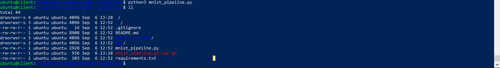


## Upload through the UI

Now that you have the compiled pipeline file, you can upload it through the Kubeflow Pipelines UI. Simply select the **"Upload pipeline"** button:


Upload your file and give it a name:

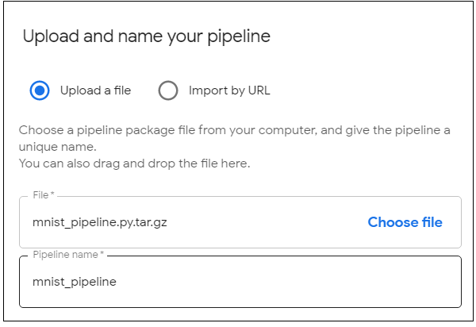

## Run the Pipeline

After clicking on the newly created pipeline, you should be presented with an overview of the pipeline graph. When you're ready, select the "Create Run" button to launch the pipeline:

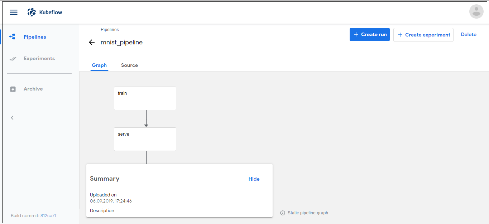

Fill out the information required for the run, and press "Start" when you are ready.
 - The `model-export-dir` field must be `/mnt/export`
 - For `pvc-name` field you must create new pvc in your cluster. You can use next `pvc.yaml` file to do that:

```yaml
apiVersion: v1
kind: PersistentVolumeClaim
metadata:
  finalizers:
  - kubernetes.io/pvc-protection
  name: local-storage
  namespace: kubeflow
spec:
  accessModes:
  - ReadWriteOnce
  resources:
    requests:
      storage: 10Gi
``` 
 - Apply this file to your cluster: 
<br /> `kubectl apply -f pvc.yaml`

 - Specify name from file you created into `pvc-name` filed.

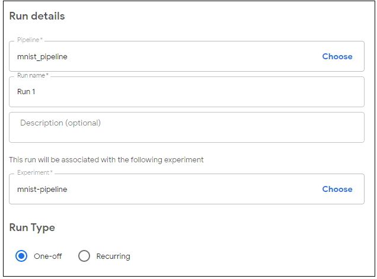

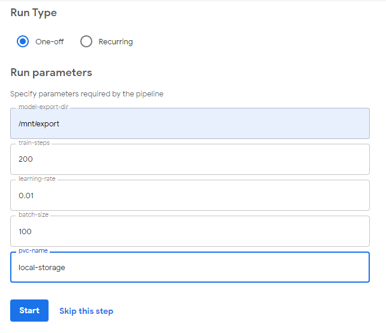

**Review experiment**

After clicking on the newly created Run, you should see the pipeline run through the `train`, `serve`, and `web-ui` components. Click on any component to see its logs. When the pipeline is complete, look at the logs for the `web-ui` component to find the IP address created for the MNIST web interface:

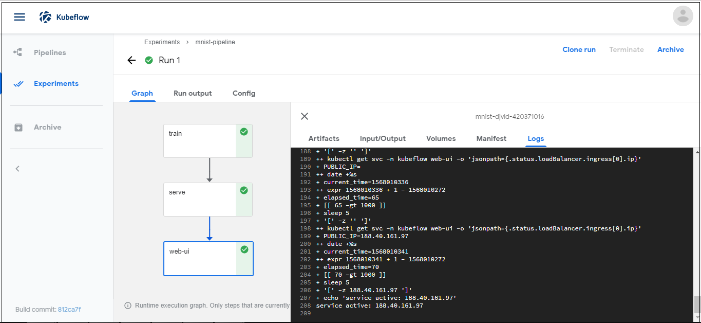

Use IP you received in previous step and open web UI page with experiment's result:

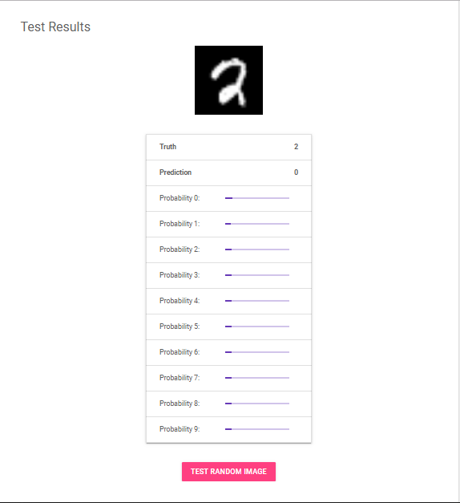

Congratulations! You successfully finished this tutorial.

Let's re-cap what we've done:
- Created new kubernetes cluster for Kubeflow.
- Deployed Kubeflow.
- Compiled mnist pipeline example.
- Uploaded pipeline to Kubeflow.
- Created and ran new experiment.
- As a result trained and served mnist model using Kubeflow in kubernetes.


