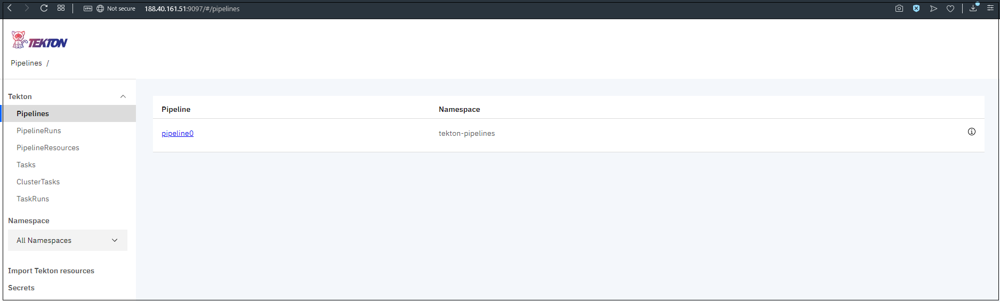
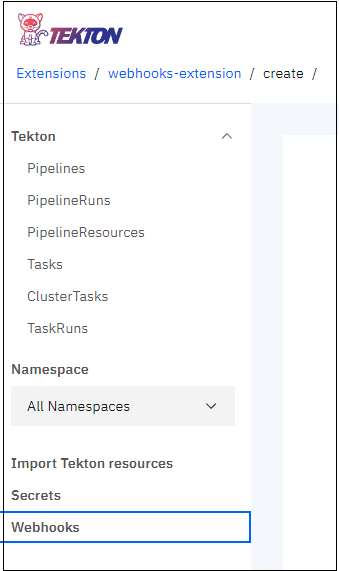
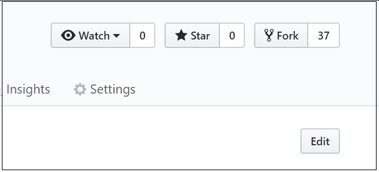
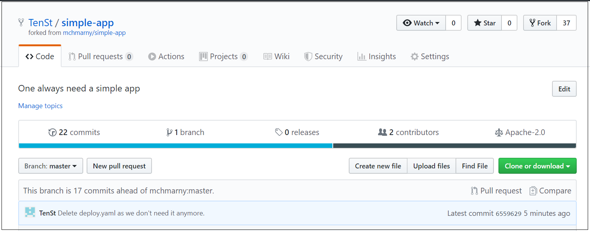
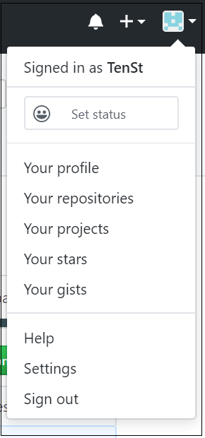
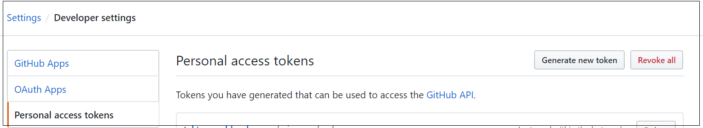
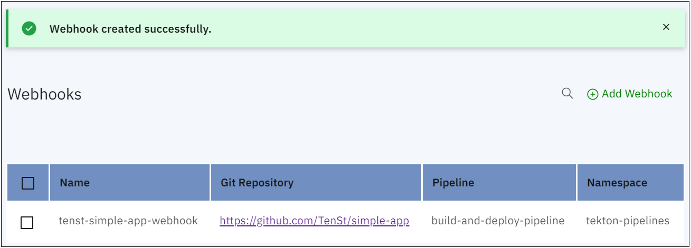
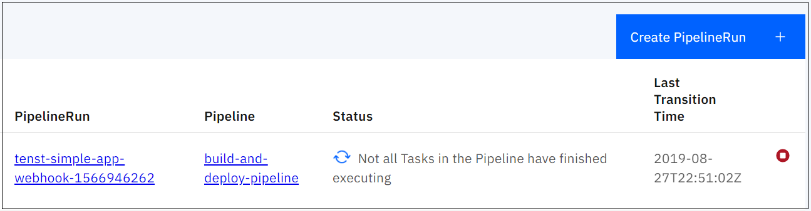
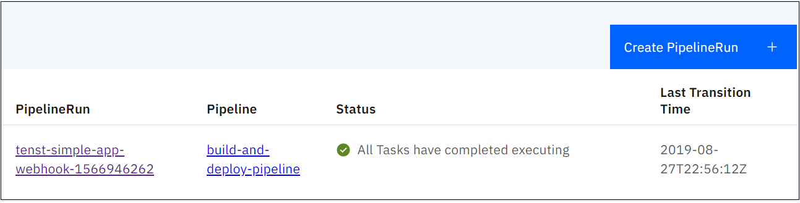
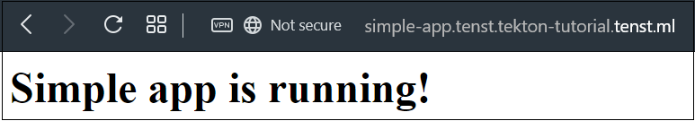

# CI/CD using Knative and Tekton Pipelines
{: .no_toc }
---







## Table of contents
{: .no_toc .text-delta }

1. TOC
{:toc}

## Create new Kubernetes cluster
---

1) Create new cluster with using tutorial: **Core Tasks/Clusters**

2) Wait until status of your cluster will be **Create completed**


## Get access to your cluster using cli
---

To get access to your cluster you need **openstack** cli tool installed and connected to your project.

1) Install openstack cli tool by running two next commands one by one. First will install openstack and second one will install magnum client which is used to operate with kubenetes clusters:

`sudo pip install python-openstackclient`<br />
`sudo pip install python-magnumclient`

2) Get OpenRC file to connect to Ventus Cloud using cli:
  - On the main Navigation Panel go to **Cloud**, choose **API users** and click the plus (+) button at the bottom-right of the screen.
  - Fill out all fields and hit **ADD API USER**
  - For new user hit **Get OpenRC file** action
  <br />
  - Select region and hit **GET FILE**
  <br />
  - File named "openrc" will be downloaded to your machine

3) Execute "openrc" file starting with dot:
<br />`. openrc`

4) Provide your password and hit enter - this will authenticate you in the Ventus Cloud using created API user.

5) Run next command to get a list of all clusters:
<br />`openstack coe cluster list`

6) Run next command to get kubeconfig for your cluster (tekton is the name of my cluster):
<br />`openstack coe cluster config kubeflow`

7) Export path to created config for as KUBECONFIG env variable:
<br />`export KUBECONFIG=/home/ubuntu/config`

8) Run next command to test that you have access to the cluster and all pods are running:
<br />`kubectl get pods --all-namespaces`


## Deploy Kubeflow
---

Follow these steps to deploy Kubeflow:

1) Download a **kfctl** release from the <a href ="https://github.com/kubeflow/kubeflow/releases/">Kubeflow releases page</a> or you can run this script: 
<br />`wget https://github.com/kubeflow/kubeflow/releases/download/v0.6.2/kfctl_v0.6.2_linux.tar.gz`

2) Unpuck it:
<br />`tar -xvf kfctl_<release tag>_<platform>.tar.gz`

3) Copy it in your folder: 
<br />`sudo cp kfctl /usr/bin/`

4) Run the following commands to set up and deploy Kubeflow. The code below includes an optional command to add the binary `kfctl` to your path. If you don’t add the binary to your path, you must use the full path to the `kfctl` binary each time you run it.



***#Add kfctl to PATH, to make the kfctl binary easier to use.***

<br />export KFAPP="kubeflow-tutorial"
<br />export CONFIG="https://raw.githubusercontent.com/kubeflow/kubeflow/v0.6-branch/bootstrap/config/kfctl_existing_arrikto.0.6.2.yaml"

***#Specify credentials for the default user.***

<br />`export KUBEFLOW_USER_EMAIL="admin@kubeflow.org"`
<br />`export KUBEFLOW_PASSWORD="12341234"`

<br />`fctl init ${KFAPP} --config=${CONFIG} -V`
<br />`cd ${KFAPP}`
<br />`kfctl generate all -V`
<br />`kfctl apply all -V`


2) Verify that Tekton Dashboard pod is running:
<br />`kubectl get pods -n tekton-pipelines`


3) Change service's type of Tekton Dashboard from "ClusterIP" to "LoadBalancer" to receive external IP and make it reachible externally:
<br />`kubectl patch service tekton-dashboard -n tekton-pipelines -p '{"spec": {"type": "LoadBalancer"}}'`


4) Wait until external IP will be assigned to your service (usually less than a minute):
<br />`kubectl get svc -n tekton-pipelines`


5) Get your external IP address and port and open up dashboard in your browser:
<br />`http://188.40.161.51:9097`



## Deploy Tekton Webhooks extension
---



1) Install prerequisites:
  - First prerequisites are Tekton Pipelines and Tekton Dashboard and we already installed them.
  - Install Istio following https://knative.dev/docs/install/installing-istio/ or you can run this script https://raw.githubusercontent.com/tektoncd/experimental/master/webhooks-extension/scripts/install_istio.sh like this: `./install_istio.sh 1.1.7` *(Istio version 1.1.7 is recommended).*
    - If you've chosen to run script, then you need to install Helm (https://github.com/helm/helm/releases) first:
      - `wget https://raw.githubusercontent.com/helm/helm/master/scripts/get`
      - `chmod +x ./get`
      - `./get`
      - `helm init`

      
    - Continue with script:
      - `wget https://raw.githubusercontent.com/tektoncd/experimental/master/webhooks-extension/scripts/install_istio.sh`
      - `chmod +x ./install_istio.sh`
      - `./install_istio.sh 1.1.7`

      
  - Verify that necessary Istio components (we need only two: istio-ingressgateway and istio-pilot) are running:
  <br />`kubectl get pods -n istio-system`

  
  - Install Knative Eventing, Eventing Sources & Serving following https://knative.dev/docs/install/index.html or you can run this script https://raw.githubusercontent.com/tektoncd/experimental/master/webhooks-extension/scripts/install_knative.sh like this: `./install_knative.sh v0.6.0` *(Knative version 0.6.0 is strongly recommended).*
    - If you've chosen to run script, use next steps:
      - `wget https://raw.githubusercontent.com/tektoncd/experimental/master/webhooks-extension/scripts/install_knative.sh`
      - `chmod +x ./install_knative.sh`
      - `./install_knative.sh v0.6.0`

      
      - `kubectl apply -f https://github.com/knative/eventing-sources/releases/download/v0.6.0/eventing-sources.yaml`
    - Verify that necessary Knative components are running:
    <br />`kubectl get pods --all-namespaces | grep knative`

    

2) Run next command to install the Tekton Webhooks Extension and its dependencies:
  - `kubectl apply --filename https://github.com/tektoncd/dashboard/releases/download/v0.1.1/webhooks-extension_release.yaml -n tekton-pipelines`
  
  
  - Verify that all pods are running:
  <br />`kubectl get pods -n tekton-pipelines`
  
  
  - Verify that "Webhooks" section is added to your Tekton Dashboard:
  
  

## Configure Tekton objects
---

In this part of tutorial we will configure all necessary Tekton object and GitHub and Docker repositories. 

Let's start with pre-requisites. First will be GitHub repo:

1) Login to your account (or create new one).
2) Use existing repository which you want to test or use fork version of mine:
  - Go to <a href="https://github.com/TenSt/simple-app">https://github.com/TenSt/simple-app</a> (this is also a fork of mchmarny/simple-app, but with my changes).
  
  
  - Click on the "Fork" button at the top right corner and select your account as a destination where to create new fork.
  - As a result you should have your own repository with unique full name, like: https://github.com/TenSt/simple-app
  
  

Next we need to create a token which we will use for authentication from our Tekton Webhooks extension to GitHub repos:

1) Click on your profile button at the top right corner and go to "Settings".



2) Go to "Developer settings" at the bottom of "Personal settings" menu and then "Personal access tokens".

3) Click "Generate new token" button.



4) Give it a name in the "Note" field.

5) Select only "admin:repo_hook" checkbox - this will give full access to repo webhooks (which we will use later on).

6) Hit "Generate token" button at the very bottom.

7) You will return back to the "Personal access tokens" page and will see next message: "Make sure to copy your new personal access token now. You won’t be able to see it again!" Go ahead and save your new token somewhere as GitHub will show it only once (if you'll lose it, you will need to generate new one). We will use it later in this tutorial.

Now let's configure your Docker repository (I'm using Docker Hub - https://hub.docker.com).
1) Login to your Docker registry.

2) Create new repository with the same name as your GitHub repository (e.g. simple-app).

3) Make sure that it is public (it is posible to use private Docker repos, but this tutorial doesn't cover it).

Great! We've finished with configuring our repos. As a result you should have:
  - GitHub repo with application and Dockerfile in the root directory which we will deploy
  - GitHub token with admin access to repo webhooks
  - Public docker repository where we will store our images

Next step is to configure domain for Knative which we deployed previosly. To integrate properly with other services it is strongly recommended to configure your own domain (which is accessible from Internet) in Knative who will use it to properly route requests to different services in your Kubernetes cluster.

1) In your cli run next command to get external IP address of istio-ingressgateway service:
<br />`kubectl get svc istio-ingressgateway -n istio-system`


2) Configure wildcard DNS record of type "A" which points to this EXTERNAL-IP address from previous command. In my case: *.tekton-tutorial.tenst.ml points to 188.40.161.33.

3) Create new yaml file called `knative-domain-config.yaml`:
```yaml
apiVersion: v1
kind: ConfigMap
metadata:
  name: config-domain
  namespace: knative-serving
data:
  # Default domain, provided without selector.
  tekton-tutorial.tenst.ml: |
```

4) Change "tekton-tutorial.tenst.ml" to your domain which you configured previously.

5) Apply it to your cluster:
<br />`kubectl apply -f knative-domain-config.yaml`


Now all requests to *.tekton-tutorial.tenst.ml will route to our istio-ingressgateway service which will route it to appropriate services in our Kubernetes cluster.

One more thing needed to be configured is Knative event source - GitHubSource:

1) Create file `gitHubSource.yaml` - it will create Knative GitHubSource which is pointed to GitHub repo:
```yaml
apiVersion: sources.eventing.knative.dev/v1alpha1
kind: GitHubSource
metadata:
  name: githubsourcesample
  namespaces: tekton-pipelines
spec:
  eventTypes:
    - push
  ownerAndRepository: TenSt/simple-app
  accessToken:
    secretKeyRef:
      name: tenst-github-token
      key: accessToken
  secretToken:
    secretKeyRef:
      name: tenst-github-token
      key: secretToken
  sink:
    apiVersion: serving.knative.dev/v1alpha1
    kind: Service
    name: webhooks-extension-sink
```

2) Fill in next fields:
  - ownerAndRepository - change it to your account/reponame
  - accessToken:secretKeyRef:name - change it to some unique name
  - secretToken:secretKeyRef:name - should be the same as previous one

3) Apply it to your cluster:
<br />`kubectl apply -f gitHubSource.yaml -n tekton-pipelines`


Let's move on and configure create new Tekton tasks, resources and pipeline:

1) Apply buildah task - it will be used to build our app:
<br />`kubectl apply -f https://raw.githubusercontent.com/tektoncd/catalog/master/buildah/buildah.yaml -n tekton-pipelines`


2) Create file `knctl-role.yaml` - it will create and bind necessary permissions for already existing service account:
```yaml
kind: ClusterRole
apiVersion: rbac.authorization.k8s.io/v1
metadata:
  name: knctl-deployer
  namespace: tekton-pipelines
rules:
  - apiGroups: ["serving.knative.dev"]
    resources: ["*"]
    verbs: ["get", "list", "create", "update", "delete", "patch", "watch"]
  - apiGroups: [""]
    resources: ["namespaces"]
    verbs: ["get", "list", "create", "update", "delete", "patch", "watch"]
---

apiVersion: rbac.authorization.k8s.io/v1beta1
kind: ClusterRoleBinding
metadata:
  name: knctl-deployer-binding
subjects:
- kind: ServiceAccount
  name: tekton-webhooks-extension
  namespace: tekton-pipelines
roleRef:
  kind: ClusterRole
  name: knctl-deployer
  apiGroup: rbac.authorization.k8s.io
```

It is composed with two parts:
  - Creating ClusterRole in our Kubernetes cluster which have full access to all resources in "serving.knative.dev" and "namespaces" resource.
  - Creating ClusterRoleBinding which will bind new role to existing tekton-webhooks-extension account (under which our pipelines will run).

3) Apply it to your cluster:
<br />`kubectl apply -f knctl-role.yaml -n tekton-pipelines`


4) Create file `knctl-task.yaml` - it will create new taks named `knctl-deploy` which will be used to deploy our app to Knative in our cluster:
```yaml
apiVersion: tekton.dev/v1alpha1
kind: Task
metadata:
  name: knctl-deploy
spec:
  inputs:
    params:
    - name: service
      description: Name of the service to deploy
    resources:
    - name: image
      type: image
    - name: git
      type: git
  steps:
  # the first step is required as knctl doesn't support inCluster configuration.
  - name: kubeconfig
    image: gcr.io/cloud-builders/kubectl # it is huge
    command: ["/bin/bash"]
    args:
    - -c
    - mkdir -p /builder/home/.kube; kubectl config view > /builder/home/.kube/config
  - name: cut
    image: golang:latest
    command: ["/bin/bash"]
    args:
    - -c
    - echo ${inputs.resources.git.url} | cut -d "/" -f 4 | tr "[:upper:]" "[:lower:]" > /workspace/account
  - name: namespace
    image: gcr.io/cloud-builders/kubectl # it is huge
    command: ["/bin/bash"]
    args:
    - -c
    - kubectl create ns `cat /workspace/account` --dry-run=true -o yaml | kubectl apply -f -
  - name: rollout
    image: tens/knctl
    command: ["/bin/bash"]
    args:
    - -c
    - knctl deploy --service ${inputs.params.service} --image ${inputs.resources.image.url} --namespace `cat /workspace/account`
```

It is composed with 4 parts:
  - Get kubeconfig from cluster and put in into "/builder/home/.kube/config" - this is required as knctl doesn't support inCluster configuration.
  - Get Account name out of GitHub repository URL
  - Create new namespace the same as GitHub
  - Deploy our app to Knative

5) Apply it to your cluster:
<br />`kubectl apply -f knctl-task.yaml -n tekton-pipelines`


6) Create file `build-and-deploy-pipeline.yaml` - it will create new pipeline named `build-and-deploy-pipeline` which will be used to deploy our app to Knative in our cluster:
```yaml
apiVersion: tekton.dev/v1alpha1
kind: Pipeline
metadata:
  name: pipeline-build-and-deploy
spec:
  params:
    - name: repository-name
      type: string
      description: repository name which also will be used as namespace
    - name: image-tag
      type: string
      description: commit id
  resources:
    - name: git-source
      type: git
    - name: docker-image
      type: image
  tasks:
    - name: build-buildah
      taskRef:
        name: buildah
      params:
        - name: DOCKERFILE
          value: ./Dockerfile
      resources:
        inputs:
          - name: source
            resource: git-source
        outputs:
          - name: image
            resource: docker-image
    - name: knctl-deploy
      taskRef:
        name: knctl-deploy
      params:
        - name: service
          value: $(params.repository-name)
      resources:
        inputs:
          - name: image
            resource: docker-image
            from:
              - build-buildah
          - name: git
            resource: git-source
```

It is composed with 2 tasks which we created earlier:
  - buildah - to build and push image with our app.
  - kntcl-deploy - to deploy newly created image to Knative in our cluster.

7) Apply it to your cluster:
<br />`kubectl apply -f build-and-deploy-pipeline.yaml -n tekton-pipelines`


After we applied last steps we now have:
  - Tasks for building and deploying
  - Roles and permissions
  - Pipeline

Last but not least part of configuration is creating secrets for GitHub and Docker registry - they will be used by Webhooks extension to clone your GitHub repo and push new image to your Docker registry.

1) Login to your Tekton Dashboard and select "Secrets" from the navigational menu.

2) Hit "Add Secret" button and provide all data:
  - Name: unique name (e.g. tenst-github)
  - Namespace: select "tekton-pipelines" from the drop-down list
  - Access To: Git Server
  - Username: username of GitHub account
  - Password/Token: password of GitHub account
  - Service Account: select "tekton-webhooks-extension"
  - Server URL: leave the first field as "tekton.dev/git-0" and put "https://github.com" in second
  
  

3) Hit "Submit" button.

4) You will see that new secret was added. Now hit "Add Secret" once more to add it for Docker registry:
  - Name: unique name (e.g. tens-docker)
  - Namespace: select "tekton-pipelines" from the drop-down list
  - Access To: Docker Registry
  - Username: username of Docker registry account
  - Password/Token: password of Docker registry account
  - Service Account: select "tekton-webhooks-extension"
  - Server URL: leave the first field as "tekton.dev/docker-0" and put link to your Docker registry in second (use "https://index.docker.io/v1/" if you're using Docker Hub)
  
  

5) Hit "Submit" button.

6) You will see that new secret was added.


## Create new webhook
---

Now we've come to the final section of this tutorial - creating new webhook and observing how our application will be automatically builded and deployed to our Knative in Kubernetes cluster.

1) Login to your Tekton Dashboard and select "Webhooks" from the navigational menu.

2) On the "Create Webhook" page fill all necessary data:
  - Name: unique name of the webhook (e.g. tenst-simple-app-webhook)
  - Repository URL: full URL to your GitHub repo
  - Access Token: 
    - Hit "+" button
    - Fill unique name for token (e.g. tenst-github-token)
    - Paste token which we created previously
    - Hit "Create" button
    
  - Namespace: tekton-pipelines
  - Pipeline: build-and-deploy-pipeline
  - Service Account: tekton-webhook-extension
  - Docker Registry: name of your account in the Docker Registry (e.g. tens)
  - Hit "Create" button

3) Review that webhook was successfully created.



Now we are ready to test it!

1) Do some changes to your GitHub repo and commit them. This will create new `push` event and trigger our pipeline to start:



2) Wait until pipeline will finish to run:



3) Go to your cli and run next command to see URL to your app :
<br />`kubectl get ksvc -n ACCOUNT`
<br />Change ACCOUNT to your GitHub account name. So for me it is:
<br />`kubectl get ksvc -n tenst`


4) Get URL from the output and open it in your browser:



Congratulations! If you see the message then you successfully finished this tutorial.

Here is what happening behind the scenes with everything configured:
  - New commit create `push` event in GitHub
  - GitHub will send details of created event to the webhook link which we created
  - Knative serving the Service for our webhook which will receive event details
  - Knative event will be created and sent to `sink` Service in Knative
  - `sink` Service will generate new PipelineRun for the Pipeline which we created
  - PipelineRun will trigger two TaskRuns - `buildah` (for build) and `knctl-deploy` (for deployment)
  - `buildah` TaskRun will clone GitHub repo, build new image using Dockerfile and push it to the Docker registry
  - `knctl-deploy` TaskRun will start after `buildah` successfully finishes - it will create new Knative Service and its URL will be like `http://repo_name.account.domain.com`

Let's re-cap what we've done:
  - Created new Kubernetes cluster.
  - Deployed Tekton Pipelines.
  - Deployed Tekton Dashboard.
  - Deployed Tekton Webhooks extention.
  - Deployed ligth version of Istio.
  - Deployed Knative.
  - Created tasks for pipelines.
  - Created pipeline.
  - Created secrets for GitHub and Docker repos.
  - Created new Tekton webhook.
  - Reviewed that the app is successfully builded and deployed after new commit was pushed to GitHub repo.