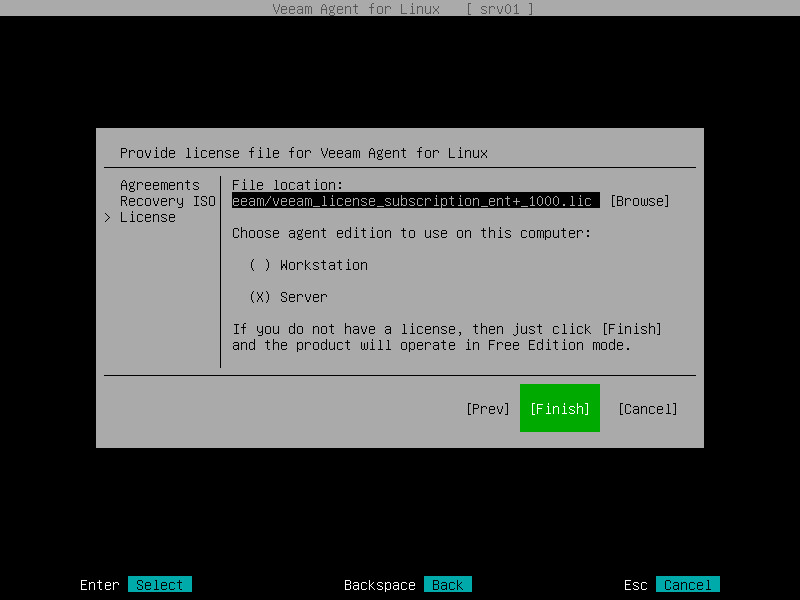

# Install Veeam Agent for Linux 4.0
{: .no_toc }
---

In this page, you can find an explanation of how to install and use Veeam Agent for Linux 4.0.

## Table of contents
{: .no_toc .text-delta }

1. TOC
{:toc}

## Prerequisites:
The computer on which you plan to install Veeam Agent for for Linux 4.0 must satisfy [system requirements](https://helpcenter.veeam.com/docs/agentforlinux/userguide/system_requirements.html?ver=40).

To install Veeam Agent for Linux software packages, you must use the root account or any user account that has super user **root** privileges on the computer where you plan to install the product.

Veeam Agent for Linux software packages have the following dependencies:

> lvm2 — required by the veeamconfig package to support operations with LVM volumes.

> dkms — required by the veeamsnap package for building the kernel module for Veeam Agent for Linux Driver.

This dependency does not apply to CentOS, RHEL and SLES distributions. For these distributions, there is no need to build the veeamsnap kernel module with DKMS. Instead, you can install it from a pre-built binary package provided by Veeam. To learn more, see [Installing Veeam Agent for Linux](https://helpcenter.veeam.com/docs/agentforlinux/userguide/installation_process.html?ver=40).

## To installing Veeam Agent for Linux

> Download the Veeam software repository installation package **(veeam-release)** from the Veeam Download page, and save the downloaded package on the computer where you plan to install the product.

> Navigate to the directory where you have saved the **veeam-release package** and install the package with the following commands:

**For CentOS / RHEL / Oracle Linux / Fedora**

```
rpm -ivh ./veeam-release* && yum check-update
```
**For openSUSE / SLES**

```
zypper in ./veeam-release* && zypper refresh
```
**For Debian / Ubuntu**

```
dpkg -i ./veeam-release* && apt-get update
```

> Install Veeam Agent for Linux packages from the Veeam software repository. To install Veeam Agent for Linux, you can use a package manager of your choice that works with software packages in your Linux distribution. For example, use the following commands:

**For CentOS / RHEL / Fedora**

```
yum install veeam
```
**For Oracle Linux**

```
yum install veeamsnap
yum install veeam
```

**For openSUSE Tumbleweed**

```
zypper in veeam
```

**For openSUSE Leap 15.1**

```
zypper in veeamsnap-kmp-default
zypper in veeam
```

**For SLES with Default kernel**

```
zypper in veeamsnap-kmp-default
zypper in veeam
```

**For SLES with Trace kernel**

```
zypper in veeamsnap-kmp-trace
zypper in veeam
```

**For SLES with Xen kernel**

```
zypper in veeamsnap-kmp-xen
zypper in veeam
```

**For SLES with PAE kernel**

```
zypper in veeamsnap-kmp-pae
zypper in veeam
```


**For Debian / Ubuntu**

```
apt-get install veeam
```

## Managing Package Dependencies

The **dkms** package is not present in default repositories for some Linux distributions. You should obtain it from third-party repositories:

> EPEL repository (for CentOS / RHEL / Oracle Linux / Fedora)

> Packman repository (for openSUSE / SLES).

Extended kernels, such as **kernel-pae**, **kernel-uek** and other, require appropriate **kernel-devel** packages to be installed, for example, **kernel-pae-devel**, **kernel-uek-devel**, and so on.

Version of the **kernel-devel** package must match your current kernel version. To check your current kernel version, run the **uname -r** command.

[For RHEL and derivatives] If the **yum** package manager installs packages that do not match your current kernel version, you should either update your system or fetch older versions of the required packages from the [CentOS Vault repository](http://vault.centos.org/).

### Installing dkms in openSUSE / SLES

In openSUSE / SLES systems, while installing the dkms package, you may see an error similar to the following:

```
Problem: nothing provides kernel-devel needed by dkms-2.2.0.3-14.1.noarch
Solution 1: do not install dkms-2.2.0.3-14.1.noarch
Solution 2: break dkms-2.2.0.3-14.1.noarch by ignoring some of its dependencies
```

To install the **dkms** package, do the following:

Make sure that you have an appropriate **kernel-devel** package installed and its version matches your kernel version. For example:

```
root@localhost:~> rpm -qa | grep kernel-default
kernel-default-devel-3.0.101-91.1
kernel-default-3.0.101-91.1
```

Install the **dkms** package ignoring dependencies:

```
zypper -n install --force dkms
```

Make sure that you have allowed unsupported modules. To learn more, see [this SUSE webpage](https://www.suse.com/documentation/sles-12/book_sle_admin/data/sec_admsupport_kernel.html).

# Upgrading Veeam Agent for Linux

For Veeam Agent for Linux, upgrade to newer versions is supported. You can start the upgrade process when the new version becomes available.

During the upgrade process, configuration and backup files that were created with the previous version of Veeam Agent are not impacted in any way.

Before starting the upgrade process, make sure that there are no jobs running on the Veeam Agent computer.

## Upgrading Veeam Agent for Linux in CentOS / RHEL

To upgrade Veeam Agent for Linux, use the following commands:

```
yum update veeam
rpm -e --nodeps dkms veeamsnap
yum install kmod-veeamsnap*
```

**or**

```
yum install kmod-veeamsnap*
yum update veeam
rpm -e dkms veeamsnap
```

With these commands, a pre-built **veeamsnap** binary package will be installed in your system. To stay on the DKMS version of the **veeamsnap** kernel module, use the following command for upgrade:

```
yum update veeamsnap && yum update veeam
```

## Upgrading Veeam Agent for Linux in Fedora / Oracle Linux

To upgrade Veeam Agent for Linux, use the following command:

```
yum update veeam
```

## Upgrading Veeam Agent for Linux in openSUSE

To upgrade Veeam Agent for Linux, use the following commands:

**For openSUSE Tumbleweed**

```
zypper up veeam
```

**For openSUSE Leap 15.1**

```
zypper in veeamsnap-kmp-default-4.0.0.1961_k4.12.14_lp150.11-lp150.2.1
zypper in --force veeamsnap-kmp-default-4.0.0.1961_k4.12.14_lp150.11-lp150.2.1
```

With these commands, a pre-built **veeamsnap** binary package will be installed in your system. The **--force** key is required to properly replace the missing link to **.ko** in case of update from the DKMS version of the **veeamsnap** kernel module to a pre-built binary. To stay on the DKMS version, use the following command for upgrade:

```
zypper update veeam
```

## Upgrading Veeam Agent for Linux in SLES 11 SP4

To upgrade Veeam Agent for Linux, use the following commands:

**For Default kernel**

```
zypper in veeamsnap-kmp-default
zypper in –-force veeamsnap-kmp-default
```

**For Xen kernel**

```
zypper in veeamsnap-kmp-xen
zypper in –-force veeamsnap-kmp-xe
```

**For Trace kernel**

```
zypper in veeamsnap-kmp-trace
zypper in –-force veeamsnap-kmp-trace
```

**For PAE kernel**

```
zypper in veeamsnap-kmp-pae
zypper in –-force veeamsnap-kmp-pae
```

With these commands, a pre-built **veeamsnap** binary package will be installed in your system. The **--force** key is required to properly replace the missing link to **.ko** in case of update from the DKMS version of the **veeamsnap** module to a pre-built binary. To stay on the DKMS version, use the following command for upgrade:

```
zypper update veeam
```
## Upgrading Veeam Agent for Linux in SLES 12 SP1 – SLES 15 SP1

Download the Veeam software repository installation package **(veeam-release)** from the [Veeam Download page](https://www.veeam.com/downloads.html), and save the downloaded package on the computer where you plan to install the product.

Install the Veeam software repository installation package with the following command:

```
zypper in ./veeam-release* && zypper refresh
```

Upgrade Veeam Agent for Linux with the following commands:

**For Default kernel**

```
zypper in veeamsnap-kmp-default
zypper in --force veeamsnap-kmp-default
```

**For Xen kernel**

```
zypper in veeamsnap-kmp-xen
zypper in --force veeamsnap-kmp-xen
```

With these commands, a pre-built **veeamsnap** binary package will be installed in your system. The **--force** key is required to properly replace the missing link to **.ko** in case of update from the DKMS version of the **veeamsnap** module to a pre-built binary. To stay on the DKMS version, use the following command for upgrade:

```
zypper update veeam
```

## Upgrading Veeam Agent for Linux in Debian / Ubuntu

To upgrade Veeam Agent for Linux, use the following commands:

```
apt-get update
apt-get install veeam
```

# Granting Permissions to Users

When you install Veeam Agent for Linux, the product program files are placed to the folders on the system volume. For full access to Veeam Agent files, super user **(root)** privileges are required. Rights to execute product files and run commands are also granted to users that belong to the **veeam** group.

The **veeam** group is automatically created by Veeam Agent at the process of the product installation. To let regular users work with Veeam Agent without the need to gain root privileges, you can add the necessary users to this group. Users in the veeam group will be able to execute Veeam Agent commands and perform backup and restore tasks under regular user account.

To add a user to the **veeam** group, in most of Linux distributions you can use the following command:

```
usermod -a -G veeam <username>
```

**where:**

> <username> — name of the account to which you want to grant access to Veeam Agent.

**For example:**

```
root@srv01:~# usermod -a -G veeam user
```

Consider the following:

> To add a user to the **veeam** group, you must have super user **(root)** privileges in the Linux OS.

> After the user is added to the **veeam** group, the user must re-login to the Linux OS.

> Add only trusted users to the **veeam** group. Veeam Agent for Linux daemon runs and executes commands and scripts with the super user privileges. Thus, users who belong to this group can potentially escalate their privileges through the creative use of pre-freeze/post-thaw **or** pre-job/post-job scripts.

To check whether the user who is currently logged in to the Linux OS is added to the veeam group, you can use the following command:

```
groups
```

**For example:**

```
user@srv01:~$ groups
user adm cdrom sudo dip plugdev lpadmin sambashare veeam
```

# Install Product License

At the **License** step of the initial setup wizard, install the license. You can choose to install the license immediately or postpone this operation.

> If you choose to install the license, you can immediately browse for the license key on your computer and complete the license installation process.

> If you choose to postpone the license installation process, you will be able to install a license later at any time you need.

Until you install a license, Veeam Agent for Linux will operate in the Free edition. To learn more, see [Product Editions](https://helpcenter.veeam.com/docs/agentforlinux/userguide/license_modes.html?ver=40).

**To install a license:**

In the **File location** field, specify a path to the license key:

> Select the **Browse** option with the **Tab** key and press **Enter**.

> In the **Choose license file location** window, select the necessary directory and press **Enter**.

> Repeat the step 'a' until a path to the directory in which the license key resides appears in the **Current directory** field.

> In the directory where the license key resides, select the license key and press **Enter**.

In the **Choose agent edition to use on this computer** section, select the product edition in which Veeam Agent will operate and press **Enter** to install the license and finish working with the initial setup wizard.

**Consider the following:**

> If you do not want to install a license, to finish working with the initial setup wizard, switch to the **Finish** button with the **Tab** key and press **Enter**.
> You can view information about the installed license (expiration date, status of the license, current edition of the product and so on) in the Veeam Agent control panel or using the Veeam Agent command line interface. To learn more, see [Viewing License](https://helpcenter.veeam.com/docs/agentforlinux/userguide/license_manage_cmd_view.html?ver=40).



# Configuring Advanced Settings

## HTTP Proxy Settings

If you want to use Veeam Agent for Linux to back up your data to a Veeam Cloud Connect repository, it might be required that you specify HTTP proxy settings for Veeam Agent.

Veeam Agent computer needs access to CRLs (Certificate Revocation Lists) of the CA (Certification Authority) who issued a certificate to the Veeam Cloud Connect service provider. In case it is not possible to establish a direct connection to CRLs, you must configure an HTTP proxy and specify settings to connect to the proxy in Veeam Agent.

To specify settings for an HTTP proxy, uncomment and edit the following lines in the **[cloudconnect]** section of the **/etc/veeam/veeam.ini** configuration file:

```
[cloudconnect]

...

# httpproxylogin= <username>

...

# httpproxypasswd= <password>

...

# httpproxyurl= <URL>
```

**where:**

> <username> — name of the account used to connect to the HTTP proxy.

> <password> — password of the account used to connect to the HTTP proxy.

> <URL> — URL of a proxy used for CRL checks.

If the proxy does not require authentication, you do not need to specify the account name и password. Keep in mind that only the basic authentication method is supported for connection to a proxy.

**For example:**

```
[cloudconnect]
...

# HTTP proxy login
httpproxylogin= user01

# HTTP proxy password
httpproxypasswd= P@ssw0rd

# HTTP proxy URL for CRL checks
httpproxyurl= http://proxy.company.lan:3128
```

## Uninstalling Veeam Agent for Linux

To uninstall Veeam Agent for Linux, you need to remove the veeam and veeamsnap packages. For this operation, you can use any package manager that works with software packages in your Linux distribution.

The following examples show commands to uninstall Veeam Agent:

**For CentOS / RHEL / Oracle Linux / Fedora**

```
yum remove veeam veeamsnap
```

**For openSUSE / SLES**

```
zypper rm veeam veeamsnap
```

**For Debian / Ubuntu**

```
apt-get remove veeam veeamsnap
```