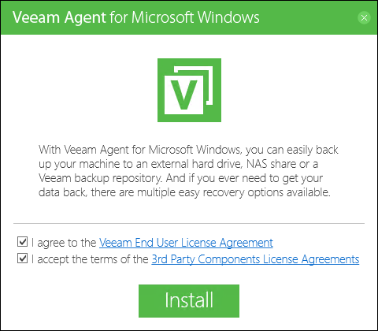

# Install Veeam Agent for Microsoft Windows
{: .no_toc }
---

In this page, you can find an explanation of how to Install and use Veeam Agent for Microsoft Windows.

## Table of contents
{: .no_toc .text-delta }

1. TOC
{:toc}

# Before You Begin

## Prerequisites:
The computer on which you plan to install Veeam Agent for Microsoft Windows must satisfy [system requirements](https://helpcenter.veeam.com/docs/agentforwindows/userguide/system_requirements.html?ver=40).
You must run the Veeam Agent for Windows setup file under user account that has Administrator privileges on the computer to install this product.
Veeam Agent for Windows requires the following components:

> Microsoft .NET Framework 4.7.2

> Microsoft SQL Server 2012 (Local DB)

> Microsoft SQL Server System CLR Types

> Microsoft SQL Server 2012 Management Objects

If these components are not pre-installed on the computer, the setup will install them automatically.

The product program files are placed to the **%ProgramFiles%\Veeam\Endpoint** Backup folder on the system volume. Veeam Agent for Windows requires at least **200 MB**.
During the recovery image creation, Veeam Agent for Windows formats the removable storage device.

## To install Veeam Agent for Windows
Save the downloaded archive on the computer where you plan to install the product.
You should accept the license agreements and click Install.

**After the installation process:**

> Auto-configure settings for the backup job.

> Configuring Scheduled Backup Job.

> Create a recovery image for your computer.

## Upgrading Veeam Agent for Windows
You can start the upgrade process from the Veeam Agent for Windows Control Panel when the new version becomes available.

During the upgrade process, configuration and backup files that were created with the previous version of Veeam Agent for Windows are not impacted in any way.

## To upgrade Veeam Agent for Windows
Open the Veeam Agent for Windows icon in the system tray, or right-click the Veeam Agent for Windows icon in the system tray and select Control Panel and open the About tab.
If the new version of Veeam Agent for Windows is available, **click Download**.
When the download is complete, **click Install**.
To upgrade Veeam Agent for Windows, you must accept the license agreement. Read the license agreement, select the I agree to the Veeam End User License Agreement check box and click Update.

## Consider the following
In some cases, upgrade to the new version of Veeam Agent for Windows may require computer reboot.
Save the downloaded archive on the computer where you plan to install the new version of the product and double-click the setup archive to start the upgrade.
After you upgrade Veeam Agent for Windows, you must obtain and install a new license.

## Uninstalling Veeam Agent for Windows
From the Start menu, select Control Panel > Programs and Features.
In the programs list, right-click Veeam Agent for Windows and select Uninstall. Wait for the process to complete.
The Local DB and other prerequisite components installed and used by Veeam Agent for Windows are not removed during the uninstall process. To remove each of the remaining components, right-click it in the programs list and select Uninstall.
