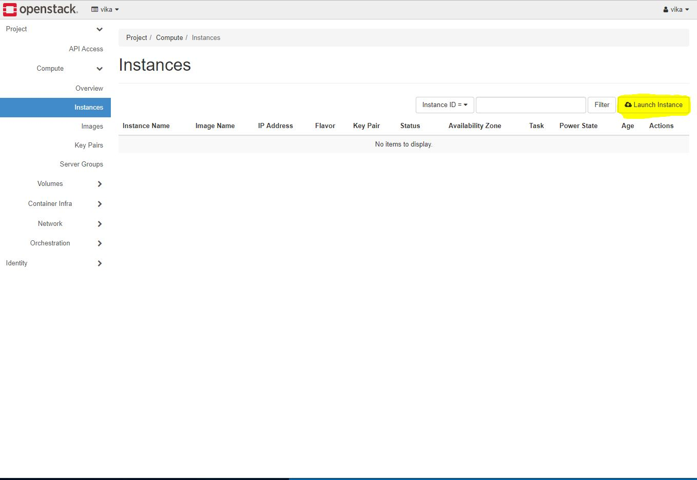
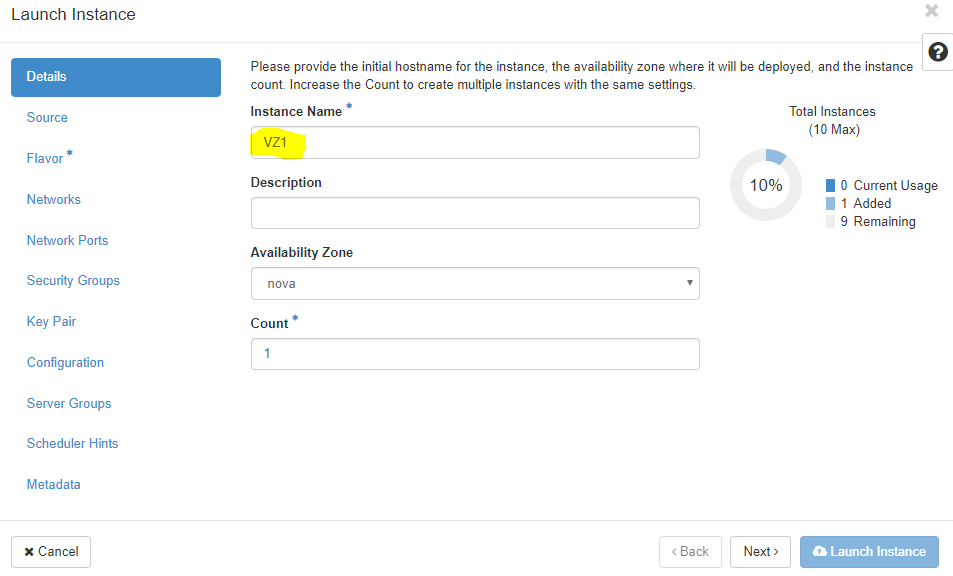
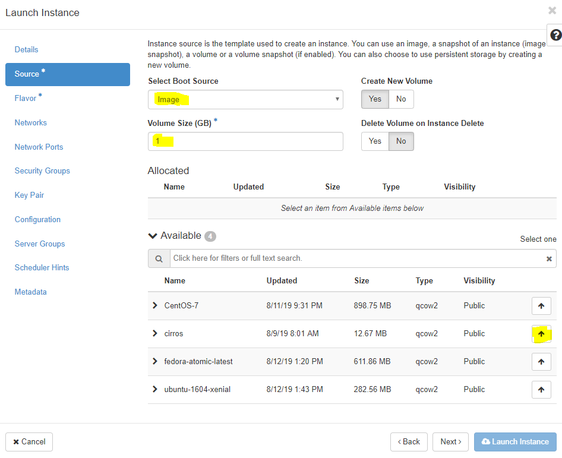
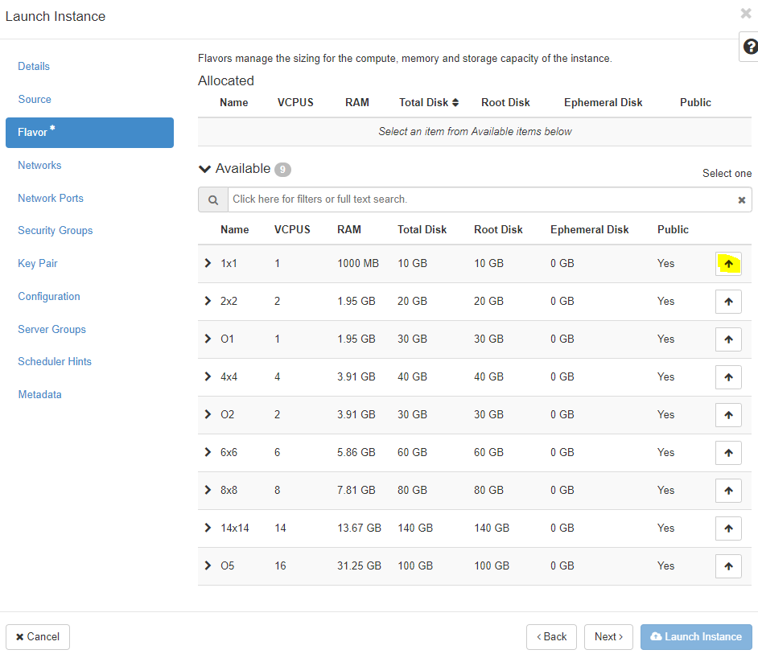
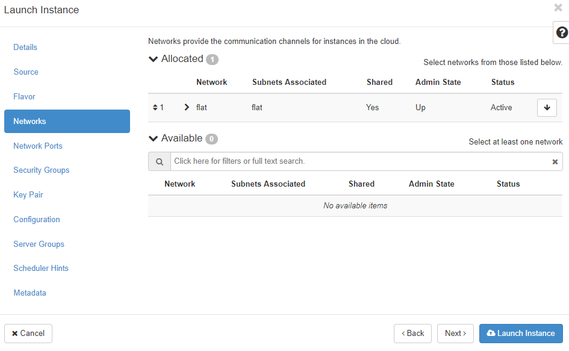
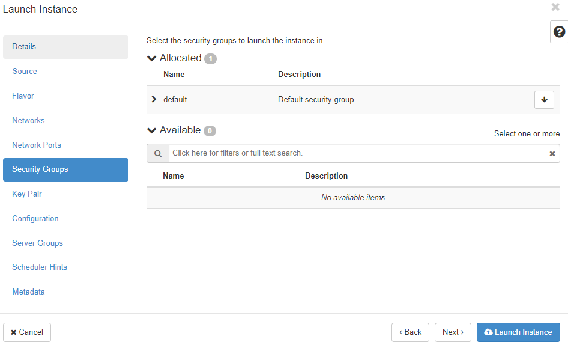
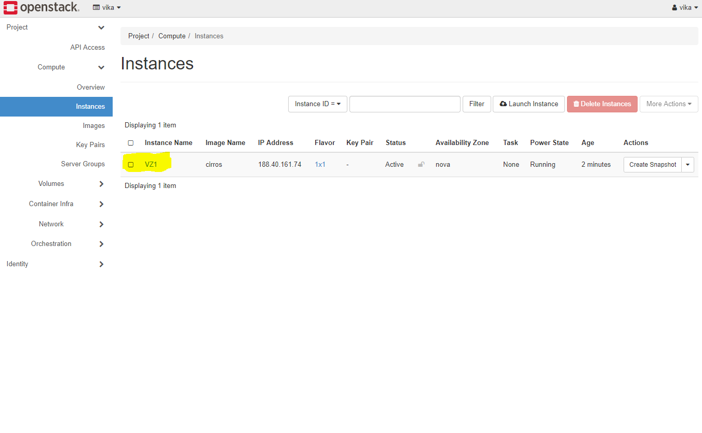
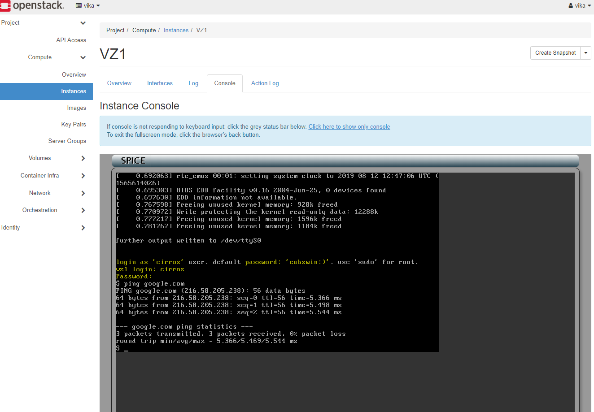

1) Go to Computer -> Instances -> Click "Launch Instance"

2) Fill the main options, which are marked whith "*" and other you need

3) Insert the name of the Instance (eg. "VZ1") and click Next Button

4) Select Instance Boot Source (eg. Image), declare Volume Size (GB) and choose desired image (eg. cirros (12.67 MB) by clicking on arrow.

5) Choose "Flavour" (eg. 1x1)

6) Click "Networking" and then choose desired networks

7) Open "Security Groups", after that, choose "default" 

8) Launch your Instance by clicking on a "Launch Instance"

9) You will see "Instances" menu whith your newly created VM

10) Open the drop-down menu and choose "Console"

11) Click on the black terminal area (to activate access to the console). 
	
12) Enter login and password. 

13) Now you can type commands.
	
14) After you finish, type "exit"

